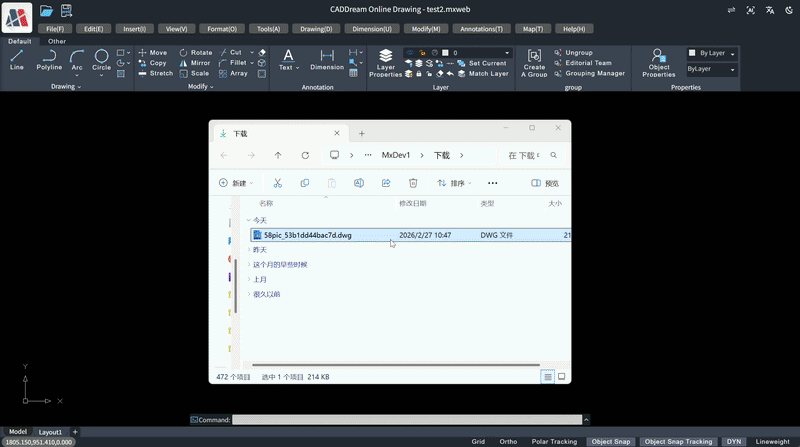

# Preface

If you have any questions during the use of mxcad, feel free to contact us. Contact: 710714273@qq.com

Official mxcad website: <https://www.webcadsdk.com/>



# Quick Start with mxcad

mxcad supports online rendering of `.mxweb` format files (this file format is our unique front-end CAD format). CAD drawing files (DWG, DXF) can be converted into .mxweb files via the drawing conversion program provided in our [mxdraw CloudDraw development package](https://www.webcadsdk.com/). The converted `.mxweb` files will be handed over to mxcad for browsing and editing in web pages. The edited `.mxweb` files can similarly be converted back into CAD drawing files through the drawing conversion program.

For specific steps on converting CAD drawing files to `.mxweb` format, please refer to the [drawing conversion steps](#drawing-conversion-steps) below.

The development of mxcad requires dependency on mxdraw, and the two need to work together. Therefore, if you are unfamiliar with the mxdraw library, please refer to：<https://github.com/mxcad/mxdraw/>

## Using mxcad with Vite

In this section, we will introduce how to create a simple mxcad project locally. The created project will use a build setup based on Vite.

First, ensure that you have installed [Node.js](https://nodejs.org/en), then navigate to the directory where you need to create the project:

1. Run the following commands in the command line to initialize the project and install Vite and mxcad

```sh
npm init -y
npm install vite -D
npm install mxcad
```
* If using `pnpm` for installation, you also need to manually install mxdraw

  ```sh
  pnpm install mxdraw
  ```

2. Create a new index.html file in the project root directory and draw a canvas.

```html
<!DOCTYPE html>
<html lang="en">
<head>
    <meta charset="UTF-8">
    <meta http-equiv="X-UA-Compatible" content="IE=edge">
    <meta name="viewport" content="width=device-width, initial-scale=1.0">
    <title>vite use mxcad</title>
</head>
<body>
    <div style="height: 600px; overflow: hidden;"> <canvas id="myCanvas"></canvas></div>
</body>
</html>
```

3. Create a new `src` directory in the root directory, and create an `assets` folder within this directory to store the target `mxweb` file. ([Click to download an mxweb file](https://gitee.com/mxcadx/mxcad_docs/blob/master/examples/public/test2.mxweb)) 

4. Create a new `index.ts` file in the `src` directory (Vite supports ts by default).。

By calling the `create()` method in mxcad, load the target drawing. The file paths loaded in this method are all absolute HTTP URL paths relative to the position of the JavaScript call, i.e., the **web address** of the file. In Vite, you can obtain the correct **web address** of the file using the loading method shown in the example code below.

```ts
import { McObject } from "mxcad"

// Place both 2d and 2d-st into static resources to ensure normal operation regardless of whether SharedArrayBuffer is enabled
const mode = "SharedArrayBuffer" in window ? "2d" : "2d-st"
// Create an mxcad instance object
const mxcad = new McObject()
mxcad.create({
    // ID of the canvas element
    canvas: "#myCanvas",
    // Get the path location of the wasm-related files (wasm/js/worker.js)
    locateFile: (fileName)=>  new URL(`/node_modules/mxcad/dist/wasm/${mode}/${fileName}`, import.meta.url).href,
    // URL path of the file to be initialized and opened
    fileUrl: new URL("../src/assets/test.mxweb", import.meta.url).href,
    // Provide the directory path for loading fonts
    fontspath:  new URL("node_modules/mxcad/dist/fonts", import.meta.url).href,
})

```

Import this ts file into the above html file.

The `create()` method in mxcad needs to be called after the canvas element has finished loading on the page, so the script tag needs to be placed inside the body tag, allowing the browser to parse the HTML page first before downloading and executing the code in the script tag.

```html
<script type="module" src="./src/index.ts"></script>
```

5. Create a `vite.config.ts` file in the root directory.

mxcad uses SharedArrayBuffer by default, which is a special type in JavaScript that allows multiple Web Worker threads to share the same memory space. Therefore, using mxcad requires setting the corresponding response headers on the server side.

```ts
import { defineConfig } from "vite"

export default defineConfig({
    server: {
        headers: {
          "Cross-Origin-Opener-Policy": "same-origin",
          "Cross-Origin-Embedder-Policy": "require-corp",
        }
    }
})
```

6. After completing the above steps, run the following command to start the project

```sh
npx vite
```

Reference example source code: <https://gitee.com/mxcadx/mxcad_docs/tree/master/examples/vite>

## Using mxcad via CDN

You can use mxcad directly through a script tag with a CDN:

Here we use [unpkg](https://unpkg.com/), but you can use any CDN that provides npm package services, or you can download this file and serve it yourself

```html
<script scr="https://unpkg.com/mxdraw/dist/mxdraw.umd.js" crossorigin="anonymous"></script>
<script scr="https://unpkg.com/mxcad/dist/mxcad.umd.js" crossorigin="anonymous"></script>
```
### Using the Global Build Version

Example of the global build version:

```html
<!DOCTYPE html>
<html lang="en">

<head>
    <meta charset="UTF-8">
    <meta http-equiv="X-UA-Compatible" content="IE=edge">
    <meta name="viewport" content="width=device-width, initial-scale=1.0">
    <title>Document</title>
    <script src="https://unpkg.com/mxdraw" crossorigin="anonymous"></script>
    <script src="https://unpkg.com/mxcad" crossorigin="anonymous"></script>
</head>

<body>
    <div style="height: 600px; overflow: hidden;"> <canvas id="myCanvas" style="height: 300px"></canvas></div>
    <script>
        const { McObject } = MxCAD
        const mxobj = new McObject()
        mxobj.create({
            canvas: "#myCanvas",//canvas's id
            locateFile: (fileName) => "https://unpkg.com/mxcad/dist/wasm/2d-st/" + fileName,
            fontspath: "https://unpkg.com/mxcad/dist/fonts/",
            fileUrl: "./test2.mxweb"//path to the target drawing
        })
    </script>
</body>

</html>
```

Reference sample source code：<https://gitee.com/mxcadx/mxcad_docs/tree/master/examples/h5>

### Build the version using the ES module

Most modern browsers already natively support the ES module, so we can use mxcad like this through the CDN and the native ES module. Because they depend on mxdraw mxcad library, so [Import mapping table (Import Maps)](https://caniuse.com/import-maps) to tell the browser how to locate the mxdraw module and mxcad module to Import.

You can also add other dependencies to the mapping table - but make sure you are using the ES module version of the library.

```html
<div style="height: 600px; overflow: hidden;"> <canvas id="myCanvas" style="height: 300px"></canvas></div>
<script type="importmap">
    {
        "imports": {
        "mxdraw": "https://unpkg.com/mxdraw/dist/mxdraw.esm.js",
        "mxcad": "https://unpkg.com/mxcad/dist/mxcad.es.js"
        }
    }
</script>
<script type="module">
    import { McObject } from "mxcad"

    const mxobj = new McObject()
    mxobj.create({
        canvas: "#myCanvas",
        locateFile: (fileName) => "https://unpkg.com/mxcad/dist/wasm/2d-st/" + fileName,
        fontspath: "https://unpkg.com/mxcad/dist/fonts/",
        fileUrl: "/test2.mxweb"
    })
</script>
```

## Use mxcad with webpack

mxcad is also supported in other packaging tools, and building mxcad projects based on webpack is described below.

1. Project initialization and installation of webpack and mxcad.
```sh
npm init -y
npm install webpack webpack-cli copy-webpack-plugin@5 html-webpack-plugin -D
npm install mxcad
```

2. Create a new `index.html` file in the root directory and draw the canvas.
```html
<!DOCTYPE html>
<html>
  <head>
    <meta charset="utf-8" />
    <title>start</title>
    <script src="https://unpkg.com/lodash@4.17.20"></script>
  </head>
  <body>
     <div style="height: 600px; overflow: hidden;"> <canvas id="myCanvas"></canvas></div>
  </body>
</html>
```

3. Create a `src` directory in the root directory and a `index.js` file in the ` src` directory to load the target file

```js
import {  McObject } from "mxcad"

const mxcad = new McObject()
mxcad.create({
    canvas: "#myCanvas",
    // Access http:xxx.com/test.mxweb to obtain the corresponding file
    // Please provide the document yourself
    fileUrl: "test.mxweb"
})
```
Introduce the js file under the `index.html` file. Put the script tag inside the body tag and let the browser finish parsing the HTML page before downloading and executing the code in the script tag.
```html
<script src="./src/index.js"></script>
```

4. Create the `webpack.config.js` file in the root directory.

Copy the mxcad required files to a static resource.

```js
const path = require('path');
//  Please feel free to use copy-webpack-plugin@5 compatible webpack4 and 5 compatible versions
const CopyWebpackPlugin = require("copy-webpack-plugin");

module.exports = {
  mode: process.env.development === "development" ? "development" : "production",
  entry: './src/index.js',
  devServer: {
    static: './dist',
    headers: {
      "Cross-Origin-Opener-Policy": "same-origin",
      "Cross-Origin-Embedder-Policy": "require-corp"
    }
  },
  output: {
    path: path.resolve(__dirname, 'dist'),
    filename: 'main.js',
  },
  plugins: [
    new CopyWebpackPlugin([
      // Copy mxcad WASM-related core code The default mxcad request path is /* All files need to be placed under dist2d
      {
        from: "node_modules/mxcad/dist/wasm/2d/*",
        to: path.resolve(__dirname, "dist"),
        flatten: true
      },
      // The font file must be required to display the text in the drawing. The mxcad library default request URL path is /fonts/* All need to be placed under dist/fonts
      {
        from: "node_modules/mxcad/dist/fonts",
        to: path.resolve(__dirname, "dist/fonts"),
        flatten: true,
        toType: "dir"
      },
    ])
  ],
  // mxcad and mxdraw libraries have js code packages that exceed the size of webpack's default limit and need to set hints: false to close the warning
  performance: {
    hints: false,
  }
};
```

5. After configuring the `packge.json` file as required, run the 'npx webpack serve' command to see the effect

Reference sample source code:

<https://gitee.com/mxcadx/mxcad_docs/tree/master/examples/webpack-v4>

<https://gitee.com/mxcadx/mxcad_docs/tree/master/examples/webpack-v5>

## Other knowledge points

### Parameter description of the mxcad.create() function

 1. canvas：canvas id of the canvas instance

 2. locateFile：The core of mxcad relies on the wasm file in the corresponding category (` 2d `|` 2d-st `) under the directory `/mxcad/dist/wasm` in mxcad library (the file is compiled and generated by c++), wherein the 2d directory is multi-threaded programs, and the 2D-ST directory is single-threaded programs. This parameter specifies the network path of the wasm program.
  
 3. fontspath：Specifies the font file load path in a cad drawing. The default path is `dist/fonts`, where you can add all the font files you need to open your drawings.

 4. fileUrl：Specifies the network path to open the mxweb drawing.
     * The parameters fontspath, fileUrl and locateFile in the `create()` function that creates mxcad objects in mxcad are network paths.

 5. onOpenFileComplete: Listen for the callback event when opening a file is successful. Operations to be performed after the drawing is opened can be executed within this method.

 6. viewBackgroundColor: Set the background color of the view area, with the value in RGB format. 

 7. browse: Whether to set as browse mode. When the value is true or 1, browse mode is enabled and CAD objects cannot be selected; when the value is 2, browse mode is enabled and CAD objects can be selected but cannot be edited by grips; when the value is false, edit mode is enabled. 

 8. middlePan: Set the operation mode for moving the view. Set to 0 to move the view by clicking the left mouse button; set to 1 to move the view by clicking the middle mouse button; set to 2 to move the view by clicking either the middle or left mouse button. 

 9. enableUndo: Whether to enable the undo function. If set to true, the Mx_Undo command can be called to undo operations; if set to false, the undo command is disabled. The default setting is false. 

 10. enableIntelliSelect: Whether to enable the object selection function. Set to true to enable; set to false to disable. 

 11. multipleSelect: Whether to enable multiple selection. Set to true to enable; set to false to disable. 

 For more initialization parameter settings of createMxCad, please refer to the [MxCadConfig Configuration Description](../../api/interfaces/2d.MxCadConfig.md)

### Description of multi-thread and single-thread mode

mxcad supports multithreading by default for performance reasons. Among them, support for multithreading mode needs to open SharedArrayBuffer permissions, open can use `/wasm/2d` under the multithreaded program, otherwise use `/wasm/ 2d-ST/` under the single-threaded program.

The SharedArrayBuffer permission needs to be configured in the server responder, for example, node.js server program to enable SharedArrayBuffer permission set as follows:

```js
const http = require('http');
http.createServer((req, res)=> {
    res.setHeader("Cross-Origin-Opener-Policy", "same-origin");
    res.setHeader("Cross-Origin-Embedder-Policy", "require-corp");
})
```

How to determine whether SharedArrayBuffer permissions are enabled in front-end js, and then automatically use the correct program loading, the code is as follows:

```js
import { McObject } from "mxcad"
// Putting both 2d and 2D-ST into a static resource ensures that it works regardless of whether SharedArrayBuffer is turned on or not
const mode = "SharedArrayBuffer" in window ? "2d" : "2d-st"
const mxobj = new McObject()
mxobj.create({
  // ...
   locateFile: (fileName)=> {
    new URL(`/node_modules/mxcad/dist/wasm/${mode}/${fileName}`, import.meta.url).href
   },
})
```
* To use SharedArrayBuffer permissions, Google's browser requires access using HTTPS or the local path (http://localhost).

# Drawing Conversion Steps

Due to the large size, multiple versions, and complex format of AutoCAD files (DWG, DXF), directly loading them into web pages is inefficient, occupies large memory space, and is prone to loading failures. Therefore, we have designed and provided a unique web CAD file format: `.mxweb`, which effectively solves the aforementioned numerous issues. mxweb files and CAD drawing files can be converted back and forth using the CloudDraw development package we provide.

For more detailed conversion steps, please refer to [Drawing conversion](https://mxcad.github.io/mxcad/en/guide/convert.html)

## Download the CloudDraw Development Package

We need to download the [MxDraw CloudDraw development package](https://www.webcadsdk.com/)


After downloading the `MxDrawCloudServer1.0TryVersion.7z` compressed package, decompress it,
Go to the directory `MxDrawCloudServer\Bin\MxCAD\Release` under the decompressed MxDrawCloudServer directory, which is the program directory responsible for converting `.mxweb` format.

## Convert CAD Drawings to mxweb Format

### Method One

Open the command window in the directory where the decompressed `MxDraw CloudDraw development package` is located, find the path of the target drawing, then run the command line: mxcadassembly target drawing path.

Example code as follows:
```bash
cd C:\Users\MxDev\Downloads\MxDrawCloudServer1.0TryVersion\MxDrawCloudServer\Bin\MxCAD\Release

mxcadassembly D:\test2.dwg
```

Wait for the command line to output `{"code":0 }` indicating the drawing conversion is successful. The successfully converted `.mxweb` format file will be automatically saved in the same directory as the target drawing.


### Method Two

Open the command window in the directory where the decompressed `MxDraw CloudDraw development package` is located, find the path of the target drawing, then run the command line: mxcadassembly JSON string.

Example code as follows:
```bash
mxcadassembly.exe {"srcpath":"D:\test2.dwg","outpath":"D:\","outname":"test", "compression":0}
```

| Parameter | Description |
| --- | --- |
| srcpath | Path of the file to be converted |
| outpath | outpath|Output file path |
| outname | outname|Output file name (suffix needs to be added when converting mxweb to CAD drawings) |
| compression | 0 means no compression, if this attribute is not written, it means compression |

## Convert mxweb Format to CAD Drawings

We can also use this program to convert `.mxweb` format files back to `.dwg` format files by executing the following command:
```bash
mxcadassembly.exe {"srcpath":"D:\test.mxweb","outpath":"D:\","outname":"test.dwg"}
```
* The parameter outname must include the suffix of the CAD drawing, generally .dwg.

## Linux Version

For the Linux version of the CloudDraw development package, authorization operation is required before operation:
Enter the `Bin/Linux/MxCAD` directory, we should first give these files permission and copy some directories to the specified location:
```bash
sudo chmod -R 777 mxcadassembly

sudo chmod -R 777 ./mx/so/*

sudo  cp -r -f ./mx/locale /usr/local/share/locale
```

Then we can refer to the Windows version file format conversion method for drawing conversion. For example, call the following command to convert CAD drawings to mxweb format:
```bash
./mxcadassembly "{'srcpath':'/home/mx/test.dwg','outpath':'/home/mx/Test','outname':'xxx'}"
```
where srcpath: the path where the target CAD file is located, outpath: the specified path where the converted drawing file is located, outname: specifies the filename of the output mxweb file.
