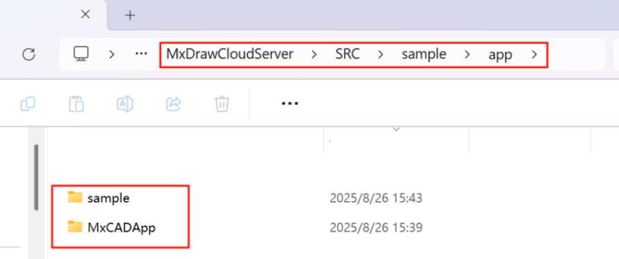
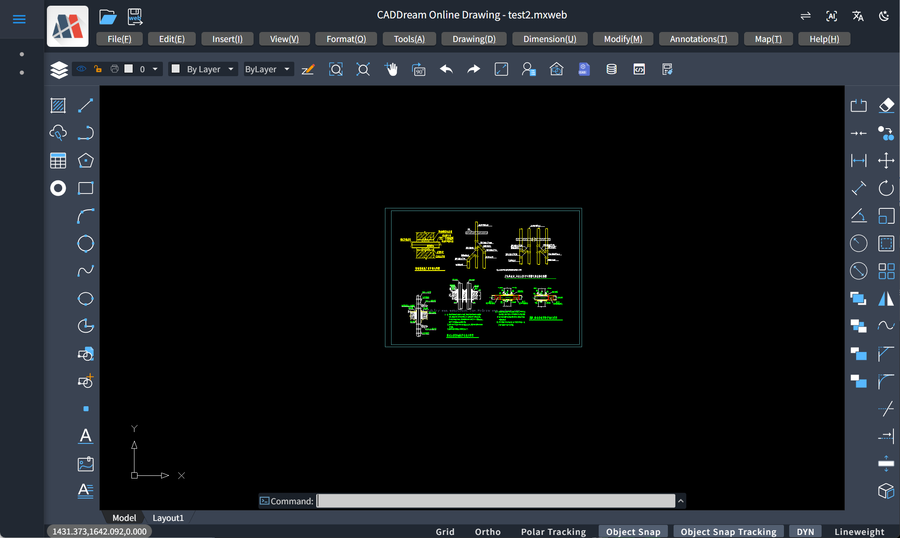

# MxCADApp Npm application integration

`mxcad-app` is a complete online CAD application plugin developed by us based on the mxcad development package. Users can directly install this plugin and integrate it into their own systems or projects. In just 3 minutes, your website can have professional CAD functions.

## 1. Installation

Install using npm or yarn `mxcad-app`：

```ts
npm install mxcad-app --save
```

Or

```ts
yarn add mxcad-app
```

## 2. Preliminary integration

### Integrate mxcad-app based on vite

1.The first step is to import the style files required for the mxcad project in `main.js` to create the initial MxCAD project

```ts
// Introduce the mxcad-app style
import "mxcad-app/style";
// Introduce MxCADView
import { MxCADView } from "mxcad-app";

// Create a default mxcad project
new MxCADView().create();
```

1. The second step is to add the resource configuration related to the MxCAD project in `vite.config.js`

   ```ts
   import { defineConfig } from "vite";
   import { mxcadAssetsPlugin } from "mxcad-app/vite";

   export default defineConfig({
     plugins: [
         ...
         mxcadAssetsPlugin(),
         ...
     ],
   });
   ```

### Integrate mxcad-app based on webpack

1. The first step is to import the style files required for the mxcad project in `main.js` to create the initial MxCAD project

   ```ts
   // Introduce the mxcad-app style
   import "mxcad-app/style";
   // Introduce MxCADView
   import { MxCADView } from "mxcad-app";

   // Create a default mxcad project
   new MxCADView().create();
   ```

2. The second step is to add the resource configuration related to the MxCAD project in `vite.config.js`

   ```ts
   npm install style-loader css-loader
   ```

   ```ts
   const { MxCadAssetsWebpackPlugin } = require("mxcad-app/webpack");
   // webpack.config.js
   const webpack = require("webpack");

   module.exports = {
     // ...
     mode: "development",
     module: {
       rules: [
         {
           test: /\.css$/, // Match all.css files
           use: [
             "style-loader", // Step 2: Inject the CSS code into the <style> tag of the DOM
             "css-loader", //Step 1: Parse the CSS file and handle @import and url()
           ],
           include: [
             path.resolve(__dirname, "src"),
             path.resolve(__dirname, "node_modules/mxcad-app"),
           ], // Optional: Only handle css under src
         },
       ],
     },
     plugins: [
       new webpack.ContextReplacementPlugin(
         /mxcad-app/, // Match the module path containing mxcad-app
         path.resolve(__dirname, "src") // Limit the scope of context lookup
       ),
       new MxCadAssetsWebpackPlugin(),
     ],
     // ...
     devServer: {
       static: "./dist",
       port: 3000,
     },
   };
   ```

## 3. High-level invocation

1. Custom interface container

   If the container element of the `mxcad-app` page is not specified, it will default to creating a container with a width and height of 100vw or 100vh directly in the project interface, and the mxcad project will also be displayed in full screen. In some scenarios, we need to dynamically control the visibility or display range of mxcad projects. Therefore, we set up the following relevant configurations to specify the specific interface container of `mxcad-app`.

   ```ts
   <div id="myMxCAD" style="width: 50vw; height: 50vh"></div>
   ```

   ```ts
   // Custom container
   import { MxCADView, mxcadApp } from "mxcad-app";
   /**
    * openFile：The path of the file to be opened
    * rootContainer：mxcad project container name
    * map：Whether to display the map mode
    */
   new MxCADView({
     // mxcadApp.getStaticAssetPath()).toString() to obtain mxcad - app static resource path, the default use static resource for nodemodules/mxcad-app/dist/mxcadAppAssets
     openFile: new URL("test.mxweb", mxcadApp.getStaticAssetPath()).toString(),
     rootContainer: "#myMxCAD",
   }).create();
   ```

Among them, if it is necessary to modify the static resource path within the MxCAD project, it can be done by calling the 'setStaticAssetPath()' method.

```ts
import { mxcadApp } from "mxcad-app";
mxcadApp.setStaticAssetPath("https://unpkg.com/mxcad-app/dist/mxcadAppAssets");
```

2. Build configuration Settings

   The `mxCAD-App` plugin provides the `mxcadAssetsPlugin` method to set the loading wasm mode of MxCAD projects, third-party dependencies, subdirectory names where resources are stored, interface UI, shortcut commands, service configuration, theme styles, etc. Users can modify the internal configuration of MxCAD projects in different scenarios according to their own needs.

   Configuration based on vite：

   ```ts
   import { mxcadAssetsPlugin } from "mxcad-app/vite";
   // vite.config.js
   export default {
     plugins: [
       mxcadAssetsPlugin({
         isWasmSt: true,
         libraryNames: ["vue"],
         outputDir: "testName",
         // Modify the UI configuration
         transformMxUiConfig: (config) => {
           config.title = "MyCAD"; // Modify the title
           return config;
         },
         // Modify the server configuration
         transformMxServerConfig: (config) => {
           config.serverUrl = "/api/cad"; // Modify the API address
           return config;
         },
         // Modify the shortcut command (command alias)
         // transformMxQuickCommand: (config) => config

         // Modify the configuration of the sketch and annotation UI mode
         // transformMxSketchesAndNotesUiConfig: (config) => config

         // Modify the Vuetify theme configuration
         // transformVuetifyThemeConfig: (config) => config
       }),
     ],
   };
   ```

   Configuration based on webpack:

   ```ts
   import { MxCadAssetsWebpackPlugin } from "mxcad-app/webpack";

   module.exports = {
     plugins: [
       new MxCadAssetsWebpackPlugin({
         isWasmSt:true,
         libraryNames: ["vue"],
         outputDir:'testName',
         transformMxServerConfig: (config) => {
           if (process.env.NODE_ENV === 'production') {
             config.serverUrl = 'https://api.prod.com/cad';
           }
           return config;
         }
           ...
       })
     ]
   };
   ```

- Set the loading mode of wasm

By default, MxCAD projects use multi-threading to load wasm resources. If you need to set single-threaded loading, you can configure the `isWasmSt` property in the `mxcadAssetsPlugin` method.

```ts
/** Whether to load wasm in a single thread (by default, multi-threading and loading are used) */
isWasmSt: true;
```

- Third-party dependency

Users can directly import and use the mxcad and mxdraw modules used internally in the `mxcad-app`. If users need to use other dependencies within `mxcad-app`, they can directly add the npm libraries of these external dependencies in the `libraryNames` attribute of the `mxcadAssetsPlugin` method and then use them directly.

The currently supported libraries for dependency mapping include 'vue', 'axios',' vuetify ', 'vuetify/components', and' mapboxgl '. You can also visit `window.MXCADAPP_EXTERNALLIBRARIES` to obtain all the provided dependent libraries, thus not relying on the use of build tools.

```ts
   libraryNames: ["vue","axios"...]
```

```ts
// After adding it in the configuration file, you can use the vue module in mxcad-app (the internal vue module packaged by mxcad-app) normally.
import { ref } from "vue";
const n = ref(1);
```

- Build the subdirectory name for storing the static resources of `mxcad-app` after packaging.

After installing `mxCAD-app` in your own project and importing the MxCAD project, when building and packaging, a folder named `mxcadAppAssets` will be created by default to store all static resources related to MxCAD, that is, `/dist/mxcadAppAssets`. If the user needs to modify the folder name where static resources are placed, they can directly call the value of the 'outputDir' attribute in the `mxcadAssetsPlugin` method.

```ts
// Output result:/dist/testName
outputDir: "testName";
```

- Modify the interface UI, CAD shortcut commands, service configuration, theme styles, etc

  Call the transform method provided in the `mxcadAssetsPlugin` method to set the depth of the MxCAD project.

  ```ts
  // Modify the UI configuration
  /** For more UI configurations, please click "config" to view inside */
  transformMxUiConfig: (config) => {
      config.title = "MyCAD"; // Modify the title
      config.mTopButtonBarData.push({
          "icon": "textIcon",
          "prompt": "test",
          "cmd": "Mx_test"
      });// Add a top button bar button
      ...
      return config;
  }

  // The configuration for modifying the sketch and annotation UI mode is the same as above
     // transformMxSketchesAndNotesUiConfig: (config) => config
  ```

  ```ts
  // Modify CAD shortcut commands (command aliases)
  /** For more modifications to the CAD shortcut command configuration, please click on "config" to view it internally */
  transformMxQuickCommand: (config) => {
    // Add the aliases '_test' and 't' of the command 'Mx_test' to see
    // "config" is used to name the alias array object within MxCAD
    config.push(["Mx_test", "_test", "t"]);
    return config;
  };
  ```

  ```ts
  // Modify the server configuration
  /** For more information on modifying server configurations, please click on "config" to view it internally */
  transformMxServerConfig: (config) => {
      config.serverUrl = "/api/cad"; // Modify the API address
      config.font.push('txt.shx', 'gdt.shx');// Add the font files that need to be loaded initially for the MxCAD project
      ...
   return config;
  }
  ```

  ```ts
  // Modify the Vuetify theme configuration
  /** For more modifications to Vuetify theme configurations, please click on the "config" section to view */
  transformVuetifyThemeConfig: (config) => {
    config.defaultTheme = "light"; //dark or light
    return config;
  };
  ```

3. Project initialization configuration

`mxcadApp.initConfig` is an initialization method in the `mxCAD-app` module, used to configure and load various configuration files required for MxCAD applications. These configuration files are usually in JSON format and contain the user interface Settings of the application, server configuration information, UI configuration for sketches and notes, theme styles, shortcut commands, and other contents. By invoking this method, these configuration items can be loaded and applied to the MxCAD application, thereby ensuring that the system starts and operates in the expected manner. The json file format related to the configuration content can be referred to the relevant json in the `MxDrawCloudServer\SRC\sample\app\MxCADApp\public\ini` directory within the Yuntu development package.

```ts
// 导入MxCAD应用相关模块
import { mxcadApp } from "mxcad-app";

mxcadApp.initConfig({
  uiConfig: "xxx/xxx/xxx.json",
  sketchesUiConfig: "xxx/xxx/xxx.json",
  serverConfig: "xxx/xxx/xxx.json",
  quickCommandConfig: "xxx/xxx/xxx.json",
  themeConfig: "xxx/xxx/xxx.json",
});
```

- uiConfig (string)：
  Specify the path of the user interface configuration file for the application. This file usually contains configurations related to interface layout, control styles, user interaction, and other aspects. For instance, it defines the display methods, layouts, colors, etc. of various elements in the user interface. The json file format configured by uiConfig is as follows:

```json
{
  "title": "CAD dreams of drawing online",
  "headerTitle": "CAD dreams of drawing online",
  "isShowNameOCurrentlyOpenDrawing": true,
  "isShowHeader": true,
  "logoImg": true,
  "isShowHeaderTopBar": true,
  "isShowHeaderTopBarRightBtns": true,
  "isSketchesAndNotesUiMode": true,
  "isShowSketchesAndNotesUiMode": true,
  "headerTopBarRightBtns": [
    "language",
    "theme"
  ],
  "defaultActiveLanguage": "zh-CN",
  "isShowUseAiFunctionButton": false,
  "headerTopBarCustomRightBtns": [
    {
      "icon": "qiehuan",
      "cmd": "Mx_switchSketchesAndNotesUiMode",
      "prompt": "Switch UI mode",
      "openPromptDelay": 700
    },
    ...
  ],
  "isShowTitleButtonBar": true,
  "mTitleButtonBarData": [
    {
      "icon": "dakaidwg",
      "cmd": "OpenDwg",
      "prompt": "Open the file"
    },
    ...
  ],
  "isShowTopButtonBar": true,
  "mTopButtonBarData": [
    {
      "icon": "zhonghua",
      "prompt": "Redraw",
      "cmd": "Mx_Regen"
    },
    ...
  ],
  "mLeftButtonBarData": {
    "isShow": true,
    "buttonBarData": [
      {
        "icon": "zhixian",
        "prompt": "Draw a line",
        "cmd": "Mx_Line"
      },
      ...
    ]
  },
  "mRightButtonBarData": {
    "isShow": true,
    "buttonBarData": [
      {
        "icon": "shanchu",
        "cmd": "Mx_Erase",
        "prompt": "Delete"
      },
      ...
    ]
  },
  "isShowMenuBar": true,
  "mMenuBarData": [
    {
      "tab": "File(F)",
      "isResponsive": false,
      "list": [
        {
          "tab": "Newly built(N)",
          "icon": "xinjian",
          "cmd": "Mx_NewFile"
        },
        ...
      ]
    },
    ...
  ],
  "mRightMenuData": [
    {
      "label": "Newly built",
      "tips": "New",
      "cmd": "Mx_NewFile"
    },
    ...
  ],
  "mRightMenuDataCommandRuning": [
    {
      "label": "Confirm(E)",
      "tips": "ok",
      "execute_operations": 1
    },
    ...
  ],
  "mRightMenuDataCommandRuningOsnapSet": [
    {
      "label": "Endpoint(E)",
      "tips": "End",
      "set_osnap_type": 1
    },
    ...
  ],
  "mRightMenuDataSelectEntity": [
    {
      "label": "Delete",
      "tips": "Delete",
      "cmd": "Mx_Erase"
    },
    ...
  ],
  "isShowFooter": true,
  "isMobileCommandLineMode": true,
  "footerRightBtnSwitchData": [
  "Grid",
  "Orthogonal",
  "Polar axis",
  "Object capture",
  "Object Tracking",
  "DYN",
  "Line width"
  ],
  "isShowModelNav": true,
  "isShowCommandLinePanel": true,
  "isShowCommandInput": true,
  "isShowFooterStatusBar": true,
  "isShowLeftDrawer": true,
  "leftDrawerComponents": [
    "DrawingComparison",
    "TextSearch",
    "BlockLibrary",
    "CodeEditor",
    "DatabaseDisplay",
    "PatternRec"
  ],
  "isShowRightDrawer": true,
  "rightDrawerComponents": [
    "EntityAttribute"
  ],
  "isShowSkeletonLoader": false,
  "isPriorityLoadingUi": false
}
```

- sketchesUiConfig (string)：
  Specify the UI configuration file paths for the sketches and notes. This file controls interface elements related to the design document, such as sketch editing functions, annotations, notes, etc. It may include the style of sketch display, the configuration of note-taking tools, etc. The json file format configured by sketchesUiConfig is as follows:

```json
{
  "mMenuData": [
    {
      "tab": "Default",
      "list": [
        {
          "tab": "Drawing(D)",
          "icon": "zhixian",
          "sameWidth": true,
          "list": [
            {
              "tab": "Drawing(L)",
              "icon": "zhixian",
              "cmd": "Mx_Line",
              "size": "large",
              "labelWithArrowLayout": false,
              "col": true,
              "isShowLabel": true,
              "isShowToMainPanel": true,
              "props": {
                "style": {
                  "width": "60px"
                }
              }
            },
            ...
          ]
        }
      ]
    },
    ...
  ]
}
```

- serverConfig (string)：
  Specify the path of the server configuration file. This file contains the Settings required for the application to communicate with the server, such as the server's address, port, authentication information, etc. It is used to set the relevant parameters for interacting with the background system to ensure that the front-end application can connect normally with the back-end. The json file format configured by serverConfig is as follows:

```json
{
  "?uploadFileConfig": "上传文件相关配置",
  "uploadFileConfig": {
    "?baseUrl": "上传服务地址",
    "baseUrl": "http://localhost:1337",
    "?create": "参考WebUploader.create方法传入的参数配置",
    "create": {
      "swf": "https://www.mxdraw3d.com/webuploader/Uploader.swf",
      "server": "/mxcad/files/uploadFiles",
      "accept": {
        "extensions": "mxweb,dwg,dxf",
        "mimeTypes": ".mxweb,.dwg,.dxf"
      }
    },
    "?fileisExist": "通过文件的md5参数检查文件是否已经存在",
    "fileisExist": "/mxcad/files/fileisExist",
    "?chunkisExist": "用于分片检查是否已经存在",
    "chunkisExist": "/mxcad/files/chunkisExist",
    "?chunked": "是否分片上传",
    "chunked": true,
    "?mxfilepath": "文件上传后前端访问路径",
    "mxfilepath": "/mxcad/file/",
    "?saveUrl": "保存文件服务地址",
    "saveUrl": "http://localhost:1337/mxcad/savemxweb",
    "?saveDwgUrl": "保存DWG文件服务地址",
    "saveDwgUrl": "http://localhost:1337/mxcad/savedwg",
    "?printPdfUrl": "把指定范围输出到pdf的服务地址",
    "printPdfUrl": "http://localhost:1337/mxcad/print_to_pdf",
    "?cutDwgUrl": "把指定范围输出到DWG的服务地址",
    "cutDwgUrl": "http://localhost:1337/mxcad/cut_dwg"
  },
  "aiConfig": {
    "?aiUrl": "ai服务地址",
    "aiUrl": "http://localhost:7900"
  },
  "?wasmConfig": "在本项目中使用了mxcad库中提供的WebAssembly wasm文件和相关胶水代码的相关配置",
  "wasmConfig": {
    "?url": ":通过指定网络路径加载mxcad库中提供的wasm相关文件, 例如:https://unpkg.com/mxcad/dist/wasm/2d-st/ 程序会自动加载2d-st目录下与wasm相关的文件",
    "url": "",
    "?type": "如果没有设置url, 我们可以通过该项目本地存放的assets目录下wasm相关的文件， 目前可选项有: 2d和2d-st 2d是多线程加载，可能需要一些额外的服务器配置， 而2d-st是单线程的，你可以很方便的使用它,也可以通过访问地址参数调置http://xxxx/mxcad/?wasmtype=st",
    "type": "2d"
  },
  "?supportTruetypeFont": "是否启用truetype字体的支持,默认是启用",
  "supportTruetypeFont": true,
  "?webgl1": "是使用webgl 1.0程序",
  "webgl1": false,

  "?defaultFont": "缺省使用的shx字体",
  "defaultFont": "",
  "defaultBigFont": "",
  "defaultTrueTypeFont": "",
  "?font": "需要加载的shx字体",
  "font": ["txt.shx"],
  "?bigFont": "需要加载的big shx字体",
  "bigFont": ["hztxt.shx", "gbcbig.shx"],
  "?trueTypeFont": "需要加载的TrueType字体 [['simsun', 'syadobe'], ['思原宋体', '思原黑体'], ['stadobe.otf', 'syadobe.otf']]",
  "trueTypeFont": [["syadobe"], ["思原黑体"], ["syadobe.otf"]],
  "?isAutomaticJumpToMobilePage": "是否自动跳转到移动端页面",
  "isAutomaticJumpToMobilePage": true,
  "?mobilePageUrl": "跳转的移动端页面的网络路径如/mxcad_mobile/或者https://xxx.com/mxcad_mobile",
  "mobilePageUrl": "/mxcad_mobile/",
  "?file_ext_name": "cad文件格式的扩展名",
  "file_ext_name": "mxweb",
  "?useUtf8": "使用Utf8编码",
  "useUtf8": false,
  "speechRecognitionModel": "vosk-model-small-cn-0.22.zip"
}
```

- quickCommandConfig (string)：
  Specify the path of the quick command configuration file. This file configures the shortcut commands in the MxCAD application, including the definition of shortcut keys, command behavior, responses, etc., to help users carry out design work efficiently. The json file format configured by quickCommandConfig is as follows:

```json
[
  ["Mx_New", "_new", "new"],
  ...
]
```

- themeConfig (string)：
  Specify the path of the theme style configuration file for the application. This file defines the visual themes of MxCAD applications, such as color schemes, font styles, control appearances, etc., to ensure that the interface meets the aesthetic and functional requirements of users. The json file format configured by themeConfig is as follows:

```json
{
  "defaultTheme": "dark",
  "themes": {
    "light": {
      "colors": {
        "surface": "#FFFFFF",
        "background": "#E0E0E0",
        "accent": "#545555",
        "prominent": "#FFFFFF",
        "hover_herder_btn": "#B3B3B3",
        "modification": "#FFFFFF",
        "transition": "#EFEFEF",
        "undertint": "#3A4352",
        "depth": "#D3D1D1",
        "on-undertint-bg": "#000",
        "undertint-bg": "#f0f0f0",
        "depth-bg": "#EBE9E9",
        "inverse": "#000000",
        "inverse1": "#FFFFFF",
        "console": "#787878",
        "on-console": "#fff",
        "dialog-card": "#FFFFFF",
        "dialog-card-text": "#E0E0E0",
        "hover_electron_view_tab_btn_hover": "#DBDBDB",
        "hover_electron_view_tab_btn_action": "#FFFFFF",
        "nav_bg": "#DBDBDB",
        "nav_bg_active": "#787878",
        "sketches_color": "#E8E8E8",
        "toolbar_header": "#99b4d1"
      },
      "variables": {
        "border-color": "#000000",
        "border-opacity": 0.12,
        "high-emphasis-opacity": 0.87,
        "medium-emphasis-opacity": 1,
        "disabled-opacity": 0.38,
        "idle-opacity": 0.04,
        "hover-opacity": 0.2,
        "focus-opacity": 0.12,
        "selected-opacity": 0.08,
        "activated-opacity": 0.1,
        "pressed-opacity": 0.12,
        "dragged-opacity": 0.08,
        "theme-kbd": "#212529",
        "theme-on-kbd": "#FFFFFF",
        "theme-code": "#F5F5F5",
        "theme-on-code": "#000000",
        "theme-tbody": "#fff",
        "theme-btn-hover": "#E0E0E0",
        "theme-undertint-bg-overlay-multiplier": 0.25
      }
    },
    "dark": {
      "colors": {
        "surface": "#212832",
        "background": "#212832",
        "accent": "#545555",
        "prominent": "#3A4352",
        "hover_herder_btn": "#3A4352",
        "modification": "#1E252F",
        "transition": "#5D6675",
        "undertint": "#AEABAB",
        "on-undertint": "#fff",
        "depth": "#5D6675",
        "on-depth": "#fff",
        "undertint-bg": "#2E3440",
        "depth-bg": "#454F61",
        "inverse": "#FFFFFF",
        "inverse1": "#000000",
        "console": "#787878",
        "on-console": "#fff",
        "dialog-card": "#212832",
        "dialog-card-text": "#3A4352",
        "hover_electron_view_tab_btn_hover": "#3A4352",
        "hover_electron_view_tab_btn_action": "#616975",
        "nav_bg": "#3A4352",
        "nav_bg_active": "#282A2D",
        "sketches_color": "#3A4352",
        "toolbar_header": "#2B3647"
      },
      "variables": {
        "border-color": "#FFFFFF",
        "border-opacity": 0.12,
        "high-emphasis-opacity": 0.87,
        "medium-emphasis-opacity": 1,
        "disabled-opacity": 0.38,
        "idle-opacity": 0.1,
        "hover-opacity": 0.2,
        "focus-opacity": 0.12,
        "selected-opacity": 0.08,
        "activated-opacity": 0.1,
        "pressed-opacity": 0.16,
        "dragged-opacity": 0.08,
        "theme-kbd": "#212529",
        "theme-on-kbd": "#FFFFFF",
        "theme-code": "#343434",
        "theme-on-code": "#CCCCCC",
        "theme-tbody": "#343b48",
        "theme-btn-hover": "#616975",
        "theme-surface-variant": "#424242",
        "theme-on-surface-variant": "#ffffff"
      }
    }
  }
}
```

4. Core dependency library

   `mxcad-app` with built-in [mxcad](https://www.mxdraw3d.com/mxcad_docs/zh/) core library, users can directly use `mxcad` don't need in the project to install again `mxcad` plug-in. If not used in a modular way, `mxcad` mounts in `window.MxCAD`, and you can directly access the required methods and classes using `MxCAD`.

   ```ts
   import { MxCpp } from "mxcad";

   // Obtain the current mxcad object
   const mxcad = MxCpp.getCurrentMxCAD();
   ```

   `mxcad` depends on `mxdraw`, and users can also directly use `mxdraw` in their projects. If not used in a modular way, `mxdraw` is mounted in `window.Mx`. You can directly use `Mx` to access the required methods and classes.

   ```ts
   import { MxFun } from "mxdraw";

   // Output the content and class of the command line.
   MxFun.acutPrintf("Test output");
   ```

   The prerequisite for directly introducing the `mxcad` and `mxdraw` modules is to use the build tool for construction. We have provided webpack and vite plugins to support modular development.

   As long as the plugin is used, the `mxcad` and `mxdraw` modules can be directly imported using `import`。

## 4. MxCAD Project Secondary Development

By following the steps above, we can obtain the original MxCAD project integrated with the `mxcad-app` plugin. If we need to perform secondary development on the original MxCAD project, we can directly use the `mxcad` and `mxdraw` core dependency libraries of `mxcad-app` to extend the functionality of the MxCAD project. Below is an example of implementing parametric drawing and calling internal MxCAD commands in a Vue project.

### 1. Parametric Drawing Extension

```ts
import { McGePoint3d, MxCpp } from "mxcad";

// Draw a circle in MxCAD with the center at (0, 0) and a radius of 100
const drawCircle = () => {
  // Get the current mxcad object
  const mxcad = MxCpp.getCurrentMxCAD();
  // Create a new canvas
  mxcad.newFile();
  mxcad.drawCircle(0, 0, 100);
  mxcad.zoomAll();
};
// Execute the drawCircle() method to draw the target circle in the drawing
drawCircle();
```

### 2. Directly Calling MxCAD Internal Commands

```ts
import { MxFun } from "mxdraw";
// Call the MxCAD internal line drawing command
MxFun.sendStringToExecute("Mx_line");
```

Registering commands follows the same process as above. First, implement the CAD functionality using the `mxcad` API, then register the command using the `MxFun` internal API.

```ts
import { MxFun } from "mxdraw";

const testFun = () => {
  ....
};
// Register the command
MxFun.addCommand("Mx_testFun", testFun);
```

## 5. Functional Practice Demo

To facilitate user understanding and usage, we have included demos related to `mxcad-app` calls in the MxDraw development kit. Users can choose the appropriate usage method for their project framework, such as webpack4, webpack+react, vite+vue, html+js, CDN, etc.

Click [Download MxDraw Development Kit](https://www.mxdraw.com/download.html) to download the SDK package. After extracting it, navigate to the `MxDrawCloudServer\SRC\sample\app` directory. All target projects are stored in this directory, with the following structure:



:::tip Note

- **MxCADApp**: Vue2 project calling `mxcad-app`.
- **sample**: Other frameworks calling `mxcad-app` (webpack4, webpack+react, vite+vue, html+js, CDN).

:::

### Running the Demo

1. Navigate to the `MxCADApp` directory and run `npm install` to install dependencies.
2. Run the `npm run dev` command to start the MxCADApp Npm project.

After running, access `http://localhost:8081/`. The effect is as follows:



For other framework demos in the `MxDrawCloudServer\SRC\sample\app\sample` directory, the running method is the same. Navigate to the corresponding directory, run `npm install` to install dependencies, and then run `npm run dev` to start the project. After running, access the corresponding project address.
