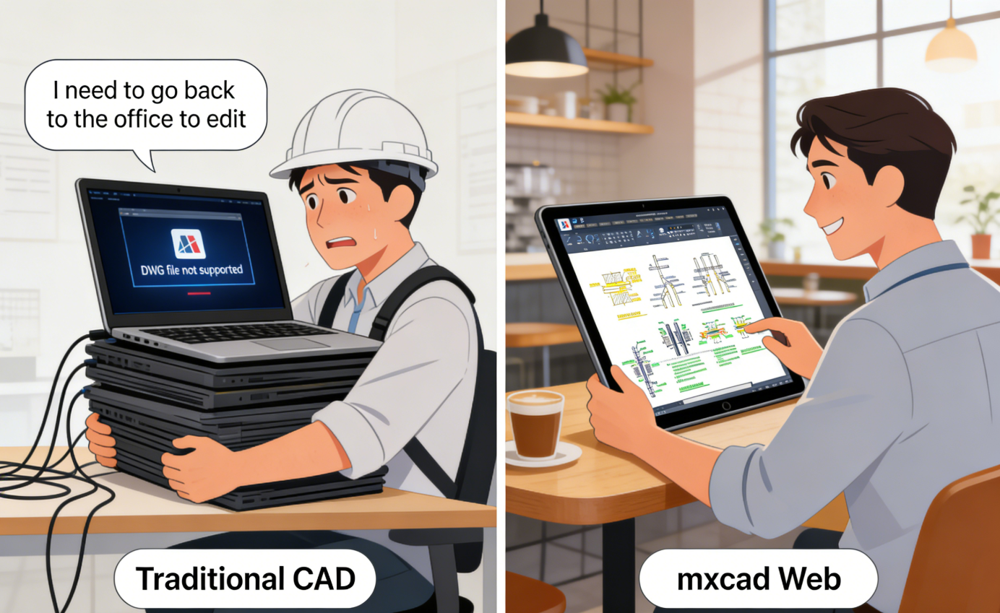
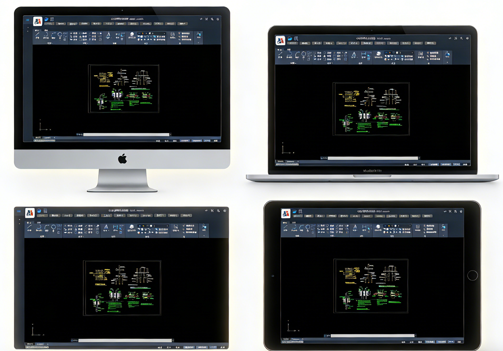
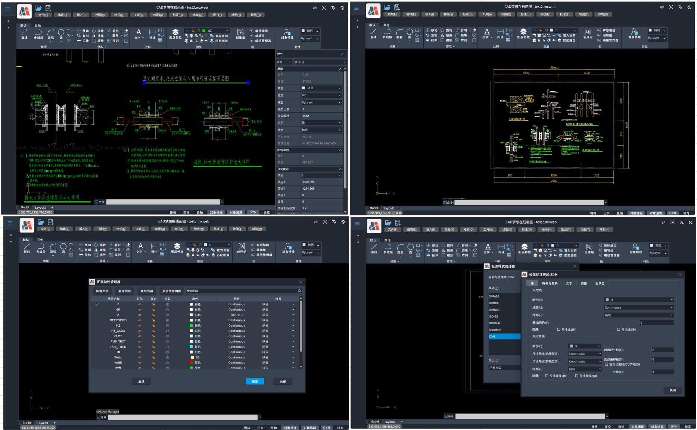
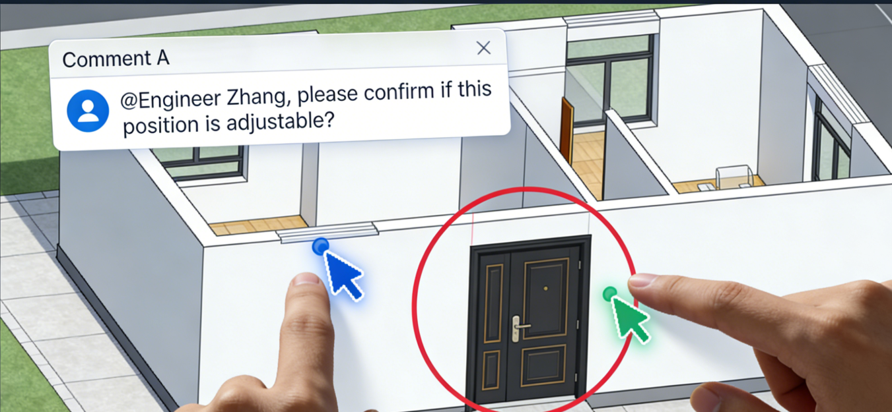
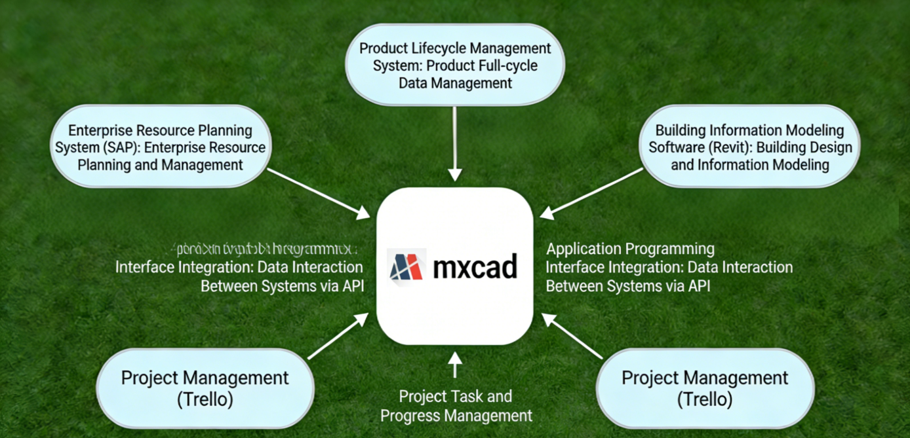

# mxcad Web CAD Platform: A Cross-Platform Collaborative Design Solution for Designers

## Abstract
mxcad is a professional-grade CAD application based on the browser, supporting full compatibility with DWG/DXF formats, enabling multi-user collaboration, automatic cloud saving, and cross-device access. This article targets architects, mechanical, industrial, and interior designers, explaining how it solves core pain points of traditional desktop CAD in mobile office work, team collaboration, and creative freedom.

## 1. Introduction: Designers' Creativity Should Not Be Limited by Tools
Traditional CAD software relies on specific operating systems, high-performance hardware, and local installation, making it difficult for designers to respond to modification requests in a timely manner in non-office scenarios (such as client sites, construction sites, remote meetings). Confused file versions and inefficient collaborative communication further consume professional value.

mxcad implements complete 2D CAD functionality through pure Web technology, allowing designers to directly edit original DWG drawings on any internet-connected device—including Windows, macOS, iPad, and Android tablets—without installation, conversion, or waiting.

## 2. Zero Installation and Cross-Platform Access: Enter Design Mode Anytime, Anywhere

### 2.1 Quick Start, Lowering the Barrier to Use
*   Users enter the drawing interface within 5 seconds after accessing the URL.
*   No need to download installation packages or activate licenses for first-time use.
*   Supports mainstream browsers: Chrome, Edge, Safari, Firefox.

### 2.2 Consistent Experience Across All Platforms
*   Operation logic is highly similar to AutoCAD, reducing learning costs.
*   Graphic rendering precision error is less than 0.001mm, complying with engineering drawing standards.
*   Devices with 16GB RAM can smoothly handle complex drawings over 20MB.

**Typical Application Scenarios:** Freelance designers modifying floor plans on an iPad in a coffee shop; construction engineers viewing and annotating construction drawings on an Android tablet at a construction site.

## 3. Professional-Grade Functionality Support: Meeting Formal Drawing Requirements
mxcad provides complete 2D drawing and editing capabilities, including:
*   **Basic Graphic Drawing:** Lines, polylines, circles, splines, rectangles, etc.
*   **Advanced Editing Commands:** Offset, trim, extend, array, mirror, stretch.
*   **Smart Dimensioning System:** Linear, angular, radius, leader annotations.
*   **Layer and Block Management:** Supports layer control, block insertion, and attribute editing.
*   **Format Compatibility:** Native support for AutoCAD 2000–2025 version DWG/DXF files.

All functions are implemented via WebAssembly and WebGL for high-performance operation, ensuring operational smoothness and visual fidelity.

## 4. Real-Time Collaborative Design: Enhancing Team Efficiency and Professional Credibility

### 4.1 Multi-User Simultaneous Editing
*   Multiple designers can edit the same drawing online simultaneously.
*   Real-time operation visibility reduces communication misunderstandings.
*   Automatic merging of modifications based on OT/CRDT algorithms avoids conflicts.

### 4.2 Collaboration Enhancement Features
*   In-drawing comments and @ reminders support task assignment.
*   Complete version history allows reverting to any point in time.
*   External link sharing supports password and expiration date controls.

This collaboration model significantly reduces inefficient links such as "file back-and-forth transmission" and "verbal explanation of modifications," making designers' professional judgments more intuitively understood by clients and partners.

## 5. Open Architecture and Industry Customization Capabilities
mxcad provides a JavaScript API and plugin architecture to support enterprise-level integration:
*   Integration with ERP, PLM, BIM systems (e.g., SAP, Glodon, Revit).
*   Industry-specific function extensions: Architectural wall libraries, mechanical tolerance dimensioning, electrical symbol libraries.
*   Custom toolbars and commands to adapt to enterprise standard workflows.

A certain equipment manufacturing enterprise used the API to automatically trigger production work orders upon drawing modifications, reducing manual intervention errors.

## 6. Technology Stack Highlights

### 6.1 High-Performance Web CAD Engine Based on WebAssembly + WebGL
*   Compiles underlying CAD geometric calculation and graphic rendering modules written in C++ into WebAssembly (WASM), achieving near-native execution efficiency in the browser.
*   Utilizes WebGL for hardware-accelerated 2D/3D graphic rendering, ensuring smooth display and interaction for complex drawings (e.g., tens of thousands of entities).
*   Supports modern browsers (Chrome, Edge, Firefox, Safari) to run professional-grade CAD functions without plugins.

### 6.2 Full-Stack SDK Architecture Supporting Multi-Terminal Integration and Secondary Development
*   Provides JavaScript/TypeScript front-end APIs that can be seamlessly embedded into mainstream frameworks like Vue and React.
*   Back-end supports docking with languages such as .NET, Java, and Node.js, facilitating integration with enterprise systems (ERP/PLM/BIM).
*   Opens command systems, event mechanisms, and custom entity interfaces, allowing deep customization of industry-specific functions (such as electrical symbols, hydraulic primitives).

## 7. Future Development Directions
mxcad will continue to invest in the following technological evolutions:
*   WebGPU rendering acceleration to improve complex graphic performance.
*   AI-assisted design: Intelligent graphic completion, drawing standard checks.
*   Compatibility with domestic CAD formats (e.g., ZWCAD, GstarCAD).

The goal is to build an open, intelligent, cross-terminal design collaboration ecosystem.

## 8. Call to Action
Designers can experience mxcad for free immediately:
*   **Online MxCAD:** [https://demo.mxdraw3d.com](https://demo.mxdraw3d.com/), https://www.webcadsdk.com/mxcad/
*   **Online MxDraw:** https://www.mxdraw3d.com/sample/vuebrowse/
*   **CAD and GIS Combination Demo:** https://www.webcadsdk.com/mxcad/?map=true&maptype=gdslwzj，https://www.mxdraw3d.com/sample/mx-vuemap/?cmd=Mx_CADGISDemo
*   **Online MxCAD3D:** https://demo2.mxdraw3d.com:3000/mxcad3d/
*   **MxCAD Cloud Drawing English Website:** https://www.webcadsdk.com/
*   **MxCAD Official Website:** https://www.mxdraw.com/

mxcad is suitable for architectural design, mechanical manufacturing, industrial design, interior decoration, engineering consulting, and education sectors, helping designers break free from equipment constraints and focus on creative expression.

## 9. Appendix: Typical Application Scenarios

| Industry | Application Scenario | Customer Value |
| :--- | :--- | :--- |
| **Architectural Design** | Remote scheme review, collaborative modification of construction drawings | Shortens delivery cycle by 30% |
| **Mechanical Manufacturing** | On-site drawing viewing and annotation in workshops | Reduces rework, improves production accuracy |
| **Education and Training** | Unified teaching environment in student computer labs | No installation required, IT maintenance costs approach zero |
| **Engineering Consulting** | Joint design by teams in multiple locations | Breaks geographical restrictions, efficient resource allocation |

## Keywords
Web CAD, Online CAD, Designer Collaboration Tool, Online DWG Editing, Cross-Platform CAD, Real-Time Collaborative Design, Cloud CAD, mxcad, No-Install CAD

## Target User Roles
*   Architects
*   Mechanical Engineers
*   Industrial Designers
*   Interior Designers
*   Freelancers
*   Small and Medium-sized Design Institutes
*   Engineering Education Institutions