# MxDraw Cloud Drawing Development Kit Structure and Function Description (Essential for Beginners) 

## 1. What is the MxDraw Cloud Drawing Development Kit 

The Cloud Drawing Development Kit is a **complete set of engineering collections for CAD cloudification solutions built around MxCAD**. It is not a single SDK, but a package of projects that unifies **background drawing conversion, service interfaces, front-end project examples, and MxCAD editing & browsing capabilities**. For beginners, it can be understood this way: the Cloud Drawing Development Kit has already split a "CAD cloud system" into corresponding directories for you. 

**Note**: The Cloud Drawing Development Kit provides corresponding versions for different operating systems (such as Windows, Linux, etc.), and the executable program form, deployment method and startup method of the development kit may vary. However, regardless of the operating system it runs on, the Cloud Drawing Development Kit remains consistent in terms of functions and overall architecture design. The directory responsibilities, core capabilities and usage methods are not affected by the platform, and the architecture and descriptions in this document apply to all operating system versions. 

## 2. Overview of the Overall Directory Structure 

The root directory of the MxDraw Cloud Drawing Development Kit is: 

Windows:

```
MXDRAWCLOUDSERVER1.0_XXX_TRYVERSION （where XXX is the version number of the Cloud Drawing Development Kit）
└─ MxDrawCloudServer   （Root directory of the Cloud Drawing Development Kit
```
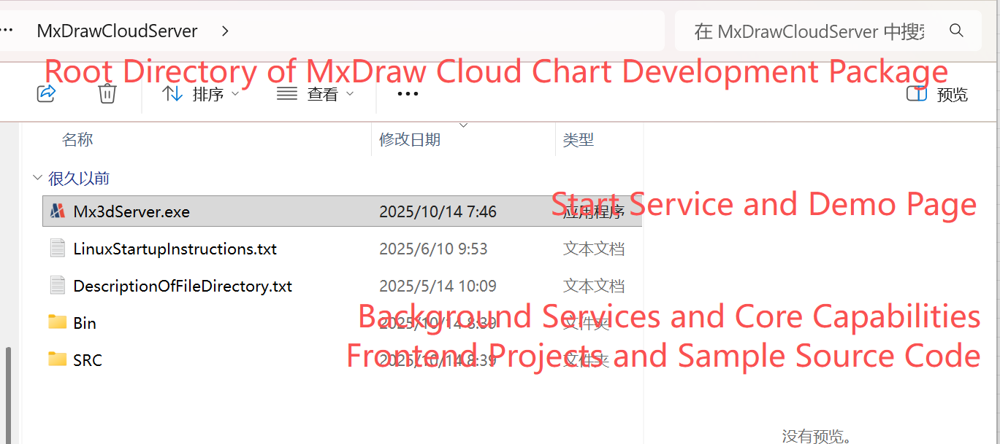 

Linux:

```
MXDRAWCLOUDSERVER1.0_XXX_xxx_TRYVERSION （where XXX is the version number of the Cloud Drawing Development Kit, xxx is the corresponding operating system）
└─ install
   └─ MxDrawCloudServer   （Root directory of the Cloud Drawing Development Kit）
```
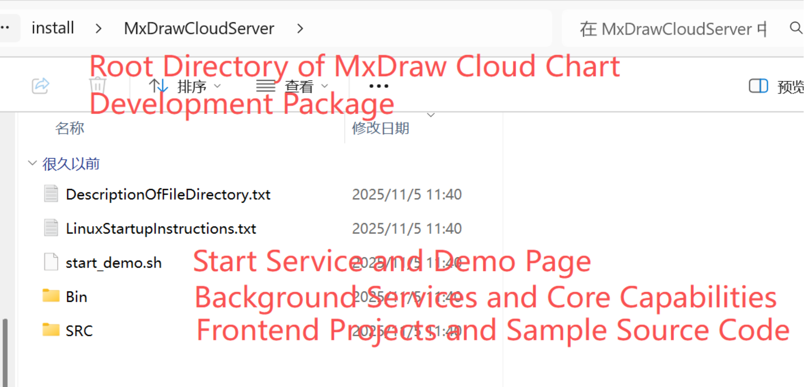 From a functional perspective, the directories can be divided into three main parts:

1. **Bin: Background Services and Core Capabilities** 

2. **SRC: Front-end Projects and Sample Source Code** 

3. **Mx3dServer.exe: Start services and demo pages (Windows)**  

   **start_demo.sh: Start services and demo pages (Linux)** 

For beginners to understand the Cloud Drawing Development Kit, as long as you first understand the division of labor of these three parts, you won't get lost. 

 ## 3. Bin Directory: Background Service-related Directory (Core)

 Windows: 

```
MxDrawCloudServer
└─ Bin
   └─ MxCAD   （Drawing conversion program directory）
   └─ MxDrawServer   （Background service directory of the MxCAD project）
```

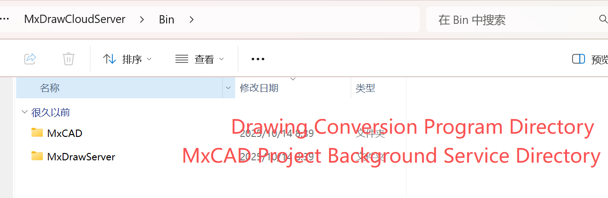 Linux:

```
MxDrawCloudServer
└─ Bin
   └─ Linux   
       └─ MxCAD   （Drawing conversion program directory）
       └─ MxDrawServer   （Background service directory of the MxCAD project）
```

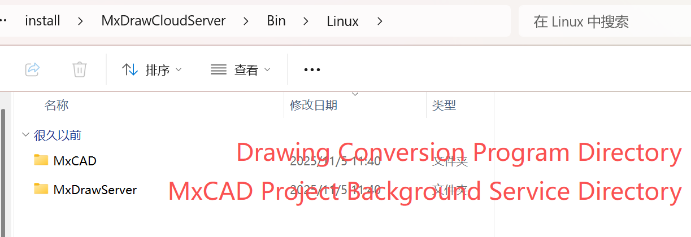 **Bin is the core directory in the Cloud Drawing Development Kit**, which bears the necessary background capabilities for CAD cloudification. 

### 1. MxCAD —— Drawing Conversion Program Directory 

* Used for **conversion and processing of CAD drawings** 
* Converts the format of original drawings such as DWG / DXF
* Is a prerequisite for the cloud drawing system to "display CAD online" 

Without the corresponding conversion program in this directory, the front end cannot directly display and edit CAD drawings. 

### 2. MxDrawServer —— Background Service Directory of the MxCAD Project

* Provides **background interface services required within the MxCAD project** 

* Offers service support for CAD drawing loading, processing, interaction and other capabilities 

* Is part of the **MxCAD engineering system** 

This is a key background module connecting "drawing data" and "CAD functions". 

## 4. SRC Directory: Front-end Project-related Directory 

Windows/Linux: 

```
MxDrawCloudServer
└─ SRC
   └─ sample   （Front-end project sample code directory）
   └─ TsWeb   （Web front-end portal of cloud services）
   └─ doc   （Document directory）
```

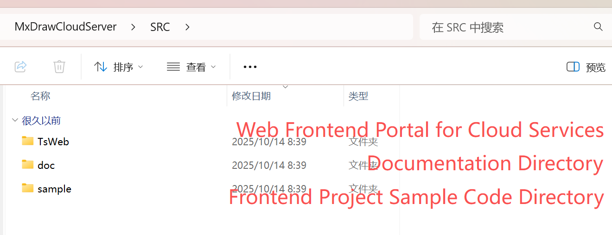 The SRC directory is a core area for developers in the MxDraw Cloud Drawing Development Kit, containing all openable front-end sample project source codes, integration templates and supporting documents. Whether you want to quickly experience the functions or conduct in-depth secondary development, you should start with this directory. 

### 1. doc —— Document Directory (empty folder by default) 

* Stores instruction documents, API manuals or integration guides related to front-end projects. 
* Developers can supplement custom instructions here to assist team collaboration or project handover. 

### **2.** TsWeb—— Web Service and Frontend Resource Hosting Module

The TsWeb directory is a core component of the MxDraw Cloud Drawing SDK, responsible for **hosting web frontend services and acting as an API proxy**. Built on Node.js and the Express framework, it does not perform CAD graphics computations. Instead, it serves as a "bridge" between the user's browser and the backend CAD engine, providing capabilities such as page loading, resource distribution, and lightweight API forwarding.

### 3. sample —— Front-end Project Sample Code Directory (Key) 

Windows/Linux:

```
MxDrawCloudServer
└─ SRC
   └─ app   （Integration examples of mxcad-app in projects with different architectures）
   └─ Edit   （Source code directory of the CAD editing version project）   
```

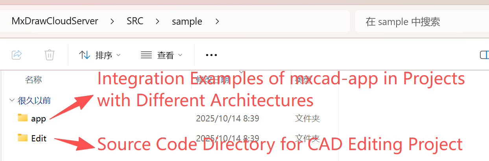 This directory provides complete front-end engineering examples for various typical application scenarios, covering core capabilities such as browsing, editing, 3D, GIS, etc., and is the best entry point for beginners to learn and reference projects.

#### (1) app —— Source code of CAD editing project examples integrating the mxcad-app dependency package 

Windows/Linux: 

```
MxDrawCloudServer
└─ SRC
   └─ sample   （Front-end project sample code directory） 
       └─ app   （Source code of integration examples of mxcad-app in projects with different architectures）
          └─ MxCADApp   （Vue2+Webpack）
          └─ plugins   （Project plugin directory）
             └─ pluginAiChat   （AI module）
          └─ sample
             └─ webapack4 
             └─ html+js
             └─ vite+vue3
             └─ webapck+react
             └─ cnd.html
```

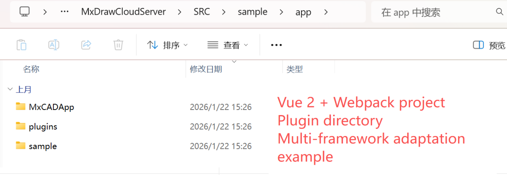 Provides standard ways to integrate `mxcad-app` under different front-end technology stacks: 

* `MxCADApp`: A complete editor project based on Vue2 + Webpack 

* `plugins`: Built-in plugin extension mechanism, such as `pluginAiChat` (AI chat module) 

* Multi-framework adaptation examples: Including `vite+vue3`, `webpack+react`, `html+js` and CDN introduction method (`cnd.html`)

 #### (2) Browse —— Source code directory of the CAD browsing version project 

Windows/Linux: 

```
MxDrawCloudServer
└─ SRC
   └─ sample   （Front-end project sample code directory） 
      └─ Browse   （CAD browsing version project example）
          └─ 2d 
             └─ Browseiframe   （iframe nested integration example）
             └─ Browse   （Source code directory of the CAD browsing version project）
```

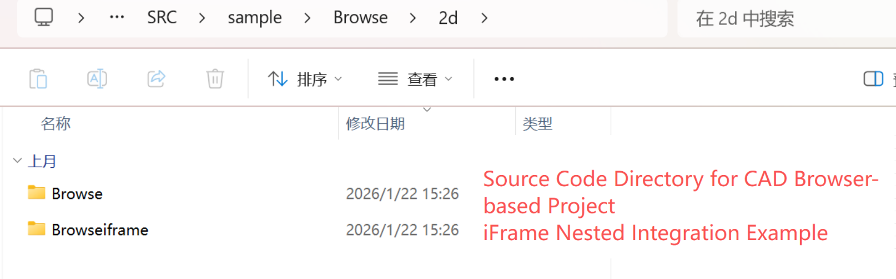 Focuses on drawing viewing scenarios and supports lightweight deployment: 

* `2d/Browse`: Pure 2D drawing browsing page 

* `2d/Browseiframe`: Browsing mode integrated through `iframe` nesting, easy to embed into third-party systems

 #### (3) Edit—— Source code directory of the CAD editing version project 

Windows/Linux: 

```
MxDrawCloudServer
└─ SRC
   └─ sample   （Front-end project sample code directory） 
      └─ Edit   （CAD editing version project example）
          └─ 2d  （2D drawing project）
             └─ dist   （Static resource package of MxCAD APP）
             └─ MxCAD   （Source code directory of a plugin in MxCAD APP）
             └─ MxCADiframe   （iframe nested integration example）
```

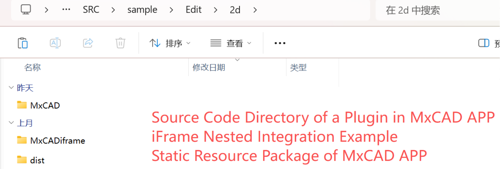 Provides complete online editing capabilities: 

* `Edit/2d`: 2D drawing editing environment, including toolbar, property panel, etc. 
* `dist` subdirectory: Precompiled static resource package, which can be directly deployed to web servers

## 5. Mx3dServer.exe/start_demo.sh: Mxdraw Cloud Drawing Startup Entry 

`Mx3dServer.exe` (Windows) and `start_demo.sh` (Linux) are the **unified startup entries** of the MxDraw Cloud Drawing Development Kit, used to initialize the entire CAD cloud service environment with one click. They shield complex details such as background service configuration, port binding, and dependency startup, allowing developers or users to enter the demo state only by "double-clicking" or "executing the script". 

### 1. **Mx3dServer.exe: Dream Cloud Drawing Service Startup Program (Graphical Entry)** 

`Mx3dServer.exe` is the **graphical startup program** of the MxDraw Cloud Drawing Development Kit on the Windows platform. Double-clicking to run it will automatically pop up the "Dream Cloud Drawing Service Startup Program" window. This program integrates the unified management and quick access functions of multi-module services, which greatly simplifies the deployment process, allowing developers and users to start a complete online CAD demo environment with one click without manual configuration. 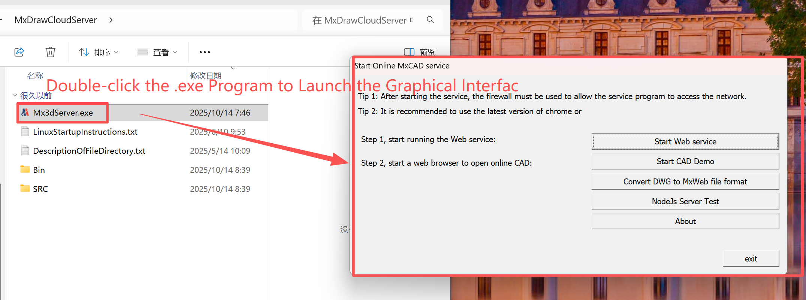 

* **Start Web Service**:   

  When you click the **"Start Web Service"** 

  button, MxDraw will automatically start two key local service programs. These two services work together to support a complete online CAD function experience.   

  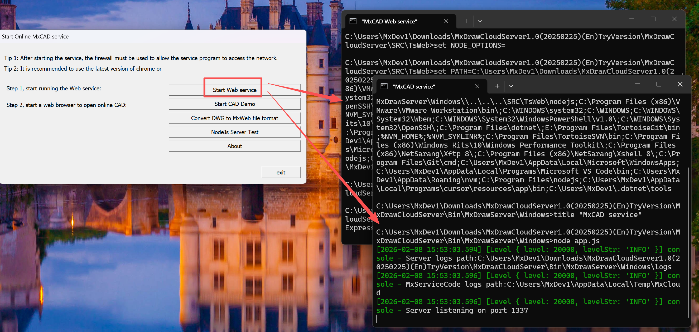

* **First Service (Port 1337): CAD Core Engine**     

  This service is started by the `Bin/MxDrawServer/Windows/app.js` script and is the "brain" of MxDraw. It is responsible for processing all underlying operations related to drawings, such as opening DWG files, parsing graphic data, saving editing results, etc. Although you cannot see its interface, all CAD functions rely on it to complete.     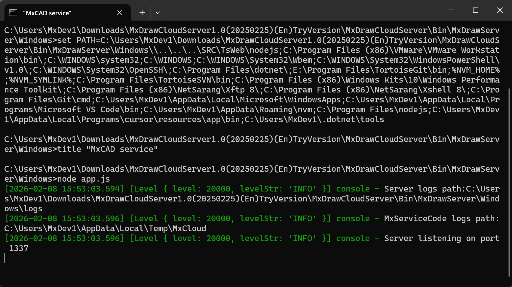   

* **Second Service (Port 3000): Web Front-end Server**     

  This service is started by the `SRC/TsWeb/app.js` script and is the user's "operation window". It is built based on the Express framework and is responsible for hosting all web files (such as 2D editor, 3D viewer, file browser, etc.), and forwarding your operation requests to the CAD engine. The interfaces, buttons, and toolbars you see are all provided by this service.     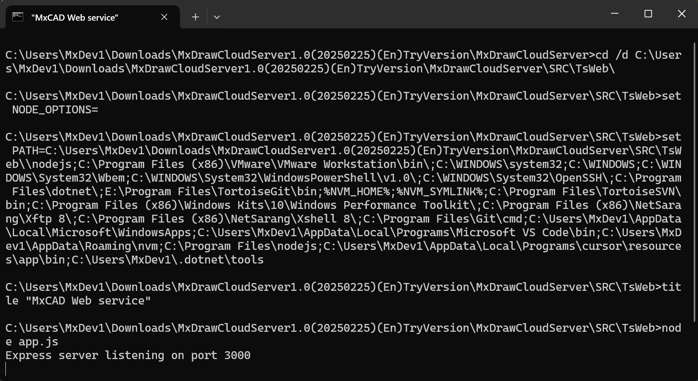 

* **Start MxCAD**   

  Open the 2D CAD online editor, which supports complete editing functions such as drawing, modification, annotation, upload, and save, suitable for engineering design scenarios.  

  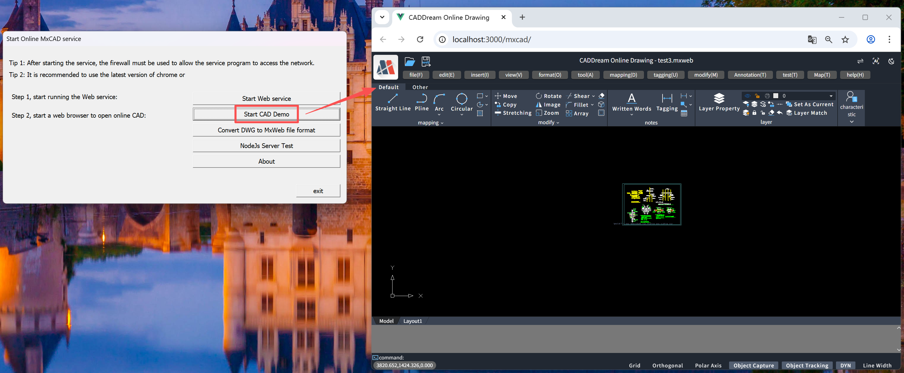 

* **NodeJs Service Test**   

  Open the `http://localhost:1337/serverTest` page, which provides a visual test function for one-click calling core CAD interfaces such as DWG conversion, PDF export, and layer reading.   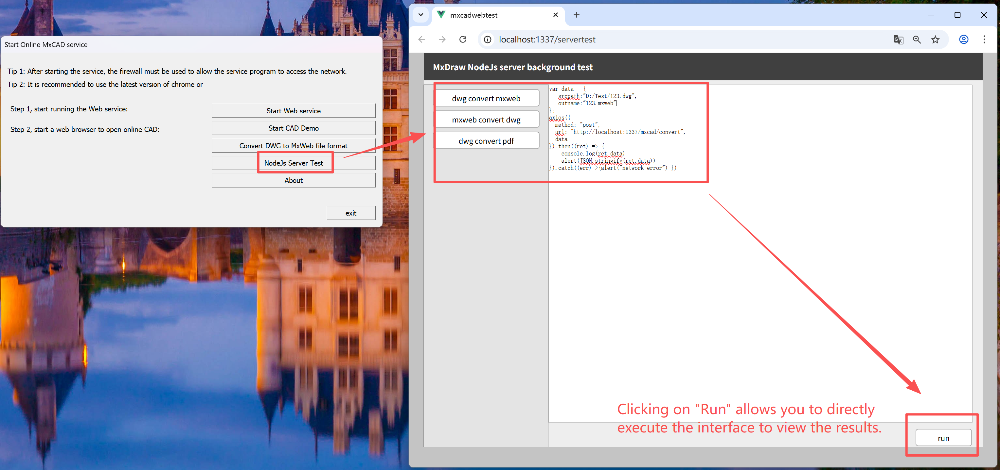 

- **Convert DWG to Dream File Format**  

  Start the DWG format conversion tool to batch convert standard AutoCAD DWG files to MxDraw's proprietary `.mxweb` format, improving loading speed and compatibility.   

  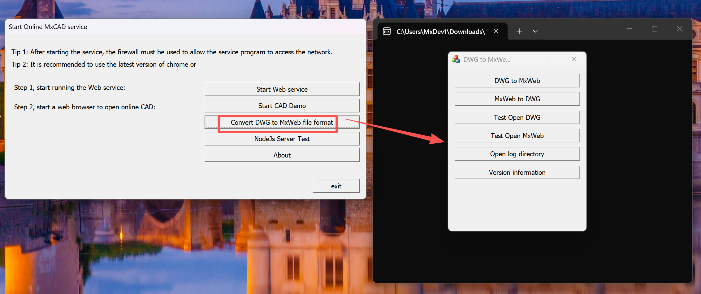

- **About**  

  Displays software version number and copyright information.   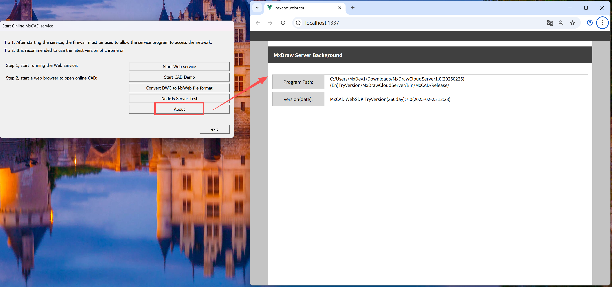 

- **Exit**   

  Close the startup program window. 

  > Tip: When running for the first time, please allow the network access permission of `Mx3dServer.exe` in the Windows Firewall to ensure the service can be connected normally. It is recommended to use the latest version of Chrome or Edge browser for the best experience. 

### 2. start_demo.sh: **Cloud Drawing Service Startup Script for Linux Platform** 

`start_demo.sh` is the **standard startup script** of the MxDraw Cloud Drawing Development Kit on the **Linux system**, used to initialize a complete Web CAD demo environment with one click. Its functions are completely equivalent to `Mx3dServer.exe` on the Windows platform, ensuring a consistent cross-platform experience. 

### **Core Functions**

* Start two key services at the same time:  
  * CAD Core Service** (Node.js): Runs on port `1337`, providing underlying capabilities such as DWG parsing, drawing command execution, and format conversion; 
  *  **Web Front-end Service** (Express): Runs on port `3000`, hosting all demo pages (such as 2D editor, 3D viewer, file browser, etc.). 
* Automatically configure service paths and dependencies without manually executing multiple commands. 

### **Usage Steps** 

1. **Check the LinuxDemo Startup Instructions in Advance**   

   Refer to "LinuxDemo Startup Instructions.txt" to set permissions and run.    

   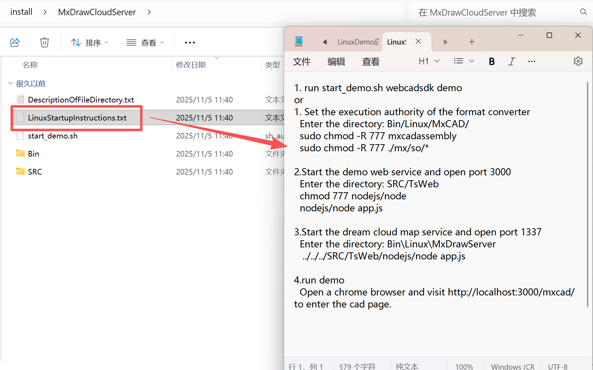

2. **Execute the Startup Script**   

   ```
   ./start_demo.sh
   ```

3. **Access the Demo Page**   

   After the service starts successfully, open the following in the browser:  

   * Home page: `http://localhost:3000`   
   * 2D Editing: `http://localhost:3000/mxcad` 

### **Notes** 

- The script starts the service in the background by default. If debugging is needed, modify the script to remove the `&` symbol to view real-time logs; 

- If the port is occupied, the `PORT` variable in the script can be edited to adjust; 

  >  **Tip**: Although there is no graphical interface, `start_demo.sh` provides the same functional integrity as the Windows `.exe` file, and is a standard entry point for Linux developers to quickly verify and integrate MxDraw cloud drawing capabilities.

