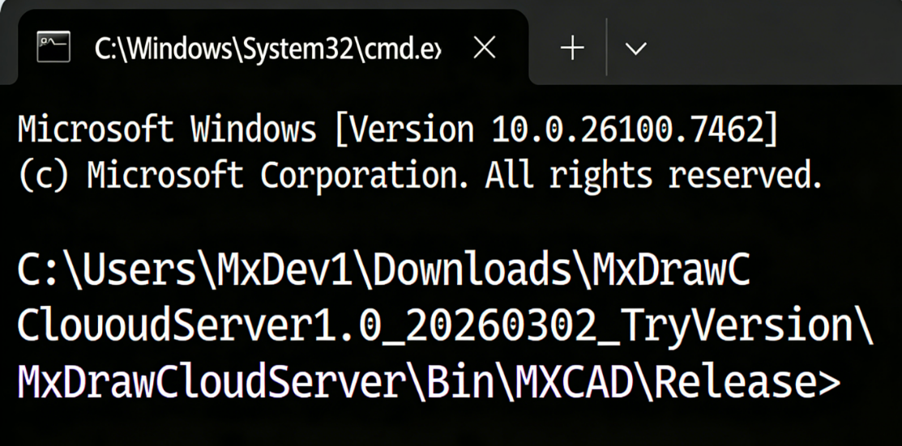
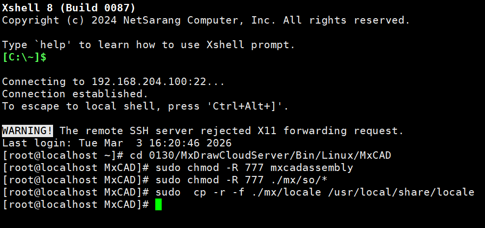
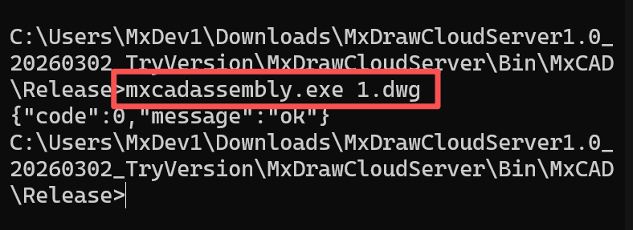
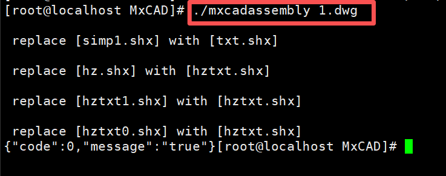
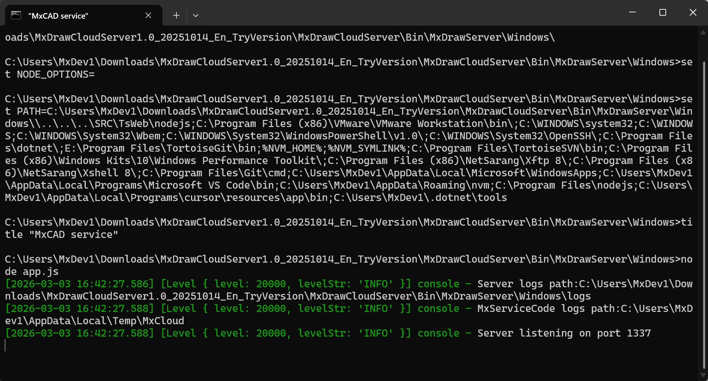
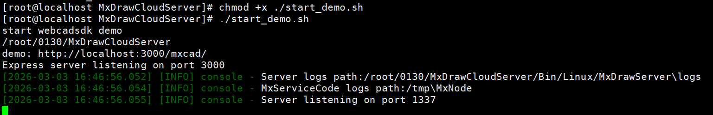

# MxDraw Cloud Map Development Kit Drawing Conversion Function Usage Guide

## I. Pre-conversion Preparation: Download the Latest Cloud Map Development Kit

Drawing format conversion relies on the MxDraw Cloud Map Development Kit. Please download the corresponding version based on your operating system:

**Windows Version:**

*   https://www.webcadsdk.com/downloads/MxDrawCloudServer1.0_20251014_En_TryVersion.7z

**Linux X86_64 Version:**

*   https://www.webcadsdk.com/downloads/MxDrawCloudServer1.0_20251014_En_Ubuntu20_TryVersion.tar.gz

If you are not yet familiar with the structure of the Cloud Map Development Kit, you can view the [Cloud Map Development Kit Instructions](./2.Cloud%20Map%20Development%20Kit%20Instructions.md). This document details the structure and functions of the development kit, helping you get started with the drawing conversion function faster.

## II. Core Principle of Drawing Conversion

The drawing conversion capability of the MxDraw Cloud Map Development Kit relies primarily on the `MxCAD` drawing conversion program located in the `Bin` directory within the kit (`Bin/MxCAD` for Windows systems, `Bin/Linux/MxCAD` for Linux systems). All drawing conversion operations, regardless of the invocation method used, essentially trigger this conversion program to execute format processing logic.

The development kit adapts the deployment path of the conversion program for different operating systems (Windows/Linux) (e.g., adding a `Linux` subdirectory for Linux), and Linux systems require additional permission configuration for the conversion program, but the core invocation logic remains consistent across platforms.

## III. Supported Scope for Drawing Conversion

The conversion program of the MxDraw Cloud Map Development Kit supports multi-format interconversion, and all format conversions allow custom specification of the drawing conversion range. Supported conversion formats include:

**Source/Target Formats:** DWG, DXF, MXWEB (MxCAD proprietary format, improves online loading speed), PDF, JPG.

## IV. Two Implementation Methods for Drawing Conversion

### Method 1: Direct Command Line Invocation of the Conversion Program

**1. Prerequisites**

* **Windows System:** Directly navigate to the `MxDrawCloudServer/Bin/MxCAD` directory (the path where the conversion program is located).

  

* **Linux System:**

  * Navigate to the `MxDrawCloudServer/Bin/Linux/MxCAD` directory.

  * Execute permission configuration commands to grant executable permissions to the conversion program:

    ```bash
    sudo chmod -R 777 mxcadassembly
    sudo chmod -R 777 ./mx/so/*
    sudo cp -r -f ./mx/locale /usr/local/share/locale
    ```

    *(Note: You can directly refer to `LinuxDemo Startup Instructions.txt` inside the development kit)*

    

**2. Invocation Method**

After entering the directory where the conversion program is located in the command line terminal (Windows: CMD/PowerShell; Linux: Shell), execute the corresponding conversion command. For specific conversion commands, please refer to the section below: [V. Detailed Explanation of File Format Conversion Commands](#v-detailed-explanation-of-file-format-conversion-commands)

* **Windows:**

  

* **Linux:**

  

### Method 2: Invoke the Port 1337 Conversion Interface

**1. Prerequisites**

Start the CAD core engine service of the Cloud Map Development Kit to ensure the port 1337 service is running normally:

* **Windows System:** Double-click `MxDrawCloudServer/Mx3dServer.exe`, click "Start Web Service", which automatically starts the CAD core engine service for port 1337 (driven by `Bin/MxDrawServer/Windows/app.js`).

  

* **Linux System:** Execute the startup script to start the port 1337 service:

  ```bash
  ./start_demo.sh
  ```

  *(The script will automatically start the CAD core service on port 1337 and the Web service on port 3000)*

  

**2. Interface Invocation Method**

Call the drawing conversion interface at `http://localhost:1337/mxcad/convert` on port 1337 via HTTP request. Core interface parameters include source file path/URL, target format, conversion range, etc. It supports POST/GET invocation methods (POST is recommended). For specific interface parameter settings, please refer to the section below: [V. Detailed Explanation of File Format Conversion Commands](#v-detailed-explanation-of-file-format-conversion-commands)

**Basic Invocation Example (HTTP POST)**

* **Windows:**

  ```javascript
  var data = {
     srcpath:"D:/Test/123.dwg",
     outname:"123.mxweb"
  };
  axios({
    method: "post",
    url: "http://localhost:1337/mxcad/convert",
    data 
  }).then((ret) => {
      console.log(ret.data)
      alert(JSON.stringify(ret.data))
  }).catch((err)=>{alert("Network Error") })
  ```

* **Linux:**

  ```bash
  curl -X POST http://localhost:1337/mxcad/convert \
    -H "Content-Type: application/json" \
    -d '{"srcpath":"/home/user/test/123.dwg","outname":"123.mxweb","outpath":"/home/user/output"}'
  ```

**Convenient Interface Testing Method**

You can directly call the conversion interface through the visual test page provided by the development kit:

1.  Ensure the port 1337 service is started.
2.  Open a browser and visit `http://localhost:1337/servertest`.
3.  Find the "DWG Conversion" related test module on the page, select the source file, target format, and conversion range, then click "Run" to trigger the conversion.

Regardless of whether the command line or interface invocation method is used, both are based on the same set of conversion programs, ensuring consistency in conversion logic, format support, and range control:

*   **Command Line Method:** Suitable for batch offline conversion and automated script integration.
*   **Port 1337 Interface Method:** Suitable for online business system integration, supporting remote invocation by front-end/third-party services without directly operating the underlying program.

## V. Detailed Explanation of File Format Conversion Commands

Based on the overall style of the document (clear hierarchy, code block differentiation, table parameter descriptions, concise technical language), the content regarding "DWG, DXF to MXWEB" has been formatted and linguistically optimized for better readability and consistency with the rest of the text.

### 1. DWG, DXF to MXWEB

Supports converting AutoCAD standard formats (`.dwg`, `.dxf`) to MxCAD's proprietary Web format (`.mxweb`) to improve loading and rendering speed of drawings in the cloud.

**(1) Direct Command Line Invocation**

**① Default Conversion (Fast Mode)**
If no specific path is specified, the program will automatically read files with the same name in the directory parallel to the conversion program.

* **Output Naming:** Original filename + `.mxweb` (e.g., `1.dwg` → `1.dwg.mxweb`)

* **Output Location:** Same directory as the source file

* **Windows:**

  ```bash
  # Convert DWG file
  mxcadassembly.exe 1.dwg
  
  # Convert DXF file
  mxcadassembly.exe 1.dxf
  ```

* **Linux:**

  ```bash
  # Convert DWG file
  ./mxcadassembly 1.dwg
  
  # Convert DXF file
  ./mxcadassembly.exe 1.dxf
  ```

**② Custom Conversion (Advanced Mode)**
Supports specifying source file path, output directory, and filename, and allows control over compression strategy.

* **Output Naming:** If no extension is written, `.mxweb` is added by default; `.mxweb` extension can also be manually specified.

* **Windows:**

  ```bash
  mxcadassembly.exe {"srcpath":"D:\test2.dwg","outpath":"D:\test","outname":"test", "compression":0}
  ```

* **Linux:**

  ```bash
  ./mxcadassembly '{"srcpath":"/home/user/test2.dwg","outpath":"/home/user/test","outname":"test", "compression":0}'
  ```

**Parameter Description:**

| Parameter     | Description                                                  |
| :------------ | :----------------------------------------------------------- |
| `srcpath`     | Full path of the source file to be converted                 |
| `outpath`     | Target path for the output file (if empty, defaults to the same directory as the source file) |
| `outname`     | Output filename (Note: Explicit extension required when converting MXWEB to CAD) |
| `compression` | Compression control: `0` means no compression; if this attribute is not passed, compression is performed by default |

**(2) Interface Invocation Method**

Call the conversion service on local port `1337` via HTTP POST request.

**Request Example:**

* **Windows:**

  ```javascript
  var data = {
     srcpath: "C:/test/a.dwg",
     outname: "123.mxweb",
     outpath: "E:/"
  };
  
  axios({
    method: "post",
    url: "http://localhost:1337/mxcad/convert",
    data: data 
  }).then((ret) => {
      console.log(ret.data);
      alert(JSON.stringify(ret.data));
  }).catch((err) => {
      alert("Network Error");
  });
  ```

* **Linux:**

  ```bash
  curl -X POST  "http://localhost:1337/mxcad/convert " \
    -H  "Content-Type: application/json " \
    -d '{
       "srcpath ":  "XXX/a.dwg ",
       "outname ":  "123.mxweb ",
       "outpath ":  "XXX "
    }'
  ```

### 2. MXWEB to DWG, DXF

Supports reverse converting MxCAD Web format (`.mxweb`) back to AutoCAD standard formats (`.dwg` or `.dxf`) for secondary editing or archiving in local CAD software.

**(1) Direct Command Line Invocation**

Specify source file, output path, and target filename via JSON parameters. **Note:** The output filename must explicitly include the `.dwg` or `.dxf` extension to determine the target conversion format.

* **Windows:**

  ```bash
  # Convert to DWG format
  mxcadassembly.exe { "srcpath ": "D:\test.mxweb ", "outpath ": "D:\ ", "outname ": "test.dwg "}
  
  # Convert to DXF format
  mxcadassembly.exe { "srcpath ": "D:\test.mxweb ", "outpath ": "D:\ ", "outname ": "test.dxf "}
  ```

* **Linux:**

  ```bash
  # Convert to DWG
  ./mxcadassembly '{ "srcpath ": "/home/user/data/test.mxweb ", "outpath ": "/home/user/data/ ", "outname ": "test.dwg "}'
  
  # Convert to DXF
  ./mxcadassembly '{ "srcpath ": "/home/user/data/test.mxweb ", "outpath ": "/home/user/data/ ", "outname ": "test.dxf "}'
  ```

**Key Parameter Description:**

*   `srcpath`: Path of the `.mxweb` source file to be converted.
*   `outpath`: Save directory for the converted file.
*   `outname`: Must include extension (e.g., `test.dwg`); the program will automatically identify the target conversion format based on the extension.

**(2) Interface Invocation Method**

Perform format reversal by calling the local service via HTTP POST request.

**Request Example:**

* **Windows:**

  ```javascript
  var data = {
     srcpath: "D:/Test/123.mxweb",
     outname: "123new.dwg",  // Specify output as .dwg format
     outpath: "D:/"
  };
  
  axios({
    method: "post",
    url: "http://localhost:1337/mxcad/convert",
    data: data 
  }).then((ret) => {
      console.log(ret.data);
      alert(JSON.stringify(ret.data));
  }).catch((err) => {
      alert("Network Error");
  });
  ```

* **Linux:**

  ```bash
  curl -X POST  "http://localhost:1337/mxcad/convert " \
    -H  "Content-Type: application/json " \
    -d '{
       "srcpath ":  "XXX/123.mxweb ",
       "outname ":  "123new.dwg ",
       "outpath ":  "XXX "
    }'
  ```

**Tip:** Unlike "DWG to MXWEB", this process must explicitly specify the `.dwg` or `.dxf` extension in `outname`, otherwise the format conversion cannot be completed.

### 3. DWG to PDF

Supports directly converting AutoCAD drawings (`.dwg`) to Portable Document Format (`.pdf`), suitable for drawing preview, print archiving, and sharing in non-CAD environments. Supports custom output resolution and color strategies.

**(1) Direct Command Line Invocation**

Configure source file, output name, image dimensions, and color mode via JSON parameters.

* **Windows:**

  ```bash
  mxcadassembly.exe {'srcpath':'C:/test/1.dwg','outname':'1.pdf','width':'5000','height':'5000','colorPolicy':'mono','exportLayout':'false','outpath':'C:/'}
  ```

* **Linux:**

  ```bash
  ./mxcadassembly '{ "srcpath ": "/absolute/path/to/1.dwg ", "outname ": "1.pdf ", "width ": "5000 ", "height ": "5000 ", "colorPolicy ": "mono ", "exportLayout ": "false ", "outpath":"XXX/XXX/"}'
  ```

**Parameter Description:**

| Parameter      | Description                                                  |
| :------------- | :----------------------------------------------------------- |
| `srcpath`      | Path of the `.dwg` source file to be converted               |
| `outpath`      | Target path for the output file (if empty, defaults to the same directory as the source file) |
| `outname`      | Output filename (must include `.pdf` extension)              |
| `width`        | Width of the output PDF (pixels)                             |
| `height`       | Height of the output PDF (pixels)                            |
| `colorPolicy`  | Color strategy: `mono` indicates black and white; if not set, defaults to **Color** |
| `exportLayout` | Whether to export layout space; if not set, defaults to **Export** |

**Note:** If `colorPolicy` is not set, the generated PDF will retain the original image colors; setting it to `mono` generates a black-and-white grayscale drawing, often used in engineering printing to save toner.

**(2) Interface Invocation Method**

Call the local service via HTTP POST request, supporting more flexible dynamic parameter configuration (such as layout export control, etc.).

**Request Example:**

* **Windows:**

  ```javascript
  var data = {
     srcpath:  "C:/test/123.dwg ",
     outpath:  "C:/ ",          // Output directory
     outname:  "123.pdf ",      // Output filename
     width:  "2000 ",           // Custom width
     height:  "2000 ",          // Custom height
     // colorPolicy:  "mono ",  // Optional: Uncomment to enable black and white mode
     // exportLayout:  "false " // Optional: Control whether to export layout space
  };
  
  axios({
    method:  "post ",
    url:  "http://localhost:1337/mxcad/convert ",
    data: data 
  }).then((ret) => {
      console.log(ret.data);
      alert(JSON.stringify(ret.data));
  }).catch((err) => {
      alert( "Network Error ");
  });
  ```

* **Linux:**

  ```bash
  curl -X POST  "http://localhost:1337/mxcad/convert " \
    -H  "Content-Type: application/json " \
    -d '{
       "srcpath ":  "XXX/XXX/123.dwg ",
       "outpath ":  "XX/ ",
       "outname ":  "123.pdf ",
       "width ":  "2000 ",
       "height ":  "2000 "
    }'
  ```

**Tip:** When calling the interface, `colorPolicy` and `exportLayout` are optional parameters. If a black and white PDF is needed, please uncomment `colorPolicy: "mono"`.

### 4. DWG and DXF Interconversion

This function supports bidirectional lossless conversion between two mainstream AutoCAD formats:

*   **DWG to DXF:** Converts binary DWG files to text or binary DXF format, facilitating cross-platform data exchange.
*   **DXF to DWG:** Restores DXF files to standard DWG format to optimize storage volume and loading performance.

**(1) Direct Command Line Invocation**

Automatically identify the conversion direction via the extension (`.dxf` or `.dwg`) of the `outname` parameter.

* **Windows:**

  ```bash
  # DWG to DXF
  mxcadassembly.exe { "srcpath ": "D:\test.dwg ", "outpath ": "D:\ ", "outname ": "test.dxf "}
  
  # DXF to DWG
  mxcadassembly.exe { "srcpath ": "D:\test.dxf ", "outpath ": "D:\ ", "outname ": "test.dwg "}
  ```

* **Linux:**

  ```bash
  # DWG to DXF
  ./mxcadassembly '{ "srcpath ": "/home/user/data/test.dwg ", "outpath ": "/home/user/data/ ", "outname ": "test.dxf "}'
  # DXF to DWG
  ./mxcadassembly '{ "srcpath ": "/home/user/data/test.dxf ", "outpath ": "/home/user/data/ ", "outname ": "test.dwg "}'
  ```

**Operation Logic:**

1.  The program reads the source file specified by `srcpath`.
2.  Determines the target format based on the extension filled in `outname`.
3.  Saves the result to the directory specified by `outpath` (if empty, saves in the same directory as the source file).

**(2) Interface Invocation Method**

Supports flexible conversion via HTTP POST request; `outpath` is an optional parameter.

* **Windows:**

  ```javascript
  var data = {
     srcpath: "D:/Test/123.dwg",
     outname: "123.dxf",    // Change extension to change conversion direction
     outpath: "D:/"         // Specify output directory
  };
  
  axios({
    method: "post",
    url: "http://localhost:1337/mxcad/convert",
    data: data 
  }).then((ret) => {
      console.log(ret.data);
      alert(JSON.stringify(ret.data));
  }).catch((err) => {
      alert("Network Error");
  });
  ```

* **Linux:**

  ```bash
  curl -X POST  "http://localhost:1337/mxcad/convert " \
    -H  "Content-Type: application/json " \
    -d '{
       "srcpath ":  "XXX/123.dwg ",
       "outname ":  "123.dxf ",
       "outpath ":  "XXX/ "
    }'
  ```

**Tip:** The conversion direction is entirely determined by the extension of `outname`. If the source file is `.dwg` and the `outname` extension is `.dxf`, DWG to DXF is executed; vice versa.

### 5. Specify Range to Crop DWG

This function supports cropping graphic content within a specified rectangular range from the original DWG drawing and generating a new independent DWG file. Suitable for extracting local details of drawings, creating detail drawings, or splitting oversized drawings.

**(1) Direct Command Line Invocation**

Specify the mode as `cut_dwg` via the `cmd` parameter, and define the coordinates of the two diagonal points `(pt1_x, pt1_y)` and `(pt2_x, pt2_y)` of the cropping area.

* **Windows:**

  ```bash
  mxcadassembly.exe {'cmd':'cut_dwg','bd_pt1_x':'1000','bd_pt1_y':'1200','bd_pt2_x':'1400','bd_pt2_y':'1400','srcpath':'1.dwg','outname':'testcut_1.dwg'}
  ```

* **Linux:**

  ```bash
  ./mxcadassembly '{ "cmd ": "cut_dwg ", "bd_pt1_x ": "1000 ", "bd_pt1_y ": "1200 ", "bd_pt2_x ": "1400 ", "bd_pt2_y ": "1400 ", "srcpath ": "/home/user/test/1.dwg ", "outname ": "/home/user/test/testcut_1.dwg "}'
  ```

**Parameter Description:**

| Parameter  | Description                                                  |
| :--------- | :----------------------------------------------------------- |
| `cmd`      | Fixed value: `cut_dwg`, used to trigger the crop command     |
| `srcpath`  | Path of the source DWG file to be cropped                    |
| `outname`  | Output filename (must include `.dwg` extension)              |
| `outpath`  | Output directory (if not filled, defaults to `srcpath` directory) |
| `bd_pt1_x` | X coordinate of the **Top-Left/Start Point** of the crop area |
| `bd_pt1_y` | Y coordinate of the **Top-Left/Start Point** of the crop area |
| `bd_pt2_x` | X coordinate of the **Bottom-Right/End Point** of the crop area |
| `bd_pt2_y` | Y coordinate of the **Bottom-Right/End Point** of the crop area |

**Note:** Coordinate values are based on the current coordinate system units of the drawing. Ensure `pt1` and `pt2` can constitute a valid rectangular area.

**(2) Interface Invocation Method**

Send cropping parameters encapsulated in the JSON data body via HTTP POST request.

**Request Example:**

* **Windows:**

  ```javascript
  var data = {
     cmd:  "cut_dwg ",            // Command type
     bd_pt1_x:  "1000 ",          // Start X
     bd_pt1_y:  "1200 ",          // Start Y
     bd_pt2_x:  "1400 ",          // End X
     bd_pt2_y:  "1400 ",          // End Y
     srcpath:  "1.dwg ",          // Source file path
     outname:  "testcut_2.dwg "   // Output filename
     // outpath:  "D:/output/ "   // Optional: Specify output directory
  };
  
  axios({
    method:  "post ",
    url:  "http://localhost:1337/mxcad/convert ",
    data: data 
  }).then((ret) => {
      console.log(ret.data);
      alert(JSON.stringify(ret.data));
  }).catch((err) => {
      alert( "Network Error ");
  });
  ```

* **Linux:**

  ```bash
  curl -X POST  "http://localhost:1337/mxcad/convert " \
    -H  "Content-Type: application/json " \
    -d '{
       "cmd ":  "cut_dwg ",
       "bd_pt1_x ":  "1000 ",
       "bd_pt1_y ":  "1200 ",
       "bd_pt2_x ":  "1400 ",
       "bd_pt2_y ":  "1400 ",
       "srcpath ":  "XXX/1.dwg ",
       "outname ":  "testcut_2.dwg ",
       "outpath ":  "XXX/ "
    }'
  ```

**Tip:** This operation retains only entities within the rectangular frame; content outside the frame will be removed. The generated new file will inherit attributes such as layers and block definitions from the original file.

### 6. Specify Range to Output PDF

This function supports directly printing/exporting content from a specified rectangular area of a DWG drawing to a PDF file. Unlike "Full Drawing to PDF", this function allows users to precisely control the output range via coordinates, and customize output paper size and color mode. It is very suitable for creating local detail drawings or presentation drawings for specific areas.

**(1) Direct Command Line Invocation**

Specify the mode as `print_to_pdf` via the `cmd` parameter, combine with coordinate parameters to define the cropping area, and set the width, height, and color strategy of the output PDF.

* **Windows:**

  ```bash
  mxcadassembly.exe {'cmd':'print_to_pdf','width':'2100','height':'2970','bd_pt1_x':'1000','bd_pt1_y':'1200','bd_pt2_x':'1400','bd_pt2_y':'1400','srcpath':'D:/Test/testprint.dwg','outname':'testprint.pdf','colorPolicy':'mono', 'outpath':'D:/'}
  ```

* **Linux:**

  ```bash
  ./mxcadassembly '{ "cmd ": "print_to_pdf ", "width ": "2100 ", "height ": "2970 ", "bd_pt1_x ": "1000 ", "bd_pt1_y ": "1200 ", "bd_pt2_x ": "1400 ", "bd_pt2_y ": "1400 ", "srcpath ": "/home/user/Test/testprint.dwg ", "outname ": "testprint.pdf ", "colorPolicy ": "mono ", "outpath ": "/home/user/Test/ "}'
  ```

**Parameter Description:**

| Parameter               | Description                                                  |
| :---------------------- | :----------------------------------------------------------- |
| `cmd`                   | Fixed value: `print_to_pdf`, triggers the specified range print command |
| `srcpath`               | Source DWG file path                                         |
| `outname`               | Output filename (must include `.pdf` extension)              |
| `outpath`               | Output directory                                             |
| `bd_pt1_x` / `bd_pt1_y` | **Start Point** coordinates of the crop area      |
| `bd_pt2_x` / `bd_pt2_y` | **End Point** coordinates of the crop area    |
| `width`                 | Width of the output PDF page (pixels or units, depending on configuration) |
| `height`                | Height of the output PDF page                                |
| `colorPolicy`           | Color strategy: `mono` (Black and White), defaults to Color if not filled |

**Note:**

*   `width` and `height` determine the physical size ratio of the generated PDF page. Please set according to actual plotting requirements (e.g., A4: 2100x2970, A3: 2970x4200, etc.).
*   The coordinate range `(pt1, pt2)` must be within the valid drawing area of the drawing.

**(2) Interface Invocation Method**

Send JSON data containing cropping range and print parameters via HTTP POST request.

**Request Example:**

* **Windows:**

  ```javascript
  var data = {
     cmd:  "print_to_pdf ",       // Command type
     width:  "2100 ",             // Output page width
     height:  "2970 ",            // Output page height
     bd_pt1_x:  "1000 ",          // Crop Start X
     bd_pt1_y:  "1200 ",          // Crop Start Y
     bd_pt2_x:  "1400 ",          // Crop End X
     bd_pt2_y:  "1400 ",          // Crop End Y
     srcpath:  "1.dwg ",          // Source file path
     outname:  "testprint.pdf ",  // Output filename
     colorPolicy:  "mono ",       // Black and white mode
     // outpath:  "D:/ "          // Optional: Specify output directory, defaults to source file directory if not filled
  };
  
  axios({
    method:  "post ",
    url:  "http://localhost:1337/mxcad/convert ",
    data: data 
  }).then((ret) => {
      console.log(ret.data);
      alert(JSON.stringify(ret.data));
  }).catch((err) => {
      alert( "Network Error ");
  });
  ```

* **Linux:**

  ```bash
  curl -X POST  "http://localhost:1337/mxcad/convert " \
    -H  "Content-Type: application/json " \
    -d '{
       "cmd ":  "print_to_pdf ",
       "width ":  "2100 ",
       "height ":  "2970 ",
       "bd_pt1_x ":  "1000 ",
       "bd_pt1_y ":  "1200 ",
       "bd_pt2_x ":  "1400 ",
       "bd_pt2_y ":  "1400 ",
       "srcpath ":  "/XXX/1.dwg ",
       "outname ":  "testprint.pdf ",
       "colorPolicy ":  "mono ",
       "outpath ":  "/XXX/ "
    }'
  ```

**Application Scenarios:**

*   **Local Plotting:** Only need to print a certain detail node in the drawing, no need to manually set viewports in CAD.
*   **Batch Slicing:** Combined with script loop calls, a single oversized drawing can be automatically cut into multiple standard-sized PDFs by coordinate grid.
*   **Standardized Output:** Forcefully specify `width` and `height` to ensure all output PDF page sizes are uniform, facilitating subsequent binding or archiving.

### 7. DWG to JPG (Windows Only)

This function is used to convert DWG drawings to high-resolution JPG images.

 **Important Note:** This function is **only supported on Windows operating systems**. Before use, you must manually download and deploy an additional conversion tool package, otherwise the interface call will fail.

**(1) Prerequisites: Tool Deployment**

Before calling the interface, please ensure the following environment configuration is completed:

1. **Download Tool Package:**
   Visit the address to download `Bin_Release_tool.7z`:
   [http://www.mxdraw3d.com/download/Bin_Release_tool.7z](http://www.mxdraw3d.com/download/Bin_Release_tool.7z)

2. **Deployment Path:**

   * Extract the downloaded compressed package to obtain the `tool` folder.

   * Place this `tool` folder into the specified directory of the Cloud Map Development Kit:
     `MxDrawCloudServer\Bin\Release\tool`

   * **Final Directory Structure Example:**

     ```text
     MxDrawCloudServer/
     └── Bin/
         └── Release/
             └── tool/  <-- This folder and internal files must exist
                 ├── MxWebTool.exe
                 └── ...
     ```

   * *Note: If the `MxDrawCloudServer\Bin\Release` directory does not exist, please create it manually.*

**(2) Interface Invocation Method**

After deployment, call the `users/tools` interface via HTTP POST request. Parameters need to be concatenated in a specific string format in the `param` field.

**Request Example:**

```javascript
var data = {
   cmd: "cadtojpg",
   // Parameter Description:
   // file: Source DWG file path
   // width: Output image width (pixels), set to 0 to calculate automatically based on height
   // height: Output image height (pixels), set to 0 to calculate automatically based on width
   // background_color: Background color (Hex RGB), 0xFFFFFF is white
   // out: Full path of the output JPG file
   param: "file=D:/Test/1.dwg width=1000 height=0 background_color=0xFFFFFF out=D:/Test/test.jpg"
};

axios({
   method: "post",
   url: "http://localhost:1337/users/tools", // Note this URL is different from other conversion interfaces
   data: data 
}).then((ret) => {
   console.log(ret.data);
   alert(JSON.stringify(ret.data));
}).catch((err) => {
   alert("Network Error");
});
```

**Parameter Details (within `param` string):**

| Parameter Key      | Description                                                  |
| :----------------- | :----------------------------------------------------------- |
| `file`             | Absolute path of the input `.dwg` file                       |
| `width`            | Width of the output image (pixels). If set to `0`, it scales automatically based on `height`. |
| `height`           | Height of the output image (pixels). If set to `0`, it scales automatically based on `width`. |
| `background_color` | Background fill color, using 6-digit hexadecimal RGB value   |
| `out`              | Full save path (including filename) of the output `.jpg` file |

**Common Troubleshooting:**

*   If an error message returns stating the tool cannot be found or the command failed, first check if the extracted files are correctly placed in the `MxDrawCloudServer\Bin\Release\tool` directory.
*   Ensure the runtime environment is Windows; this function is unavailable under Linux or macOS.
*   It is recommended to use forward slashes `/` or double backslashes `\\` in paths to avoid escaping issues.

### Supplementary Note: MXWEB Format Support

All the above functions (including full drawing conversion, format interconversion, specified range cropping/printing) fully support the MXWEB format.

**Operation Principle:**
MXWEB is MxCAD's lightweight Web format. When using command line or interface invocation, there is no need to change any command logic or parameter structure. Simply point the input file path (`srcpath`) to a `.mxweb` file and modify the extension of the output filename (`outname`) to the corresponding target format.

#### 1. General Rules for MXWEB Participation in Conversion

| Scenario           | Input File (`srcpath`) | Output File (`outname`) | Description                                           |
| :----------------- | :--------------------- | :---------------------- | :---------------------------------------------------- |
| MXWEB to PDF       | xxx.mxweb              | xxx.pdf                 | Directly convert lightweight format to print document |
| MXWEB to DWG       | xxx.mxweb              | xxx.dwg                 | Restore to standard CAD binary format                 |
| MXWEB to DXF       | xxx.mxweb              | xxx.dxf                 | Convert to exchange format                            |
| MXWEB Range Crop   | xxx.mxweb              | cut_xxx.mxweb           | Perform local extraction on lightweight file          |
| MXWEB Range to PDF | xxx.mxweb              | part_xxx.pdf            | Capture local area of lightweight file to PDF         |

#### 2. Example Demonstrations

**Example A: MXWEB to PDF (Full Drawing)**
Simply change the source file extension to `.mxweb` and the output extension to `.pdf`.

```bash
# Command Line
mxcadassembly.exe {'srcpath':'C:/test/model.mxweb','outname':'model.pdf','width':'5000','height':'5000'}
```

**Example B: MXWEB Specified Range to PDF**
Keep the command `cmd` as `print_to_pdf`, coordinate logic remains unchanged, only file extensions change.

```javascript
// Interface Call
var data = {
   cmd:  "print_to_pdf ",
   srcpath:  "D:/Test/web_model.mxweb ",  // Input MXWEB
   outname:  "web_part.pdf ",             // Output PDF
   bd_pt1_x:  "1000 ", bd_pt1_y:  "1200 ",
   bd_pt2_x:  "1400 ", bd_pt2_y:  "1400 ",
   width:  "2100 ", height:  "2970 ",
   colorPolicy:  "mono "
};
// ... axios request code same as above ...
```

**Example C: DWG to MXWEB (As Intermediate Format)**
Also applies to format interconversion logic.

```bash
# Command Line
mxcadassembly.exe {"srcpath":"D:\draw.dwg","outpath":"D:\","outname":"draw.mxweb"}
```

**Summary:** The system backend performs unified abstract processing for `.dwg`, `.dxf`, and `.mxweb`. When performing any conversion or cropping operation, users only need to focus on changes in file extensions; all other parameters (such as coordinates, dimensions, color strategies, command words) remain consistent without requiring additional configuration.

## VI. Cross-Platform Considerations

*   **Conversion Program Path:** Windows uses `Bin/MxCAD` directly; Linux must locate `Bin/Linux/MxCAD`.
*   **Linux Permissions:** Linux systems must complete executable permission configuration for the conversion program, otherwise it cannot be called.
*   **Parameter Consistency:** Conversion parameter formats for both invocation methods are cross-platform universal; specify only according to actual needs.
*   **Firewall:** After starting the port 1337 service, ensure the firewall allows traffic on this port to avoid interface call failures.