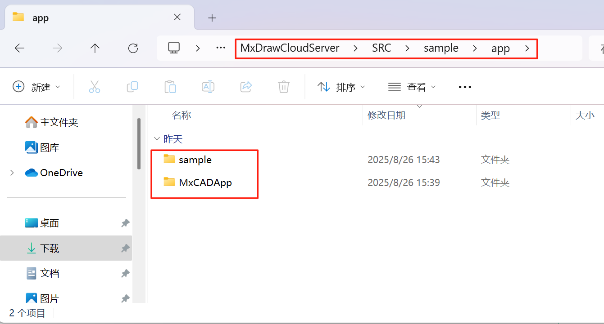
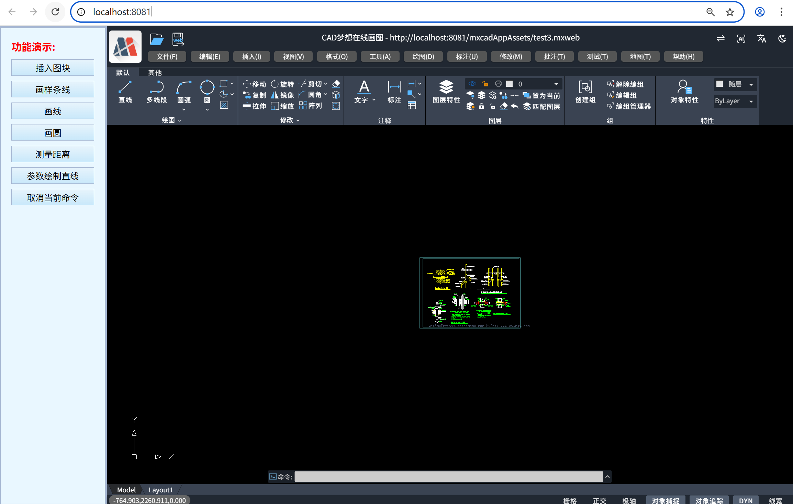

# MxCADApp Npm 应用集成

`mxcad-app` 是我们根据 mxcad 开发包开发的一个完整的在线 CAD 应用插件 用户可以直接安装该插件把它集成到自己的系统或项目中，3 分钟就能让你的网站拥有专业 CAD 功能。

## 1.安装

使用 npm 或 yarn 安装 `mxcad-app`：

```ts
npm install mxcad-app --save
```

或者

```ts
yarn add mxcad-app
```

## 2. 初步集成

### 基于 vite 集成 mxcad-app

1. 第一步，在`main.js`中引入 mxcad 项目所需要的样式文件，创建初始 MxCAD 项目

   ```ts
   // 引入mxcad-app样式
   import "mxcad-app/style";
   // 引入MxCADView
   import { MxCADView } from "mxcad-app";

   // 创建默认mxcad项目
   new MxCADView().create();
   ```

1. 第二步，在`vite.config.js`中加入 MxCAD 项目相关的资源配置

   ```ts
   import { defineConfig } from "vite";
   import { mxcadAssetsPlugin } from "mxcad-app/vite";

   export default defineConfig({
     plugins: [
         ...
         mxcadAssetsPlugin(),
         ...
     ],
   });
   ```

### 基于 webpack 集成 mxcad-app

1. 第一步，在`main.js`中引入 mxcad 项目所需要的样式文件，创建初始 MxCAD 项目

   ```ts
   // 引入mxcad-app样式
   import "mxcad-app/style";
   // 引入MxCADView
   import { MxCADView } from "mxcad-app";

   // 创建默认mxcad项目
   new MxCADView().create();
   ```

2. 第二步，在`vite.config.js`中加入 MxCAD 项目相关的资源配置

   ```ts
   npm install style-loader css-loader
   ```

   ```ts
   const { MxCadAssetsWebpackPlugin } = require("mxcad-app/webpack");
   // webpack.config.js
   const webpack = require("webpack");

   module.exports = {
     // ...
     mode: "development",
     module: {
       rules: [
         {
           test: /\.css$/, // 匹配所有 .css 文件
           use: [
             "style-loader", // 第二步：将 CSS 代码注入到 DOM 的 <style> 标签中
             "css-loader", // 第一步：解析 CSS 文件，处理 @import 和 url()
           ],
           include: [
             path.resolve(__dirname, "src"),
             path.resolve(__dirname, "node_modules/mxcad-app"),
           ], // 可选：只处理 src 下的 css
         },
       ],
     },
     plugins: [
       new webpack.ContextReplacementPlugin(
         /mxcad-app/, // 匹配包含 mxcad-app 的模块路径
         path.resolve(__dirname, "src") // 限制上下文查找范围
       ),
       new MxCadAssetsWebpackPlugin(),
     ],
     // ...
     devServer: {
       static: "./dist",
       port: 3000,
     },
   };
   ```

## 3. 高阶调用

1. 自定义界面容器

   `mxcad-app`如果不指定页面的容器元素，会默认直接在项目界面创建一个宽高为 100vw,100vh 的容器，mxcad 项目也将全屏展示。在某些情境下，我们需要动态控制 mxcad 项目的显隐或显示范围，因此，我们设置如下相关配置来指定`mxcad-app`的特定界面容器。

   ```ts
   <div id="myMxCAD" style="width: 50vw; height: 50vh"></div>
   ```

   ```ts
   // 自定义容器
   import { MxCADView, mxcadApp } from "mxcad-app";
   /**
    * openFile：需要打开的文件路径
    * rootContainer：mxcad项目容器名
    * map：是否显示地图模式
    */
   new MxCADView({
     // mxcadApp.getStaticAssetPath()).toString() 获取mxcad-app的静态资源路径，默认使用的静态资源为nodemodules/mxcad-app/dist/mxcadAppAssets
     openFile: new URL("test.mxweb", mxcadApp.getStaticAssetPath()).toString(),
     rootContainer: "#myMxCAD",
   }).create();
   ```

   其中，如果需要修改 MxCAD 项目内部的静态资源路径，可以通过调用`setStaticAssetPath()`方法修改。

   ```ts
   import { mxcadApp } from "mxcad-app";
   mxcadApp.setStaticAssetPath(
     "https://unpkg.com/mxcad-app/dist/mxcadAppAssets"
   );
   ```

2. 构建配置设置

   `mxcad-app`插件内提供了`mxcadAssetsPlugin`方法对 MxCAD 项目的加载 wasm 方式、第三方依赖、资源存放的子目录名、界面 UI、快捷命令、服务配置、主题样式等进行设置，用户可以根据自己的需求在不同的场景里修改 MxCAD 项目的内部配置。

   基于 vite 的配置：

   ```ts
   import { mxcadAssetsPlugin } from "mxcad-app/vite";
   // vite.config.js
   export default {
     plugins: [
       mxcadAssetsPlugin({
         isWasmSt: true,
         libraryNames: ["vue"],
         outputDir: "testName",
         // 修改UI配置
         transformMxUiConfig: (config) => {
           config.title = "我的CAD"; // 修改标题
           return config;
         },
         // 修改服务器配置
         transformMxServerConfig: (config) => {
           config.serverUrl = "/api/cad"; // 修改API地址
           return config;
         },
         // 修改快捷命令(命令别名)
         // transformMxQuickCommand: (config) => config

         // 修改草图与注释UI模式的配置
         // transformMxSketchesAndNotesUiConfig: (config) => config

         // 修改Vuetify主题配置
         // transformVuetifyThemeConfig: (config) => config
       }),
     ],
   };
   ```

   基于 webpack 的配置:

   ```ts
   import { MxCadAssetsWebpackPlugin } from "mxcad-app/webpack";

   module.exports = {
     plugins: [
       new MxCadAssetsWebpackPlugin({
         isWasmSt:true,
         libraryNames: ["vue"],
         outputDir:'testName',
         transformMxServerConfig: (config) => {
           if (process.env.NODE_ENV === 'production') {
             config.serverUrl = 'https://api.prod.com/cad';
           }
           return config;
         }
           ...
       })
     ]
   };
   ```

* 设置加载wasm方式

  MxCAD项目内部默认使用多线程加载wasm资源，如果需要设置单线程加载，可以设置`mxcadAssetsPlugin`方法中的`isWasmSt`属性。

  ```ts
   /** 是否单线程加载wasm (默认使用多线程及加载) */
    isWasmSt:true
  ````

- 第三方依赖

  用户可以直接引入使用`mxcad-app`内部使用的 mxcad 和 mxdraw 模块，如果用户有需要使用`mxcad-app`内的其他依赖可以直接在`mxcadAssetsPlugin`方法中的`libraryNames`属性中添加这些外部依赖的 npm 库，然后直接使用。

  目前支持的依赖映射的库有`vue`, `axios`, `vuetify`, `vuetify/components`, `mapboxgl`, `pinia` 你也可以访问`window.MXCADAPP_EXTERNALLIBRARIES`获取到所有提供的依赖库，从而不依赖与构建工具的使用。

  ```ts
     libraryNames: ["vue","axios"...]
  ```

  ```ts
  // 在配置文件中添加后，就可以正常使用mxcad-app中的vue模块（mxcad-app打包的内部vue模块）
  import { ref } from "vue";
  const n = ref(1);
  ```

- 构建打包后`mxcad-app`静态资源存放的子目录名。

  在自己的项目中安装`mxcad-app`导入 MxCAD 项目后，构建打包的时候会默认创建名为 mxcadAppAssets 的文件夹来存放 MxCAD 相关的所有静态资源，即`/dist/mxcadAppAssets`。如果用户需要修改放置静态资源的文件夹名，可以直接调用`mxcadAssetsPlugin`方法中的`outputDir`属性值。

  ```ts
  // 输出结果：/dist/testName
  outputDir: "testName";
  ```

- 修改界面 UI、CAD 快捷命令、服务配置、主题样式等

  调用`mxcadAssetsPlugin`方法中的提供的 transform 方法深度设置 MxCAD 项目。

  ```ts
  // 修改UI配置
  /** 更多UI配置可点击config内部查看 */
  transformMxUiConfig: (config) => {
      config.title = "我的CAD"; // 修改标题
      config.mTopButtonBarData.push({
          "icon": "textIcon",
          "prompt": "test",
          "cmd": "Mx_test"
      });// 添加顶部按钮栏按钮
      ...
      return config;
  }

  // 修改草图与注释UI模式的配置同上
     // transformMxSketchesAndNotesUiConfig: (config) => config
  ```

  ```ts
  // 修改CAD快捷命令(命令别名)
  /** 更多修改CAD快捷命令配置可点击config内部查看 */
  transformMxQuickCommand: (config) => {
    // 添加命令Mx_test的别名'_test'、't'
    // config 为MxCAD内部命名别名数组对象
    config.push(["Mx_test", "_test", "t"]);
    return config;
  };
  ```

  ```ts
  // 修改服务器配置
  /** 更多修改服务器配置可点击config内部查看 */
  transformMxServerConfig: (config) => {
      config.serverUrl = "/api/cad"; // 修改API地址
      config.font.push('txt.shx', 'gdt.shx');// 添加MxCAD项目初始需要加载的字体文件
      ...
   return config;
  }
  ```

  ```ts
  // 修改Vuetify主题配置
  /** 更多修改Vuetify主题配置可点击config内部查看 */
  transformVuetifyThemeConfig: (config) => {
    config.defaultTheme = "light"; //dark或者light
    return config;
  };
  ```

3. 核心依赖库

   `mxcad-app`内置了[`mxcad`](https://www.mxdraw3d.com/mxcad_docs/zh/) 核心库，用户可以直接使用`mxcad` 不需要在项目中再次安装`mxcad`插件。如果不是模块化的方式使用,`mxcad`在`window.MxCAD`挂载你可以直接使用`MxCAD`访问到需要的方法和类。

   ```ts
   import { MxCpp } from "mxcad";

   // 获取当前mxcad对象
   const mxcad = MxCpp.getCurrentMxCAD();
   ```

   `mxcad`依赖`mxdraw`, 用户在项目中也可以直接使用`mxdraw`。如果不是模块化的方式使用, `mxdraw` 在 `window.Mx` 挂载。你可以直接使用`Mx`访问到需要的方法和类。

   ```ts
   import { MxFun } from "mxdraw";

   // 输出命令行内容
   MxFun.acutPrintf("测试输出");
   ```

   直接引入`mxcad`和`mxdraw`模块的前提是要使用构建工具构建。我们提供给了 webpack 和 vite 的插件, 用于支持模块化开发。

   只要使用了插件就可以直接使用`import`引入`mxcad`和`mxdraw`模块。

## 4.MxCAD项目二次开发

按照上述步骤操作，我们就能得到初步集成`mxcad-app`插件的原始MxCAD项目。如果我们需要在原始MxCAD项目上做二次开发，可以直接通过`mxcad-app`的`mxcad`和`mxdraw`核心依赖库来对MxCAD项目做功能扩展。下面以在vue项目中的MxCAD中实现参数化绘图和调用MxCAD内部命令为例。

1. 参数化绘图扩展

   ```ts
   import { McGePoint3d, MxCpp } from "mxcad";
   
   //在MxCAD中绘制一个圆心在（0，0），半径为100的圆
   const drawCircle = () => {
     //获取当前mxcad对象
     const mxcad = MxCpp.getCurrentMxCAD();
     //创建新画布
     mxcad.newFile();
     mxcad.drawCircle(0, 0, 100);
     mxcad.zoomAll()
   };
   //直接执行drawCircle()方法即可在图纸中绘制目标圆
   drawCircle()
   ```

2. 直接调用MxCAD内部命令

   ```ts
   import { MxFun } from "mxdraw"
   // 调用MxCAD内部绘直线命令
   MxFun.sendStringToExecute('Mx_line')
   ```

   注册命令也是同上面一样的操作，首先调用mxcad相关API实现CAD功能方法，再调用MxFun内部API注册命令。

   ```ts
   import { MxFun } from "mxdraw"
   
   const testFun = () => {
     ....
   };
   // 注册命令
   MxFun.addCommand("Mx_testFun", testFun);
   ```

## 5.功能实践demo

为方便用户使用理解，我们在云图开发包中内置了`mxcad-app`调用相关的demo。用户可以选择适配自己项目框架的相关使用方法，如webpack4、webpack+react、vite+vue、html+js、cnd等。

点击 [下载云图开发包](https://www.mxdraw.com/download.html) 
下载sdk包并解压后，我们需进入`MxDrawCloudServer\SRC\sample\app`目录，我们的目标项目均存放在该目录中，其结构如下：


:::tip 注意

* MxCADApp：vue2项目调用mxcad-app

* sample：其他框架调用mxcad-app（webpack4、webpack+react、vite+vue、html+js、cnd）
:::  

#### 运行demo

1. 进入 MxCADApp 目录， 运行`npm install` 安装依赖。
2. 调用`npm run dev`命令运行MxCADApp Npm项目。

运行后直接访问http://localhost:8081/，效果如下图：



`MxDrawCloudServer\SRC\sample\app\sample`目录中其他框架调用mxcad-app的demo，运行方法同上。先进入对应目录，运行`npm install` 安装依赖，再运行`npm run dev`命令运行项目，运行后直接访问对应的项目地址即可。