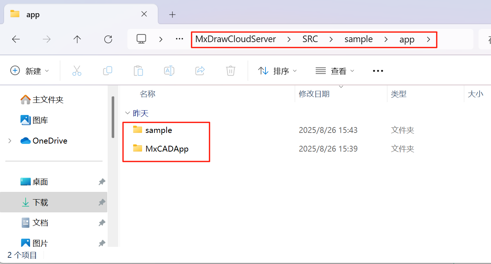
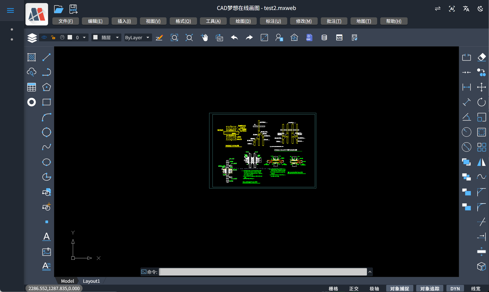

# MxCADApp Npm 应用集成

`mxcad-app` 是我们根据 mxcad 开发包开发的一个完整的在线 CAD 应用插件 用户可以直接安装该插件把它集成到自己的系统或项目中，3 分钟就能让你的网站拥有专业 CAD 功能。

## 1.安装

使用 npm 或 yarn 安装 `mxcad-app`：

```ts
npm install mxcad-app --save
```

或者

```ts
yarn add mxcad-app
```

## 2. 初步集成

### 基于 vite 集成 mxcad-app

1. 第一步，在`main.js`中引入 mxcad 项目所需要的样式文件，创建初始 MxCAD 项目

   ```ts
   // 引入mxcad-app样式
   import "mxcad-app/style";
   // 引入MxCADView
   import { MxCADView } from "mxcad-app";

   // 创建默认mxcad项目
   new MxCADView().create();
   ```

1. 第二步，在`vite.config.js`中加入 MxCAD 项目相关的资源配置

   ```ts
   import { defineConfig } from "vite";
   import { mxcadAssetsPlugin } from "mxcad-app/vite";

   export default defineConfig({
     plugins: [
         ...
         mxcadAssetsPlugin(),
         ...
     ],
   });
   ```

### 基于 webpack 集成 mxcad-app

1. 第一步，在`main.js`中引入 mxcad 项目所需要的样式文件，创建初始 MxCAD 项目

   ```ts
   // 引入mxcad-app样式
   import "mxcad-app/style";
   // 引入MxCADView
   import { MxCADView } from "mxcad-app";

   // 创建默认mxcad项目
   new MxCADView().create();
   ```

2. 第二步，在`vite.config.js`中加入 MxCAD 项目相关的资源配置

   ```ts
   npm install style-loader css-loader
   ```

   ```ts
   const { MxCadAssetsWebpackPlugin } = require("mxcad-app/webpack");
   // webpack.config.js
   const webpack = require("webpack");

   module.exports = {
     // ...
     mode: "development",
     module: {
       rules: [
         {
           test: /\.css$/, // 匹配所有 .css 文件
           use: [
             "style-loader", // 第二步：将 CSS 代码注入到 DOM 的 <style> 标签中
             "css-loader", // 第一步：解析 CSS 文件，处理 @import 和 url()
           ],
           include: [
             path.resolve(__dirname, "src"),
             path.resolve(__dirname, "node_modules/mxcad-app"),
           ], // 可选：只处理 src 下的 css
         },
       ],
     },
     plugins: [
       new webpack.ContextReplacementPlugin(
         /mxcad-app/, // 匹配包含 mxcad-app 的模块路径
         path.resolve(__dirname, "src") // 限制上下文查找范围
       ),
       new MxCadAssetsWebpackPlugin(),
     ],
     // ...
     devServer: {
       static: "./dist",
       port: 3000,
     },
   };
   ```

## 3. 高阶调用

1. 自定义界面容器

   `mxcad-app`如果不指定页面的容器元素，会默认直接在项目界面创建一个宽高为 100vw,100vh 的容器，mxcad 项目也将全屏展示。在某些情境下，我们需要动态控制 mxcad 项目的显隐或显示范围，因此，我们设置如下相关配置来指定`mxcad-app`的特定界面容器。

   ```ts
   <div id="myMxCAD" style="width: 50vw; height: 50vh"></div>
   ```

   ```ts
   // 自定义容器
   import { MxCADView, mxcadApp } from "mxcad-app";
   /**
    * openFile：需要打开的文件路径
    * rootContainer：mxcad项目容器名
    * map：是否显示地图模式
    */
   new MxCADView({
     // mxcadApp.getStaticAssetPath()).toString() 获取mxcad-app的静态资源路径，默认使用的静态资源为nodemodules/mxcad-app/dist/mxcadAppAssets
     openFile: new URL("test.mxweb", mxcadApp.getStaticAssetPath()).toString(),
     rootContainer: "#myMxCAD",
   }).create();
   ```

   其中，如果需要修改 MxCAD 项目内部的静态资源路径，可以通过调用`setStaticAssetPath()`方法修改。

   ```ts
   import { mxcadApp } from "mxcad-app";
   mxcadApp.setStaticAssetPath(
     "https://unpkg.com/mxcad-app/dist/mxcadAppAssets"
   );
   ```

2. 构建配置设置

   `mxcad-app`插件内提供了`mxcadAssetsPlugin`方法对 MxCAD 项目的加载 wasm 方式、第三方依赖、资源存放的子目录名、界面 UI、快捷命令、服务配置、主题样式等进行设置，用户可以根据自己的需求在不同的场景里修改 MxCAD 项目的内部配置。

   基于 vite 的配置：

   ```ts
   import { mxcadAssetsPlugin } from "mxcad-app/vite";
   // vite.config.js
   export default {
     plugins: [
       mxcadAssetsPlugin({
         isWasmSt: true,
         libraryNames: ["vue"],
         outputDir: "testName",
         // 修改UI配置
         transformMxUiConfig: (config) => {
           config.title = "我的CAD"; // 修改标题
           return config;
         },
         // 修改服务器配置
         transformMxServerConfig: (config) => {
           config.serverUrl = "/api/cad"; // 修改API地址
           return config;
         },
         // 修改快捷命令(命令别名)
         // transformMxQuickCommand: (config) => config

         // 修改草图与注释UI模式的配置
         // transformMxSketchesAndNotesUiConfig: (config) => config

         // 修改Vuetify主题配置
         // transformVuetifyThemeConfig: (config) => config
       }),
     ],
   };
   ```

   基于 webpack 的配置:

   ```ts
   import { MxCadAssetsWebpackPlugin } from "mxcad-app/webpack";

   module.exports = {
     plugins: [
       new MxCadAssetsWebpackPlugin({
         isWasmSt:true,
         libraryNames: ["vue"],
         outputDir:'testName',
         transformMxServerConfig: (config) => {
           if (process.env.NODE_ENV === 'production') {
             config.serverUrl = 'https://api.prod.com/cad';
           }
           return config;
         }
           ...
       })
     ]
   };
   ```

* 设置加载wasm方式

  MxCAD项目内部默认使用多线程加载wasm资源，如果需要设置单线程加载，可以设置`mxcadAssetsPlugin`方法中的`isWasmSt`属性。

  ```ts
   /** 是否单线程加载wasm (默认使用多线程及加载) */
    isWasmSt:true
  ````

- 第三方依赖

  用户可以直接引入使用`mxcad-app`内部使用的 mxcad 和 mxdraw 模块，如果用户有需要使用`mxcad-app`内的其他依赖可以直接在`mxcadAssetsPlugin`方法中的`libraryNames`属性中添加这些外部依赖的 npm 库，然后直接使用。

  目前支持的依赖映射的库有`vue`, `axios`, `vuetify`, `vuetify/components`, `mapboxgl`, `pinia` 你也可以访问`window.MXCADAPP_EXTERNALLIBRARIES`获取到所有提供的依赖库，从而不依赖与构建工具的使用。

  ```ts
     libraryNames: ["vue","axios"...]
  ```

  ```ts
  // 在配置文件中添加后，就可以正常使用mxcad-app中的vue模块（mxcad-app打包的内部vue模块）
  import { ref } from "vue";
  const n = ref(1);
  ```

- 构建打包后`mxcad-app`静态资源存放的子目录名。

  在自己的项目中安装`mxcad-app`导入 MxCAD 项目后，构建打包的时候会默认创建名为 mxcadAppAssets 的文件夹来存放 MxCAD 相关的所有静态资源，即`/dist/mxcadAppAssets`。如果用户需要修改放置静态资源的文件夹名，可以直接调用`mxcadAssetsPlugin`方法中的`outputDir`属性值。

  ```ts
  // 输出结果：/dist/testName
  outputDir: "testName";
  ```

- 修改界面 UI、CAD 快捷命令、服务配置、主题样式等

  调用`mxcadAssetsPlugin`方法中的提供的 transform 方法深度设置 MxCAD 项目。

  ```ts
  // 修改UI配置
  /** 更多UI配置可点击config内部查看 */
  transformMxUiConfig: (config) => {
      config.title = "我的CAD"; // 修改标题
      config.mTopButtonBarData.push({
          "icon": "textIcon",
          "prompt": "test",
          "cmd": "Mx_test"
      });// 添加顶部按钮栏按钮
      ...
      return config;
  }

  // 修改草图与注释UI模式的配置同上
     // transformMxSketchesAndNotesUiConfig: (config) => config
  ```

  ```ts
  // 修改CAD快捷命令(命令别名)
  /** 更多修改CAD快捷命令配置可点击config内部查看 */
  transformMxQuickCommand: (config) => {
    // 添加命令Mx_test的别名'_test'、't'
    // config 为MxCAD内部命名别名数组对象
    config.push(["Mx_test", "_test", "t"]);
    return config;
  };
  ```

  ```ts
  // 修改服务器配置
  /** 更多修改服务器配置可点击config内部查看 */
  transformMxServerConfig: (config) => {
      config.serverUrl = "/api/cad"; // 修改API地址
      config.font.push('txt.shx', 'gdt.shx');// 添加MxCAD项目初始需要加载的字体文件
      ...
   return config;
  }
  ```

  ```ts
  // 修改Vuetify主题配置
  /** 更多修改Vuetify主题配置可点击config内部查看 */
  transformVuetifyThemeConfig: (config) => {
    config.defaultTheme = "light"; //dark或者light
    return config;
  };
  ```

3. 项目初始化配置

`mxcadApp.initConfig` 是 `mxcad-app` 模块中的一个初始化方法，用于配置和加载 MxCAD 应用所需的各类配置文件。这些配置文件通常是 JSON 格式的，包含了应用的用户界面设置、服务器配置信息、草图和笔记的UI配置、主题样式、快捷命令等内容。通过调用该方法，可以将这些配置项载入并应用到 MxCAD 应用中，从而确保系统按照预期的方式启动和运行。配置内容相关的json文件格式可参考云图开发包内 `MxDrawCloudServer\SRC\sample\app\MxCADApp\public\ini` 目录下的相关json。

```ts
// 导入MxCAD应用相关模块
import { mxcadApp } from "mxcad-app";

mxcadApp.initConfig({
    uiConfig: 'xxx/xxx/xxx.json', 
    sketchesUiConfig: 'xxx/xxx/xxx.json', 
    serverConfig: 'xxx/xxx/xxx.json', 
    quickCommandConfig: 'xxx/xxx/xxx.json', 
    themeConfig: 'xxx/xxx/xxx.json'
});
```
* uiConfig (string)：
指定应用的用户界面配置文件路径。这个文件通常包含了有关界面布局、控件样式、用户交互等方面的配置。例如，定义了用户界面的各类元素的显示方式、布局、颜色等。uiConfig配置的json文件格式如下：
```json
{
  "title": "CAD梦想在线画图",
  "headerTitle": "CAD梦想在线画图",
  "isShowNameOCurrentlyOpenDrawing": true,
  "isShowHeader": true,
  "logoImg": true,
  "isShowHeaderTopBar": true,
  "isShowHeaderTopBarRightBtns": true,
  "isSketchesAndNotesUiMode": true,
  "isShowSketchesAndNotesUiMode": true,
  "headerTopBarRightBtns": [
    "language",
    "theme"
  ],
  "defaultActiveLanguage": "zh-CN",
  "isShowUseAiFunctionButton": false,
  "headerTopBarCustomRightBtns": [
    {
      "icon": "qiehuan",
      "cmd": "Mx_switchSketchesAndNotesUiMode",
      "prompt": "切换UI模式",
      "openPromptDelay": 700
    },
    ...
  ],
  "isShowTitleButtonBar": true,
  "mTitleButtonBarData": [
    {
      "icon": "dakaidwg",
      "cmd": "OpenDwg",
      "prompt": "打开文件"
    },
    ...
  ],
  "isShowTopButtonBar": true,
  "mTopButtonBarData": [
    {
      "icon": "zhonghua",
      "prompt": "重画",
      "cmd": "Mx_Regen"
    },
    ...
  ],
  "mLeftButtonBarData": {
    "isShow": true,
    "buttonBarData": [
      {
        "icon": "zhixian",
        "prompt": "绘线",
        "cmd": "Mx_Line"
      },
      ...
    ]
  },
  "mRightButtonBarData": {
    "isShow": true,
    "buttonBarData": [
      {
        "icon": "shanchu",
        "cmd": "Mx_Erase",
        "prompt": "删除"
      },
      ...
    ]
  },
  "isShowMenuBar": true,
  "mMenuBarData": [
    {
      "tab": "文件(F)",
      "isResponsive": false,
      "list": [
        {
          "tab": "新建(N)",
          "icon": "xinjian",
          "cmd": "Mx_NewFile"
        },
        ...
      ]
    },
    ...
  ],
  "mRightMenuData": [
    {
      "label": "新建",
      "tips": "New",
      "cmd": "Mx_NewFile"
    },
    ...
  ],
  "mRightMenuDataCommandRuning": [
    {
      "label": "确认(E)",
      "tips": "ok",
      "execute_operations": 1
    },
    ...
  ],
  "mRightMenuDataCommandRuningOsnapSet": [
    {
      "label": "端点(E)",
      "tips": "End",
      "set_osnap_type": 1
    },
    ...
  ],
  "mRightMenuDataSelectEntity": [
    {
      "label": "删除",
      "tips": "Delete",
      "cmd": "Mx_Erase"
    },
    ...
  ],
  "isShowFooter": true,
  "isMobileCommandLineMode": true,
  "footerRightBtnSwitchData": [
    "栅格",
    "正交",
    "极轴",
    "对象捕捉",
    "对象追踪",
    "DYN",
    "线宽"
  ],
  "isShowModelNav": true,
  "isShowCommandLinePanel": true,
  "isShowCommandInput": true,
  "isShowFooterStatusBar": true,
  "isShowLeftDrawer": true,
  "leftDrawerComponents": [
    "DrawingComparison",
    "TextSearch",
    "BlockLibrary",
    "CodeEditor",
    "DatabaseDisplay",
    "PatternRec"
  ],
  "isShowRightDrawer": true,
  "rightDrawerComponents": [
    "EntityAttribute"
  ],
  "isShowSkeletonLoader": false,
  "isPriorityLoadingUi": false
}
```

* sketchesUiConfig (string)：
指定草图和笔记的UI配置文件路径。此文件控制草图编辑功能、注释、笔记等与设计文档相关的界面元素。它可能包括草图显示的样式、笔记工具的配置等。sketchesUiConfig配置的json文件格式如下：
```json
{
  "mMenuData": [
    {
      "tab": "默认",
      "list": [
        {
          "tab": "绘图(D)",
          "icon": "zhixian",
          "sameWidth": true,
          "list": [
            {
              "tab": "直线(L)",
              "icon": "zhixian",
              "cmd": "Mx_Line",
              "size": "large",
              "labelWithArrowLayout": false,
              "col": true,
              "isShowLabel": true,
              "isShowToMainPanel": true,
              "props": {
                "style": {
                  "width": "60px"
                }
              }
            },
            ...
          ]
        }
      ]
    },
    ...
  ]
}
```

* serverConfig (string)：
指定服务器配置文件的路径。此文件包含应用与服务器通信所需的设置，例如服务器的地址、端口、身份验证信息等。它用于设置与后台系统交互的相关参数，确保前端应用能够与后端正常对接。serverConfig配置的json文件格式如下：
```json
{
  "?uploadFileConfig": "上传文件相关配置",
  "uploadFileConfig": {
    "?baseUrl": "上传服务地址",
    "baseUrl": "http://localhost:1337",
    "?create": "参考WebUploader.create方法传入的参数配置",
    "create": {
      "swf": "https://www.mxdraw3d.com/webuploader/Uploader.swf",
      "server": "/mxcad/files/uploadFiles",
      "accept": {
        "extensions": "mxweb,dwg,dxf",
        "mimeTypes": ".mxweb,.dwg,.dxf"
      }
    },
    "?fileisExist": "通过文件的md5参数检查文件是否已经存在",
    "fileisExist": "/mxcad/files/fileisExist",
    "?chunkisExist": "用于分片检查是否已经存在",
    "chunkisExist": "/mxcad/files/chunkisExist",
    "?chunked": "是否分片上传",
    "chunked": true,
    "?mxfilepath": "文件上传后前端访问路径",
    "mxfilepath": "/mxcad/file/",
    "?saveUrl": "保存文件服务地址",
    "saveUrl": "http://localhost:1337/mxcad/savemxweb",
    "?saveDwgUrl": "保存DWG文件服务地址",
    "saveDwgUrl": "http://localhost:1337/mxcad/savedwg",
    "?printPdfUrl": "把指定范围输出到pdf的服务地址",
    "printPdfUrl": "http://localhost:1337/mxcad/print_to_pdf",
    "?cutDwgUrl": "把指定范围输出到DWG的服务地址",
    "cutDwgUrl": "http://localhost:1337/mxcad/cut_dwg"
  },
  "aiConfig": {
    "?aiUrl": "ai服务地址",
    "aiUrl": "http://localhost:7900"
  },
  "?wasmConfig": "在本项目中使用了mxcad库中提供的WebAssembly wasm文件和相关胶水代码的相关配置",
  "wasmConfig": {
    "?url": ":通过指定网络路径加载mxcad库中提供的wasm相关文件, 例如:https://unpkg.com/mxcad/dist/wasm/2d-st/ 程序会自动加载2d-st目录下与wasm相关的文件",
    "url": "",
    "?type": "如果没有设置url, 我们可以通过该项目本地存放的assets目录下wasm相关的文件， 目前可选项有: 2d和2d-st 2d是多线程加载，可能需要一些额外的服务器配置， 而2d-st是单线程的，你可以很方便的使用它,也可以通过访问地址参数调置http://xxxx/mxcad/?wasmtype=st",
    "type": "2d"
  },
  "?supportTruetypeFont": "是否启用truetype字体的支持,默认是启用",
  "supportTruetypeFont": true,
  "?webgl1": "是使用webgl 1.0程序",
  "webgl1": false,

  "?defaultFont": "缺省使用的shx字体",
  "defaultFont": "",
  "defaultBigFont": "",
  "defaultTrueTypeFont": "",
  "?font": "需要加载的shx字体",
  "font": [ "txt.shx" ],
  "?bigFont": "需要加载的big shx字体",
  "bigFont": ["hztxt.shx", "gbcbig.shx"],
  "?trueTypeFont": "需要加载的TrueType字体 [['simsun', 'syadobe'], ['思原宋体', '思原黑体'], ['stadobe.otf', 'syadobe.otf']]",
  "trueTypeFont": [["syadobe"], ["思原黑体"], ["syadobe.otf"]],
  "?isAutomaticJumpToMobilePage": "是否自动跳转到移动端页面",
  "isAutomaticJumpToMobilePage": true,
  "?mobilePageUrl": "跳转的移动端页面的网络路径如/mxcad_mobile/或者https://xxx.com/mxcad_mobile",
  "mobilePageUrl": "/mxcad_mobile/",
  "?file_ext_name": "cad文件格式的扩展名",
  "file_ext_name": "mxweb",
  "?useUtf8": "使用Utf8编码",
  "useUtf8": false,
  "speechRecognitionModel": "vosk-model-small-cn-0.22.zip"
}
```

* quickCommandConfig (string)：
指定快速命令配置文件的路径。该文件配置了 MxCAD 应用中的快捷命令，包括快捷键的定义、命令行为、响应等，帮助用户高效地进行设计工作。quickCommandConfig配置的json文件格式如下：
```json
[
  ["Mx_New", "_new", "new"],
  ...
]
```

* themeConfig (string)：
指定应用的主题样式配置文件路径。此文件定义了 MxCAD 应用的视觉主题，例如颜色方案、字体样式、控件外观等，确保界面符合用户的美学和功能需求。themeConfig配置的json文件格式如下：
```json
{
  "defaultTheme": "dark",
  "themes": {
    "light": {
      "colors": {
        "surface": "#FFFFFF",
        "background": "#E0E0E0",
        "accent": "#545555",
        "prominent": "#FFFFFF",
        "hover_herder_btn": "#B3B3B3",
        "modification": "#FFFFFF",
        "transition": "#EFEFEF",
        "undertint": "#3A4352",
        "depth": "#D3D1D1",
        "on-undertint-bg": "#000",
        "undertint-bg": "#f0f0f0",
        "depth-bg": "#EBE9E9",
        "inverse": "#000000",
        "inverse1": "#FFFFFF",
        "console": "#787878",
        "on-console": "#fff",
        "dialog-card": "#FFFFFF",
        "dialog-card-text": "#E0E0E0",
        "hover_electron_view_tab_btn_hover": "#DBDBDB",
        "hover_electron_view_tab_btn_action": "#FFFFFF",
        "nav_bg": "#DBDBDB",
        "nav_bg_active": "#787878",
        "sketches_color": "#E8E8E8",
        "toolbar_header": "#99b4d1"
      },
      "variables": {
        "border-color": "#000000",
        "border-opacity": 0.12,
        "high-emphasis-opacity": 0.87,
        "medium-emphasis-opacity": 1,
        "disabled-opacity": 0.38,
        "idle-opacity": 0.04,
        "hover-opacity": 0.2,
        "focus-opacity": 0.12,
        "selected-opacity": 0.08,
        "activated-opacity": 0.1,
        "pressed-opacity": 0.12,
        "dragged-opacity": 0.08,
        "theme-kbd": "#212529",
        "theme-on-kbd": "#FFFFFF",
        "theme-code": "#F5F5F5",
        "theme-on-code": "#000000",
        "theme-tbody": "#fff",
        "theme-btn-hover": "#E0E0E0",
        "theme-undertint-bg-overlay-multiplier": 0.25
      }
    },
    "dark": {
      "colors": {
        "surface": "#212832",
        "background": "#212832",
        "accent": "#545555",
        "prominent": "#3A4352",
        "hover_herder_btn": "#3A4352",
        "modification": "#1E252F",
        "transition": "#5D6675",
        "undertint": "#AEABAB",
        "on-undertint": "#fff",
        "depth": "#5D6675",
        "on-depth": "#fff",
        "undertint-bg": "#2E3440",
        "depth-bg": "#454F61",
        "inverse": "#FFFFFF",
        "inverse1": "#000000",
        "console": "#787878",
        "on-console": "#fff",
        "dialog-card": "#212832",
        "dialog-card-text": "#3A4352",
        "hover_electron_view_tab_btn_hover": "#3A4352",
        "hover_electron_view_tab_btn_action": "#616975",
        "nav_bg": "#3A4352",
        "nav_bg_active": "#282A2D",
        "sketches_color": "#3A4352",
        "toolbar_header": "#2B3647"
      },
      "variables": {
        "border-color": "#FFFFFF",
        "border-opacity": 0.12,
        "high-emphasis-opacity": 0.87,
        "medium-emphasis-opacity": 1,
        "disabled-opacity": 0.38,
        "idle-opacity": 0.1,
        "hover-opacity": 0.2,
        "focus-opacity": 0.12,
        "selected-opacity": 0.08,
        "activated-opacity": 0.1,
        "pressed-opacity": 0.16,
        "dragged-opacity": 0.08,
        "theme-kbd": "#212529",
        "theme-on-kbd": "#FFFFFF",
        "theme-code": "#343434",
        "theme-on-code": "#CCCCCC",
        "theme-tbody": "#343b48",
        "theme-btn-hover": "#616975",
        "theme-surface-variant": "#424242",
        "theme-on-surface-variant": "#ffffff"
      }
    }
  }
}
```

4. 核心依赖库

   `mxcad-app`内置了[`mxcad`](https://www.mxdraw3d.com/mxcad_docs/zh/) 核心库，用户可以直接使用`mxcad` 不需要在项目中再次安装`mxcad`插件。如果不是模块化的方式使用,`mxcad`在`window.MxCAD`挂载你可以直接使用`MxCAD`访问到需要的方法和类。

   ```ts
   import { MxCpp } from "mxcad";

   // 获取当前mxcad对象
   const mxcad = MxCpp.getCurrentMxCAD();
   ```

   `mxcad`依赖`mxdraw`, 用户在项目中也可以直接使用`mxdraw`。如果不是模块化的方式使用, `mxdraw` 在 `window.Mx` 挂载。你可以直接使用`Mx`访问到需要的方法和类。

   ```ts
   import { MxFun } from "mxdraw";

   // 输出命令行内容
   MxFun.acutPrintf("测试输出");
   ```

   直接引入`mxcad`和`mxdraw`模块的前提是要使用构建工具构建。我们提供给了 webpack 和 vite 的插件, 用于支持模块化开发。

   只要使用了插件就可以直接使用`import`引入`mxcad`和`mxdraw`模块。

## 4.MxCAD项目二次开发

按照上述步骤操作，我们就能得到初步集成`mxcad-app`插件的原始MxCAD项目。如果我们需要在原始MxCAD项目上做二次开发，可以直接通过`mxcad-app`的`mxcad`和`mxdraw`核心依赖库来对MxCAD项目做功能扩展。下面以在vue项目中的MxCAD中实现参数化绘图和调用MxCAD内部命令为例。

1. 参数化绘图扩展

   ```ts
   import { McGePoint3d, MxCpp } from "mxcad";
   
   //在MxCAD中绘制一个圆心在（0，0），半径为100的圆
   const drawCircle = () => {
     //获取当前mxcad对象
     const mxcad = MxCpp.getCurrentMxCAD();
     //创建新画布
     mxcad.newFile();
     mxcad.drawCircle(0, 0, 100);
     mxcad.zoomAll()
   };
   //直接执行drawCircle()方法即可在图纸中绘制目标圆
   drawCircle()
   ```

2. 直接调用MxCAD内部命令

   ```ts
   import { MxFun } from "mxdraw"
   // 调用MxCAD内部绘直线命令
   MxFun.sendStringToExecute('Mx_line')
   ```

   注册命令也是同上面一样的操作，首先调用mxcad相关API实现CAD功能方法，再调用MxFun内部API注册命令。

   ```ts
   import { MxFun } from "mxdraw"
   
   const testFun = () => {
     ....
   };
   // 注册命令
   MxFun.addCommand("Mx_testFun", testFun);
   ```

## 5.功能实践demo

为方便用户使用理解，我们在云图开发包中内置了`mxcad-app`调用相关的demo。用户可以选择适配自己项目框架的相关使用方法，如webpack4、webpack+react、vite+vue、html+js、cnd等。

点击 [下载云图开发包](https://www.mxdraw.com/download.html) 
下载sdk包并解压后，我们需进入`MxDrawCloudServer\SRC\sample\app`目录，我们的目标项目均存放在该目录中，其结构如下：


:::tip 注意

* MxCADApp：vue2项目调用mxcad-app

* sample：其他框架调用mxcad-app（webpack4、webpack+react、vite+vue、html+js、cnd）
:::  

#### 运行demo

1. 进入 MxCADApp 目录， 运行`npm install` 安装依赖。
2. 调用`npm run dev`命令运行MxCADApp Npm项目。

运行后直接访问http://localhost:8081/，效果如下图：



`MxDrawCloudServer\SRC\sample\app\sample`目录中其他框架调用mxcad-app的demo，运行方法同上。先进入对应目录，运行`npm install` 安装依赖，再运行`npm run dev`命令运行项目，运行后直接访问对应的项目地址即可。