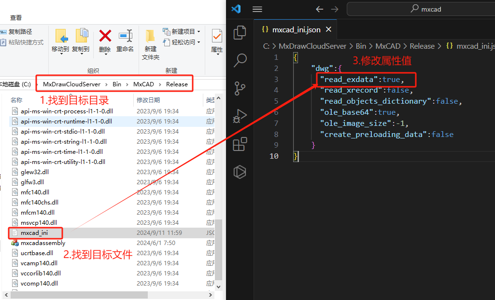
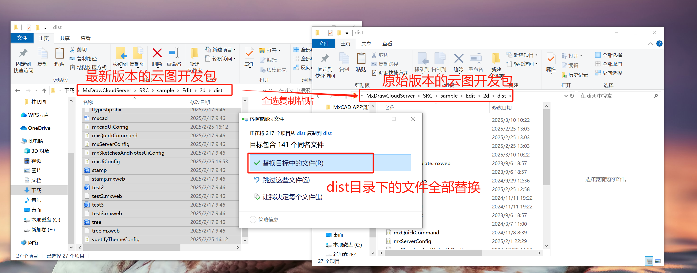

# 常见问题

## 图纸

### 1.图纸无法显示

尽量保证mxcad和mxdraw以及[MxDraw云图开发包](https://www.mxdraw.com/download.html)是最新版本，

出现图纸无法显示且浏览器控制台没有报错，一般情况都是版本问题。

更新到最新版本:

```bash
npm install mxcad@latest mxdraw@latest
```

### 2.图纸显示错误

如果你在打开我们提供的转换后的示例图纸打开是正常的,但是你自己转换的图纸无法显示部分或者根本不显示。

那么你可以多转换几张图纸, 如果只是这张图纸有问题，那么可能是转换程序对该图纸支持不完善，你可以将这张图纸发给客服，便于我们修复这个问题。

### 3.mxcad集成项目中，如何修改默认打开的图纸

可以通过 iframe 的 src 属性进行 query 传参`{file:'目标图纸'}`，如下所示：

```ts
 iframe.src = "http://localhost:3000/mxcad?file=empty_template.mxweb";
```

### 4.修改图纸精度

在 mxcad 中打开 mxweb 图纸时，会出现图形显示精度不够导致图形偏差的情况。如：图纸上的圆显示为多边形，这是因为在图纸初始化时它的显示精度是一个经验值，mxcad 会根据圆的大小来确定它的显示精度。

解决方案1：调用重绘方法，重新调整图纸显示精度。
```ts
import { MxCpp } from "mxcad";
// 调用重绘命令
MxCpp.getCurrentMxCAD().regen();
```

解决方案2：在 mxcad 项目初始化时，手动设定显示精度值（0~1000）。
```ts
import { MxCpp } from "mxcad";

// 设置对象的显示精度
const mxcad = MxCpp.getCurrentMxCAD();
mxcad.setAttribute({DisplayPrecision:900});
```

### 5.文字显示

在 mxcad 中加载 mxweb 图纸时，会出现图纸文字乱码的问题。如：打开图纸，图纸上的部分文字或所有文字均显示为“？”，这是因为 mxcad 的字体文件加载路径`fontspath`下并没有找到图纸上文字对应的目标字体文件。

解决方案1：将图纸上的所有未加载相应字体文件的字体，全部转成 mxcad 项目中已经加载了字体文件的字体。

解决方案2：在云图开发包`MxDrawCloudServer\Bin\MxCAD\Release`目录中下的`fonts`文件夹下加入缺失的字体文件，并将图纸上缺少的字体文件也放入前端项目 mxcad 的字体文件加载路径`fontspath`下。最后重新转换图纸格式，并用新的前端项目打开新转换出来的图纸。


### 6.设置线重不生效

在 mxcad 中设置实体线重，但在图纸中没有生效看到效果，这可能时是由于在mxcad对象的显示线重属性 [showLineWeight](../../api/classes/2d.McObject.md#showlineweight) 未设置导致的。

解决方案：在需要显示线重时，设置 mxcad对象的线重方法 [showLineWeight()](../../api/classes/2d.McObject.md#showlineweight) 为 true。

```ts
import { MxCpp, McDbLine, McCmColor} from "mxcad";

//画直线
function drawLine() {
  const mxcad = MxCpp.getCurrentMxCAD();
  // 创建新画布
  mxcad.newFile();
  let line = new McDbLine(1000, 500, 0, -1000, -500, 0)
  line.trueColor = new McCmColor(255, 0, 0);
  line.lineweight = 200;
  mxcad.showLineWeight(true);
  mxcad.drawEntity(line);
}

// 调用画直线方法
drawLine();
```

### 7.图纸转pdf（包含图片）

我们在云图开发包中提供了图纸转pdf相关的图纸转换程序，在dwg图纸转pdf的过程中，我们发现当图纸中包含有图片时导出的pdf没有包含图片。这是因为转换程序没有找到目标图片，所以转出的pdf中不包含图片。

解决方案：将插入到dwg图纸中的图片与需要转换的dwg图纸放在同一目录下，再次转换就能够得到的pdf就会包含图纸中插入的图片。

## 图块

### 1.一个图块多次插入，改变其中一个其它的图块随之改变

CAD的图块功能，它默认采用的是引用的方式，因此其中一个改变其他图块也会跟着一起改变。你如果不想采用引用的方式插入图块，可以直接修改图块名。

以引用的方式使用图块就比较节约内存，如果不使用引用的方式的话，你有100个图块，相当于就有100个内存不同的名字。

### 2.获取目标图块详情

我们可以通过调用 CAD 图块引用实体 McDbBlockReference() 中的 [getAllAttribute()](../../api/classes/2d.McDbBlockReference.md#getallattribute) 方法得到块引用的所有属性文字对象id，然后通过对象id获取到图块中的实体详情。
```ts
import { MxCpp ,McDbBlockReference, McDbAttribute } from "mxcad"

// 对象选择事件
MxCpp.getCurrentMxCAD().get.on("selectChange", (ids: McObjectId[]) => {
if (ids.length == 0) return;
let id = ids[0];
let mxent = id.getMxDbEntity();
let ent = id.getMcDbEntity();
if (ent !== null) {
    if (ent instanceof McDbBlockReference) {
    let blkRef: McDbBlockReference = ent;
    let aryId = blkRef.getAllAttribute();
    aryId.forEach((id) => {
        let attribt: McDbAttribute = id.getMcDbEntity() as any;
        console.log(attribt.textString);
        console.log(attribt.tag);
    })
    }
}
})
```

## 图层

### 1.对象过滤

在CAD中，图层允许用户将图形对象组织到不同的层中，以便于管理和编辑。每个图层都有其独特的特性，如颜色、线型、线宽等，这些特性决定了图层上对象的显示方式。我们可以通过设置 [MxCADResbuf](../../api/classes/2d.MxCADResbuf.md#class-mxcadresbuf) 过滤器来实现图层上的对象过滤。


```ts
import { MxCADSelectionSet } from "mxcad";

let ss = new MxCADSelectionSet();
// 得到图上，直线，圆，圆弧，多义线，在0层上的对象.
ss.allSelect(new MxCADResbuf([DxfCode.kEntityType, "LINE,ARC,CIRCLE,LWPOLYLINE",DxfCode.kLayer,"0"]));
console.log("得到对象数目:" + ss.count());
```

## 更新版本

运行项目调用API的过程中可能出现调用不成功或报错：is not a function 等，这些都是由于调用的mxcad中的API为最新版本，而项目中的 mxcad 版本未更新，因此需保证项目中的 mxcad 和 mxdraw 均为最新版本。

清除项目缓存和清除浏览器缓存后，先卸载再重新安装。其中，清除浏览器缓存可参考下面操作：

 

清除项目缓存可通过运行命令，以 npm 为例：
```sh
npm cache clean --force
```
卸载 mxcad 和 mxdraw，并下载最新版本的 mxcad 和 mxdraw 。以 npm 为示例： 
```sh
npm uni mxcad mxdraw

npm i mxcad@latest mxdraw@latest
```
更新完成后，可通过查看依赖包的版本号是否与 npm 库的最新版本相同。


或者，查看运行起来的项目日志中打印的版本号是否与[在线demo](https://demo.mxdraw3d.com:3000/mxcad/)日志中打印的版本号一致


## MxCAD APP应用集成

### 1.如何修改APP的UI界面

1. 若只是在原有 MxCAD App 界面的基础上简单修改页面布局可参考 [MxCAD APP在线CAD 配制说明](../7.BestPractice/2.MxCADAPPApplicationIntegration/1.BasicDescriptionOfProjectIntegration.md#mxcad-app在线cad-配制说明) ,根据自身需求修改 mxUiConfig.json 文件来配置界面。

2. 若想要自定义界面，可以在项目中实现自己的UI，然后根据ID、类、属性等定位到目标位置插入你自己的UI。

* 在项目中绘制UI界面
 

* 将绘制好的UI界面插入目标位置
 

此外，你也可以直接创建元素插入到目标位置，其中，该目标位置需要自己取获取，拿到它对应的元素后把你写的元素或者组件插入进去。

### 2.如何修改文字字体

在项目初始化时通过 [MxCpp.App.addNetworkLoadingTrueTypeFont()](../../api/classes/2d.McAppType.md#addnetworkloadingtruetypefont) 方法来设置我们系统需要加载哪些字体，方便后面我们修改字体时加载使用。

然后获取文字实体，最后将该文字的 textStyle 属性设置为目标文字字体样式。

```ts
import { MxFun } from 'mxdraw' ;
import { MxCpp } from 'mxcad' ;

// MxCAD创建成功
MxFun.on("mxcadApplicationCreatedMxCADObject", (param) => {
    // addNetworkLoadingTrueTypeFont([字体名],[字体中文名],[字体文件])
    MxCpp.App.addNetworkLoadingTrueTypeFont(["simsun","syadobe"],["思原宋体","思原黑体"],["stadobe.otf","syadobe.otf"]);
})

// 修改文字样式
function Mx_Test_TrueText(){
    let mxcad = MxCpp.getCurrentMxCAD();
    //清空当前显示内容
    mxcad.newFile();
    MxCpp.App.loadFonts([], [], ["syadobe","simsun"], () => {

        // 添加一个黑体文字样式
        mxcad.AddTureTypeTextStyle("ht_style","syadobe");

        // 添加一个宋体文字样式
        mxcad.AddTureTypeTextStyle("st_style","simsun");

        // 设置当前样式为黑体
        mxcad.drawTextStyle = "ht_style";

        mxcad.drawColor = new McCmColor(200, 255, 50);
        let idText = mxcad.drawText(0, 3500, "绘图控件TrueType文字测试", 100, 0, 0, 1);
      
        let ent = idText.getMcDbEntity();
        // 修改文字样式为宋体
        if(ent) ent.textStyle = "st_style";
    
        mxcad.zoomAll();
        mxcad.regen();
        mxcad.updateDisplay();
    });
}
```

### 3.添加字体文件

mxcad 项目中存储了一些常用的字体文件，但我们经常会遇到一些目标图纸需要加载自己特需的字体文件。这种图纸在 mxcad 项目中初次打开的时候会出现文本样式与AutoCAD中的展示有偏差、字体文本显示为“？”、或字体样式不符合预期等情况。

我们可以将目标字体文件拷贝到云图开发包的`MxDrawCloudServer\Bin\MxCAD\Release\fonts` 目录下，在 mxcad 项目中添加上图纸需要的目标字体文件。

 


### 4.更新图纸水印显示

我们在修改图纸水印后会提供修改水印后的云图开发包，在该开发包中的MxCAD项目中打开项目能够直接看到图纸水印修改后的样子。若用户需要在其他MxCAD项目中使用修改的水印效果，则需要替换 mxcad 依赖包中的 wasm 文件夹下的相关文件，其具体操作如下：
1. 解压修改水印后的云图开发包，找到`MxDrawCloudServer\SRC\TsWeb\public\mxcad\assets`目录。
2. 将上述目录下的 js文件、wasm文件等分别拷贝到目标项目的 mxcad 依赖包下的 wasm 中。
* 选中`MxDrawCloudServer\SRC\TsWeb\public\mxcad\assets`目录下的 `mxdrawassembly_min.js` 、 `mxdrawassembly_min.wasm` 、`mxdrawassembly_min.worker.js` 三个文件拷贝进目标项目的 `\node_modules\mxcad\dist\wasm\2d` 文件夹下；再将 `mxdrawassembly_min.js`、 `mxdrawassembly_minst.wasm` 两个文件拷贝进目标项目的 `\node_modules\mxcad\dist\wasm\2d-st` 文件夹下。其中，拷贝的文件命名中会有一串hash码，在放入`2d`文件夹下时需将文件重命名去除中间的hash码。
 
 
* 替换文件后，删除目标项目中`node_modules`文件夹下的所有缓存文件，如`.vite`文件夹下的所有文件（可直接删除`.vite `文件夹），再清除浏览器中缓存。
* 重新启动项目，查看效果。

::: tip 注意
`MxDrawCloudServer\SRC\TsWeb\public\mxcad\assets`目录下有两个`mxdrawassembly_min.js`文件，这两个文件名中的hash码不同，文件大小也有差异。这两个文件需要分别拷贝到对应的`2d`和`2d-st`文件夹中。通常情况下，`2d`文件夹下的`mxdrawassembly_min.js`文件体积会偏大一点，在替换的时候需要注意。
:::

### 5.设置加载扩展数据

在通过云图开发包启动node.js后台服务，打开dwg图纸时可能会出现无法读取图纸内扩展数据的情况。这是因为为了提高程序转换图纸的速率，我们默认在打开dwg文件时不加载扩展数据。如果你需要在加载图纸后能够读取扩展数据，则需要将`MxDrawCloudServer\Bin\MxCAD\Release`目录下的`mxcad_ini.json`文件种的`read_exdata`属性设置为`true`，并重启服务。清理缓存或不使用缓存打开图纸后就能够读取图纸中的扩展数据了。


  
### 6.更新MxCAD APP

云图开发包中提供的MxCAD工程是MxCAD APP中的测试模块，该工程打包后是一个js文件，这个js文件最终会被放进MxCAD工程同目录下的`dist\plugins`中。而且，MxCAD 中引用的mxcad、mdraw均是dist目录下的依赖，因此，要想更新MxCAD APP就需要将最新云图开发包中的dist目录下的所有文件复制粘贴到原本的dist目录下。



### 7.更新后端转换程序

与上述更新MxCAD APP的操作步骤一样，我们只需要将最新云图开发包中提供后端服务的`MxDrawCloudServer\Bin`目录下的转换程序全部复制粘贴到原本的后端服务所在的目录进行替换就可以了。

## 其他

### 1.对象ID句柄使用说明

ID和句柄都用来标识一个对象，ID是一个64位长整型变量，是一个内存地址，访问速度最快，但它每次打开都不一样，如果需要把一个对象的标识存起来，下次又能找到对象，就需要使用句柄，句柄是一个字符串变量，它保证不管什么时候总是不会变化,句柄在DWG图纸中是唯一存在，ID是内存中唯一存在。

* 通过句柄查找对象

```ts
import { MxCpp, McDbDatabase } from "mxcad";

// 通过句柄查找对象
const handle: string = "6e78";
const dataBase: McDbDatabase = MxCpp.getCurrentMxCAD().getDatabase();
const objectId = dataBase.handleToIdIndex(handle);
const entity = objectId.getMxDbEntity();
if(entity){
    console.log("目标实体对象",entity);
}
```

* 通过实体对象查找句柄

```ts
import { MxCpp, McObjectId } from "mxcad";

  let getEntity = new MxCADUiPrEntity();
  getEntity.setMessage("选择目标对象");
  let entId = await getEntity.go();
  if(!entId.id) return;
  // 通过ID对象得到图形数据对象
  let ent = entId.getMcDbEntity();
  if(!ent) return;
  // 通过图形数据对象得到句柄
  let handle = ent.getHandle();
  console.log("目标对象句柄",handle);
```

### 2.关闭移动端三视图

在 mxcad 移动端demo中，可能会出现转动屏幕，图纸内容被当作是3对象会随着 Z 轴转动，这是因为mxcad对象开启了三视图旋转，可通过下述代码关闭三视图回到2d视图：

```ts
import { MxCpp } from "mxcad";  

const mxcad = MxCpp.getCurrentMxCAD();
mxcad.mxdraw.getOrbitControls().touches.ONE = THREE.TOUCH.PAN;
```