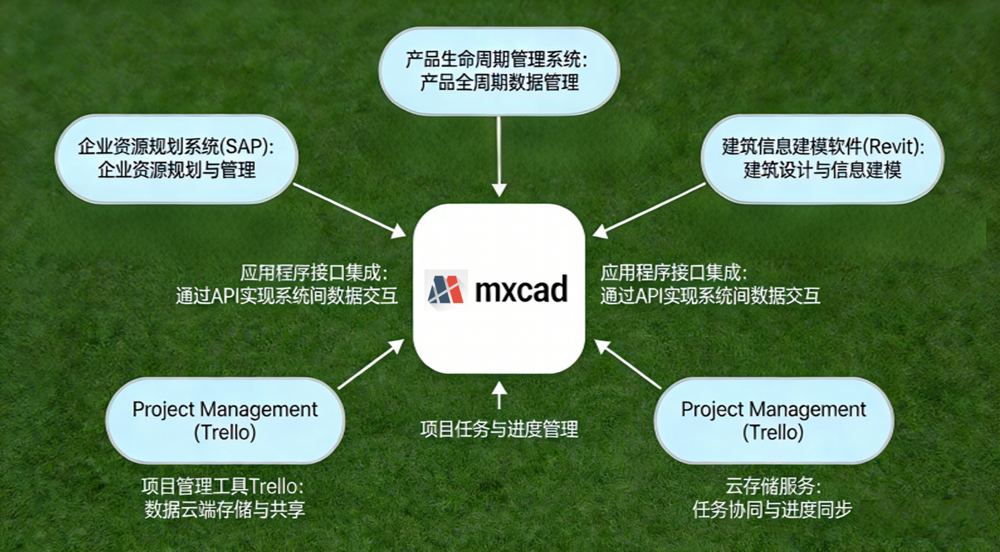
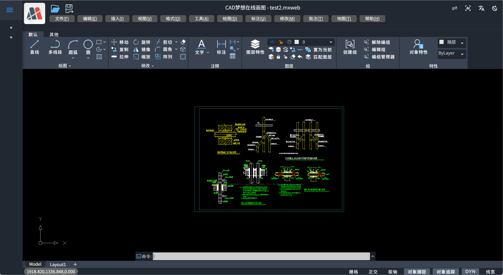

# mxcad 网页CAD平台：面向设计师的跨平台协同设计解决方案

## 摘要

mxcad 是一款基于浏览器的专业级 CAD 应用，支持 DWG/DXF 全格式兼容、可实现多人协作、云端自动保存与跨设备访问。本文面向建筑、机械、工业及室内设计师群体，阐述其如何解决传统桌面 CAD 在移动办公、团队协作与创作自由度方面的核心痛点。

## 1. 引言：设计师的创作不应被工具限制

传统 CAD 软件依赖特定操作系统、高性能硬件和本地安装，导致设计师在非办公场景（如客户现场、工地、远程会议）难以及时响应修改需求。文件版本混乱、协作沟通低效进一步消耗专业价值。

mxcad 通过纯 Web 技术实现完整 2D CAD 功能，让设计师在任何能联网的设备上——包括 Windows、macOS、iPad 和安卓平板——均可直接编辑原始 DWG 图纸，无需安装、无需转换、无需等待。

## 2. 零安装与跨平台访问：随时随地进入设计状态

### 2.1 快速启动，降低使用门槛

- 用户访问 URL 后 5 秒内进入绘图界面
- 首次使用无需下载安装包或激活许可
- 支持主流浏览器：Chrome、Edge、Safari、Firefox

### 2.2 全平台一致体验

- 操作逻辑与 AutoCAD 高度相似，降低学习成本
- 图形渲染精度误差小于 0.001mm，符合工程制图标准
- 16GB 内存设备可流畅处理 20MB+ 复杂图纸

典型应用场景：自由设计师在咖啡馆使用 iPad 修改平面布局；建筑工程师在工地用安卓平板查看并批注施工图。

## 3. 专业级功能支持：满足正式出图需求

mxcad 提供完整的 2D 绘图与编辑能力，包括：

- 基础图形绘制：直线、多段线、圆、样条曲线、矩形等
- 高级编辑命令：偏移、修剪、延伸、阵列、镜像、拉伸
- 智能标注系统：线性、角度、半径、引线注释
- 图层与块管理：支持图层控制、块插入与属性编辑
- 格式兼容性：原生支持 AutoCAD 2000–2025 版本 DWG/DXF 文件

所有功能均通过 WebAssembly 与 WebGL 实现高性能运行，确保操作流畅性与视觉保真度。

## 4. 实时协同设计：提升团队效率与专业可信度

### 4.1 多人同时编辑

- 多名设计师可同时在线编辑同一图纸
- 实时操作可见，减少沟通误解
- 基于 OT/CRDT 算法自动合并修改，避免冲突

### 4.2 协作增强功能

- 图纸内评论与 @ 提醒，支持任务分配
- 完整版本历史记录，可回溯任意时间点
- 外链分享支持密码与有效期控制

该协作模式显著减少“文件来回传输”和“口头解释修改”的低效环节，使设计师的专业判断更直观地被客户与合作方理解。

## 5. 开放架构与行业定制能力

mxcad 提供 JavaScript API 与插件化架构，支持企业级集成：

- 与 ERP、PLM、BIM 系统对接（如 SAP、广联达、Revit）
- 行业专用功能扩展：建筑墙体库、机械公差标注、电气符号库
- 自定义工具栏与命令，适配企业标准工作流

某装备制造企业通过 API 实现图纸修改自动触发生产工单，减少人工干预错误。

## 6. 技术栈亮点

### 6.1. **基于 WebAssembly + WebGL 的高性能 Web CAD 引擎**

- 将 C++ 编写的底层 CAD 几何计算与图形渲染模块编译为 **WebAssembly（WASM）**，在浏览器中实现接近原生的执行效率
- 利用 **WebGL** 进行硬件加速的 2D/3D 图形渲染，确保复杂图纸（如万级实体）的流畅显示与交互
- 支持现代浏览器（Chrome、Edge、Firefox、Safari）无需插件即可运行专业级 CAD 功能

### 6.2. **全栈式 SDK 架构，支持多端集成与二次开发**

- 提供 **JavaScript/TypeScript 前端 API**，可无缝嵌入 Vue、React 等主流框架
- 后端支持 **.NET、Java、Node.js** 等语言对接，便于与企业系统（ERP/PLM/BIM）集成
- 开放命令系统、事件机制、自定义实体接口，允许深度定制行业专用功能（如电气符号、水利图元）

## 7. 未来发展方向

mxcad 将持续投入以下技术演进：

- WebGPU 渲染加速，提升复杂图形性能
- AI 辅助设计：智能图形补全、制图规范检查
- 国产 CAD 格式兼容（如中望、浩辰）

目标是构建一个开放、智能、跨端的设计协作生态。

## 8. 行动号召

设计师可立即免费体验 mxcad：

- 在线MxCAD：[https://demo.mxdraw3d.com](https://demo.mxdraw3d.com/), https://demo2.mxdraw3d.com:3000/mxcad/
- 在线MxDraw：https://www.mxdraw3d.com/sample/vuebrowse/
- CAD与GIS结合演示：https://demo2.mxdraw3d.com:3000/mxcad/?map=true&maptype=gdslwzj，https://www.mxdraw3d.com/sample/mx-vuemap/?cmd=Mx_CADGISDemo
- 在线MxCAD3D：https://demo2.mxdraw3d.com:3000/mxcad3d/
- MxCAD云图英文网站：https://www.webcadsdk.com/
- MxCAD官方网址：https://www.mxdraw.com/

mxcad 适用于建筑设计、机械制造、工业设计、室内装饰、工程咨询及教育领域，帮助设计师摆脱设备束缚，专注创意表达。

## 9.附录：典型应用场景

| 行业     | 应用场景                     | 客户价值                     |
| -------- | ---------------------------- | ---------------------------- |
| 建筑设计 | 远程方案评审、施工图协同修改 | 缩短交付周期30%              |
| 机械制造 | 车间现场图纸查阅与批注       | 减少返工，提升生产准确性     |
| 教育培训 | 学生机房统一教学环境         | 无需安装，IT维护成本趋近于零 |
| 工程咨询 | 多地团队联合设计             | 打破地域限制，资源高效调配   |

## 关键词

网页CAD, Web CAD, 在线CAD, 设计师协作工具, DWG在线编辑, 跨平台CAD, 实时协同设计, 云端CAD, mxcad, 无安装CAD

## 目标用户角色

- 建筑师
- 机械工程师
- 工业设计师
- 室内设计师
- 自由职业者
- 中小型设计院
- 工程教育机构