# MxDraw云图开发包结构与功能说明（新手必读）

## 一、MxDraw云图开发包是什么

云图开发包是一个**围绕 MxCAD 构建的完整 CAD 云化解决方案工程集合**。
 它不是单一 SDK，而是将 **后台图纸转换、服务接口、前端项目示例、MxCAD 编辑与浏览能力** 统一打包的一套工程。对新手来说，可以这样理解：云图开发包已经帮你把“一个 CAD 云系统”拆分好、放在了对应目录中。

**说明：** 云图开发包会根据不同操作系统（如 Windows、Linux 等）提供对应版本，开发包在可执行程序形式、部署方式及启动方式上可能存在差异。但无论运行于何种操作系统，云图开发包在功能层面与整体架构设计上保持一致，目录职责划分、核心能力以及使用方式不受平台影响，本文档中的架构与说明均适用于所有操作系统版本。

## 二、整体目录结构总览

MxDraw云图开发包的根目录为：

Windows：

```
MXDRAWCLOUDSERVER1.0_XXX_TRYVERSION （其中XXX为云图开发包版本号）
└─ MxDrawCloudServer   （云图开发包根目录）
```

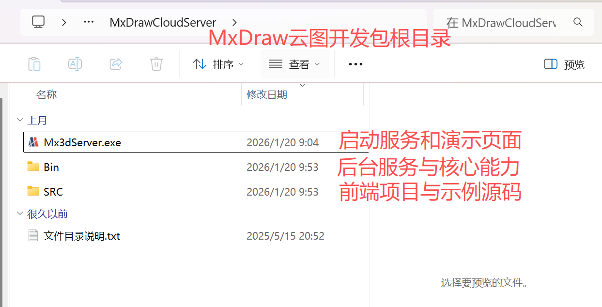

Linux:

```
MXDRAWCLOUDSERVER1.0_XXX_xxx_TRYVERSION （其中XXX为云图开发包版本号,xxx为对应的操作系统）
└─ install
   └─ MxDrawCloudServer   （云图开发包根目录）
```

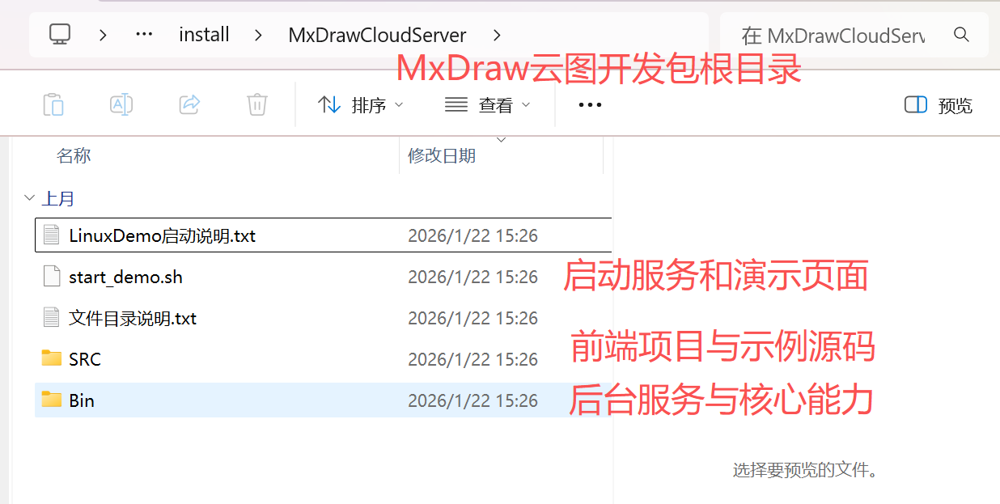

从功能角度看，目录可以分为三大块：

1. **Bin：后台服务与核心能力**

2. **SRC：前端项目与示例源码**

3. **Mx3dServer.exe：启动服务和演示页面(Windows)**

   **start_demo.sh：启动服务和演示页面(Linux)**

新手理解云图开发包，只要先理解这三块的分工，就不会迷路。

------

## 三、Bin 目录：后台服务相关目录（核心）

Windows:

```
MxDrawCloudServer
└─ Bin
   └─ MxCAD   （图纸转换程序目录）
   └─ MxDrawServer   （MxCAD 项目的后台服务目录）
   └─ MxServiceCode   （Node.js 服务代码目录）
```

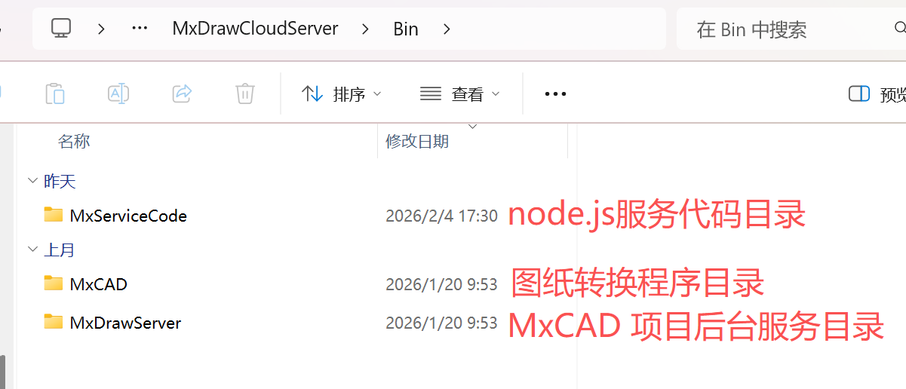

Linux:

```
MxDrawCloudServer
└─ Bin
   └─ Linux   
       └─ MxCAD   （图纸转换程序目录）
       └─ MxDrawServer   （MxCAD 项目的后台服务目录）
   └─ MxServiceCode   （Node.js 服务代码目录）
```

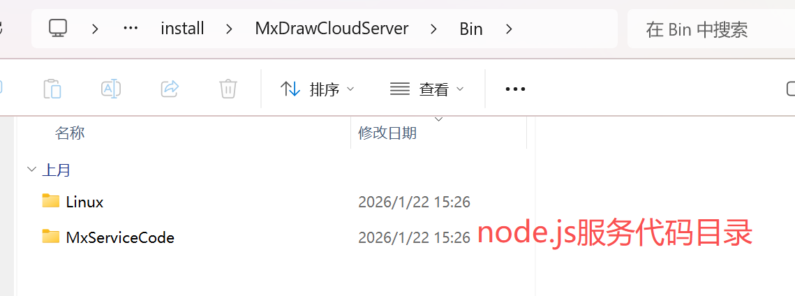

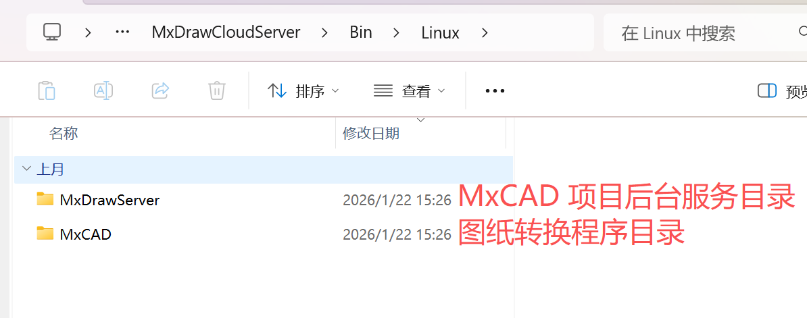

**Bin 是云图开发包中最核心的目录**，承载了 CAD 云化所必需的后台能力。

### 1. MxCAD —— 图纸转换程序目录

- 用于 **CAD 图纸的转换处理**
- 将 DWG / DXF 等原始图纸的格式转换
- 是云图系统能够“在线显示 CAD”的前提条件

没有这个目录下对应的转换程序，前端无法直接展示编辑 CAD 图纸。

------

### 2. MxDrawServer —— MxCAD 项目的后台服务目录

- 提供 **MxCAD 项目内部所需的后台接口服务**
- 为 CAD 图纸加载、处理、交互等能力提供服务支持
- 属于 **MxCAD 工程体系的一部分**

这是连接“图纸数据”和“CAD 功能”的关键后台模块。

------

### 3. MxServiceCode —— Node.js 服务代码目录

- 基于 Node 的 **后台服务代码**
- 用于对外提供后台图纸处理服务接口
- 常用于后台图纸处理，如后台参数化绘图，图纸数据提取，图纸拆分等

对新手而言，这是理解“云图后台如何工作”的最佳入口。

------

## 四、SRC 目录：前端项目相关目录

Winodws/Linux:

```
MxDrawCloudServer
└─ SRC
   └─ sample   （前端项目示例代码目录）
   └─ TsWeb   （云服务的web前端门户）
   └─ doc   （文档目录）
```

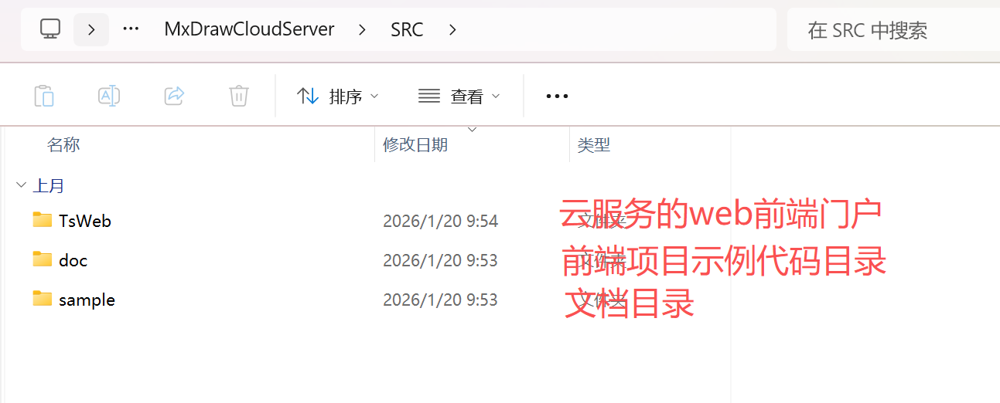

SRC 目录是 MxDraw 云图开发包中面向开发者的核心区域，包含了所有可开放的前端示例项目源码、集成模板及配套文档。无论你是要快速体验功能，还是进行深度二次开发，都应从此目录入手。

------

### 1. doc —— 文档目录（默认为空文件夹）

- 存放与前端项目相关的说明文档、API 手册或集成指南。
- 开发者可在此补充自定义说明，辅助团队协作或项目交接。

### 2. **TsWeb** —— **Web 服务与前端资源托管模块**

TsWeb 目录是 MxDraw 云图开发包中负责 **Web 前端服务托管与接口代理** 的核心组件，基于 Node.js 与 Express 框架构建。它不执行 CAD 图形计算，而是作为用户浏览器与后端 CAD 引擎之间的“桥梁”，提供页面加载、资源分发和轻量级 API 转发能力。

### 3. sample —— 前端项目示例代码目录（重点）

Winodws/Linux:

```ts
MxDrawCloudServer
└─ SRC
   └─ app   （mxcad-app 在不同架构项目下的集成示例）
   └─ Browse   （CAD浏览版项目源码目录）
   └─ Edit   （CAD编辑版项目源码目录）   
   └─ GIS   （CAD+GIS结合项目源码目录）
```

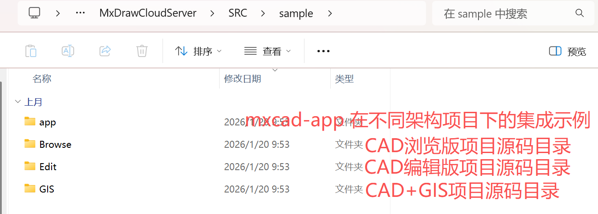

该目录提供了多种典型应用场景的完整前端工程示例，覆盖浏览、编辑、3D、GIS 等核心能力，是新手学习和项目参考的最佳入口。

#### （1）app —— 集成 mxcad-app 依赖包的CAD编辑项目示例源码

Winodws/Linux:

```ts
MxDrawCloudServer
└─ SRC
   └─ sample   （前端项目示例代码目录） 
       └─ app   （mxcad-app 在不同架构项目下的集成示例源码）
          └─ MxCADApp   （Vue2+Webpack）
          └─ plugins   （项目插件目录）
             └─ pluginAiChat   （AI模块）
          └─ sample
             └─ webapack4 
             └─ html+js
             └─ vite+vue3
             └─ webapck+react
             └─ cnd.html
```

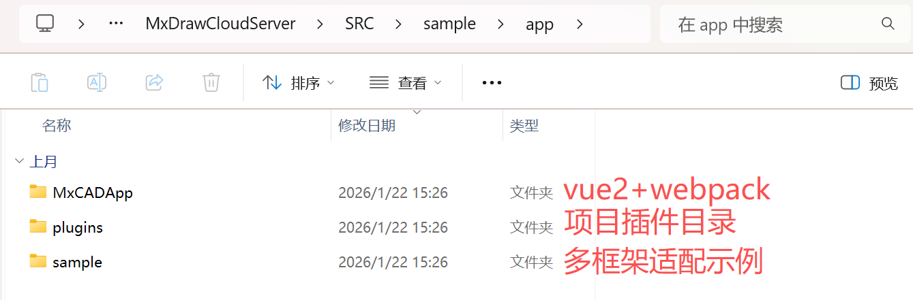

提供在不同前端技术栈下集成 `mxcad-app` 的标准方式：

- `MxCADApp`：基于 Vue2 + Webpack 的完整编辑器项目
- `plugins`：内置插件扩展机制，如 `pluginAiChat`（AI 对话模块）
- 多框架适配示例：包含 `vite+vue3`、`webpack+react`、`html+js` 及 CDN 引入方式（`cnd.html`）

#### （2）Browse —— CAD 浏览版项目源码目录

Winodws/Linux:

```ts
MxDrawCloudServer
└─ SRC
   └─ sample   （前端项目示例代码目录） 
      └─ Browse   （CAD 浏览版项目示例）
          └─ 2d 
             └─ Browseiframe   （iframe嵌套集成示例）
             └─ Browse   （CAD浏览版项目源码目录）
```

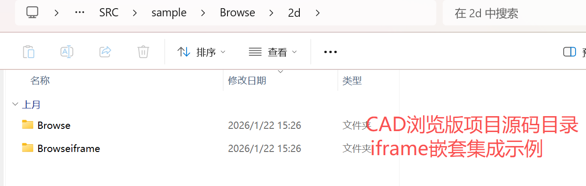

专注于图纸查看场景，支持轻量级部署：

- `2d/Browse`：纯 2D 图纸浏览页面
- `2d/Browseiframe`：通过 `iframe` 嵌套集成的浏览模式，便于嵌入第三方系统

#### （3）Edit—— CAD 编辑版项目源码目录

Winodws/Linux:

```ts
MxDrawCloudServer
└─ SRC
   └─ sample   （前端项目示例代码目录） 
      └─ Edit   （CAD 编辑版项目示例）
          └─ 2d  （二维图纸项目）
             └─ dist   （MxCAD APP 的静态资源包）
             └─ MxCAD   （MxCAD APP 中的一个插件源码目录）
             └─ MxCADiframe   （iframe嵌套集成示例）
          └─ 3d  （三维图纸项目）
             └─ dist   （3D项目的静态资源包） 
             └─ MxCAD   （3D项目中的一个插件源码目录） 
```

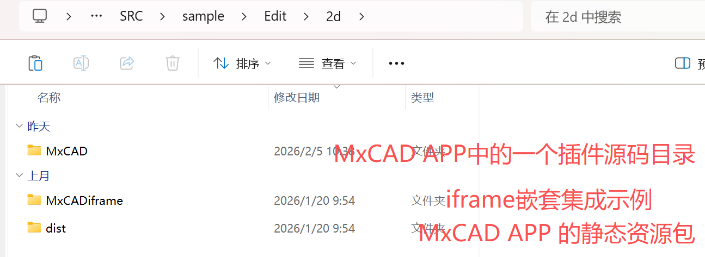

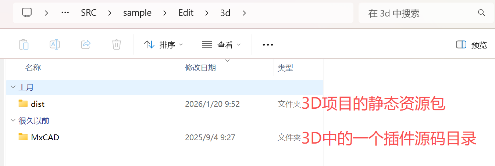

提供完整的在线编辑能力，包含二维与三维模式：

- `Edit/2d`：2D 图纸编辑环境，含工具栏、属性面板等
- `Edit/3d`：3D 模型查看与基础操作界面
- `dist` 子目录：预编译的静态资源包，可直接部署到 Web 服务器

#### （4）GIS —— CAD+GIS项目源码目录

Winodws/Linux:

```TS
MxDrawCloudServer
└─ SRC
   └─ sample   （前端项目示例代码目录） 
       └─ GIS
          └─ MxCADMap   （GIS+CAD项目源码目录） 
```

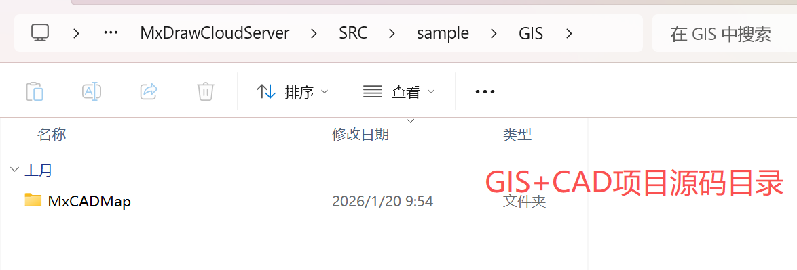

展示 MxCAD 与地理信息系统（GIS）的集成方案：

* `MxCADMap`：将 CAD 图形叠加到地图底图上，实现空间数据联动分析

**各子项目均采用模块化设计，开发者可按需复制、修改或组合使用，极大降低集成门槛**

## 五、Mx3dServer.exe/start_demo.sh：Mxdraw云图启动入口

`Mx3dServer.exe`（Windows）与 `start_demo.sh`（Linux）是 MxDraw 云图开发包的**统一启动入口**，用于一键初始化整个 CAD 云服务环境。它们屏蔽了后台服务配置、端口绑定、依赖启动等复杂细节，让开发者或用户只需“双击”或“执行脚本”即可进入演示状态。

#### 1. **Mx3dServer.exe：梦想云图服务启动程序（图形化入口）**

`Mx3dServer.exe` 是 MxDraw 云图开发包在 Windows 平台上的**图形化启动程序**，双击运行后将自动弹出“梦想云图服务启动程序”窗口。该程序集成了多模块服务的统一管理与快速访问功能，极大简化了部署流程，让开发者与用户无需手动配置即可一键开启完整的 CAD 在线演示环境。

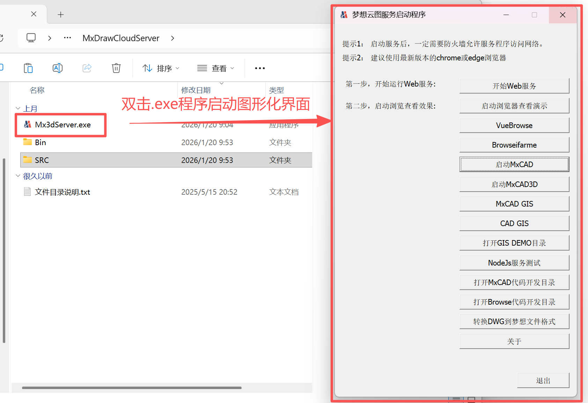

- **开始Web服务**：

  当你点击 **“开启Web服务”** 按钮时，MxDraw 会自动启动两个关键的本地服务程序。这两个服务协同工作，共同支撑起完整的在线 CAD 功能体验。

  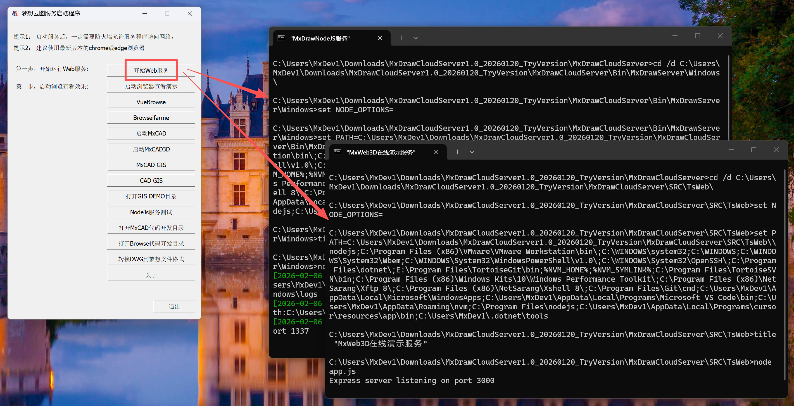

  - **第一个服务（端口 1337）：CAD 核心引擎**

    该服务由 `Bin/MxDrawServer/Windows/app.js` 脚本启动，是 MxDraw 的“大脑”。它负责处理所有与图纸相关的底层操作，例如打开 DWG 文件、解析图形数据、保存编辑结果等。虽然你看不到它的界面，但所有 CAD 功能都依赖它来完成。

    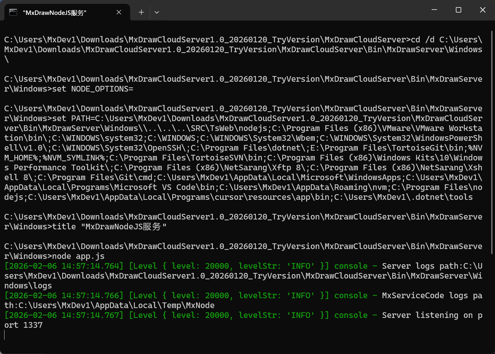

  - **第二个服务（端口 3000）：Web 前端服务器**

    该服务由 `SRC/TsWeb/app.js` 脚本启动，是用户的“操作窗口”。它基于 Express 框架构建，负责托管所有网页文件（如 2D 编辑器、3D 查看器、文件浏览器等），并将你的操作请求转发给 CAD 引擎。你看到的界面、按钮、工具栏，都由这个服务提供。

    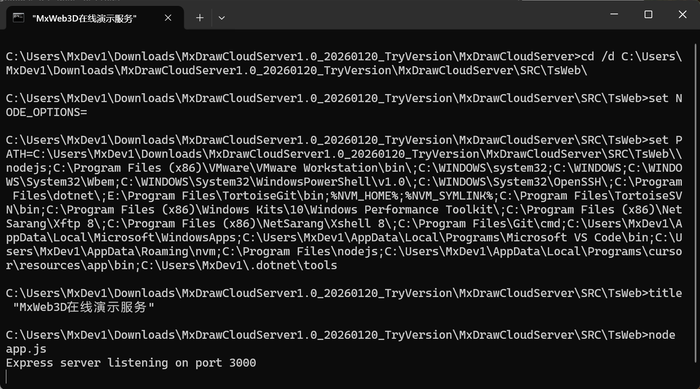
    

- **启动浏览器查看演示**

  自动调用系统默认浏览器（推荐 Chrome 或 Edge）打开首页地址 `http://localhost:3000`，快速进入演示环境。

  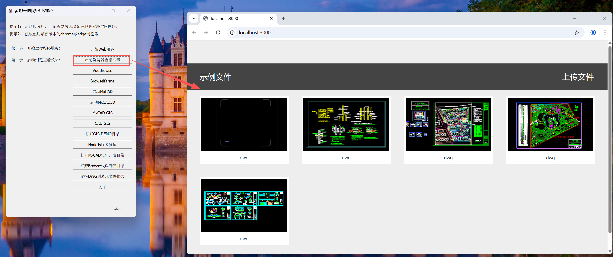

- **VueBrowse**

  启动基于 Vue 框架的图纸浏览项目。

  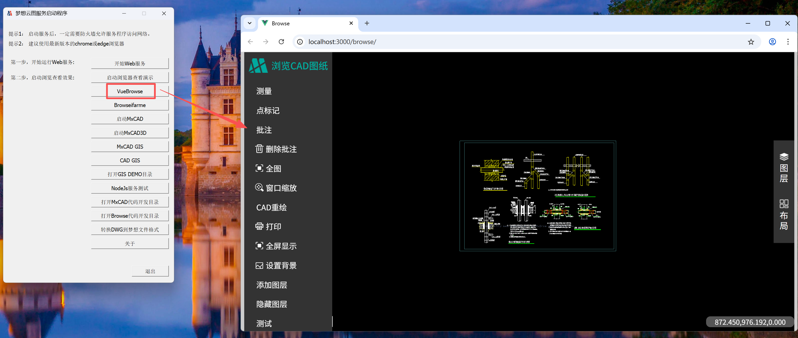

- **Browseiframe**

  以 `iframe` 嵌入模式加载 CAD 浏览页面，便于集成到第三方系统或企业门户中。

- **启动MxCAD**

  打开 2D CAD 在线编辑器，支持绘图、修改、标注、上传、保存等完整编辑功能，适用于工程设计场景。

  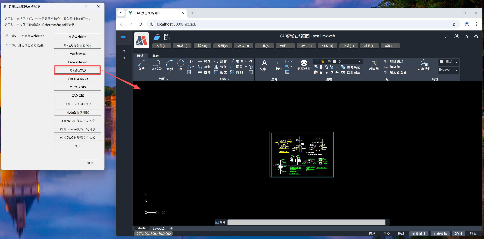

- **启动MxCAD3D**

  启动 3D CAD 查看器，基于 WebGL 渲染三维模型。

  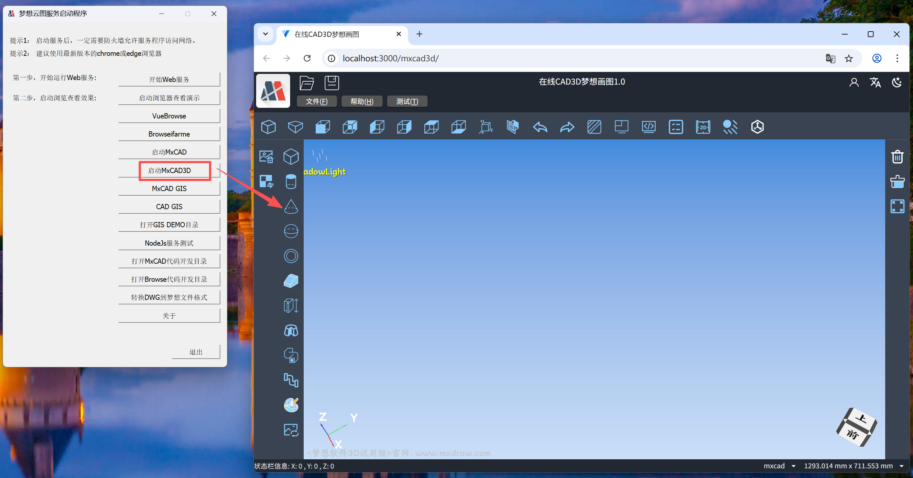

- **MxCAD GIS**

  启动 CAD 与 GIS 融合应用，将 CAD 图纸叠加至地图底图，实现空间数据联动分析。

  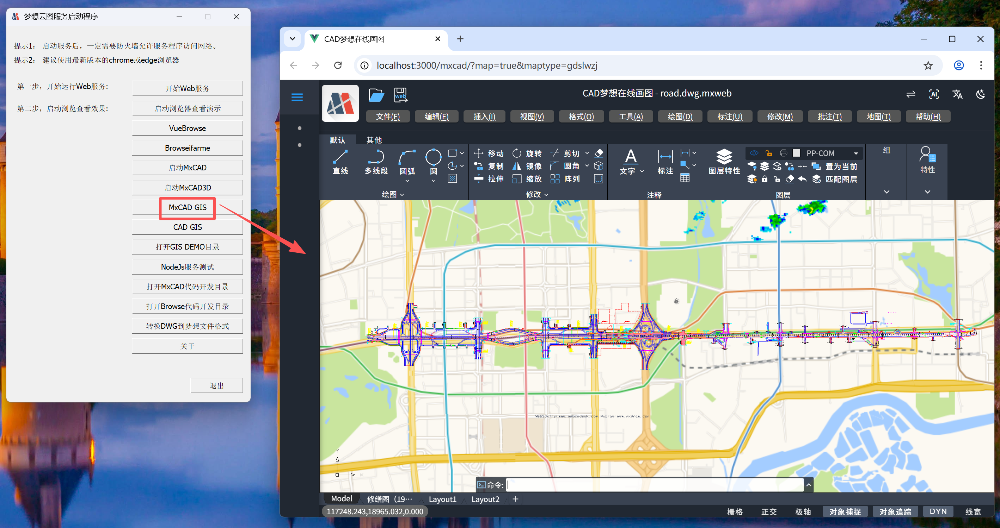

- **CAD GIS**

  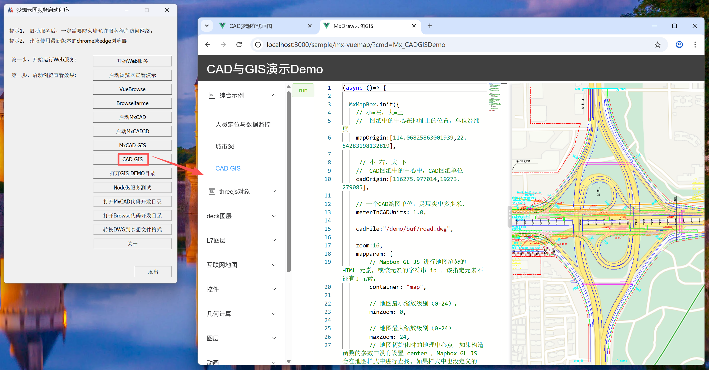

- **打开GIS DEMO目录**

  直接打开本地 GIS 示例项目的文件夹，方便查看相关代码与数据资源。

  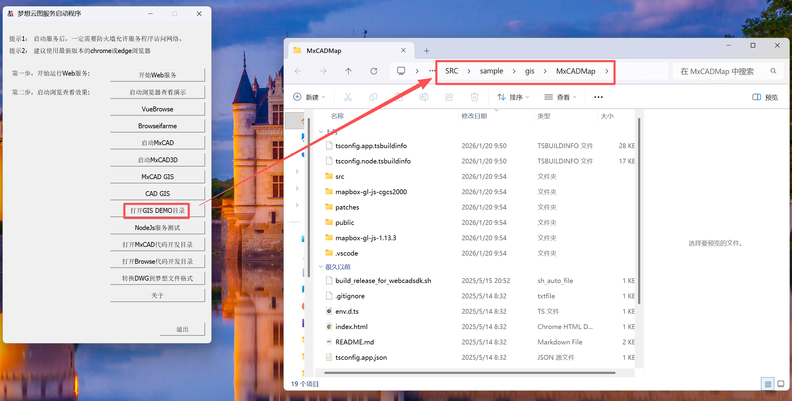

- **NodeJs服务测试**

  打开 `http://localhost:1337/serverTest` 页面，提供一键调用 DWG 转换、PDF 导出、图层读取等核心 CAD 接口的可视化测试功能。

  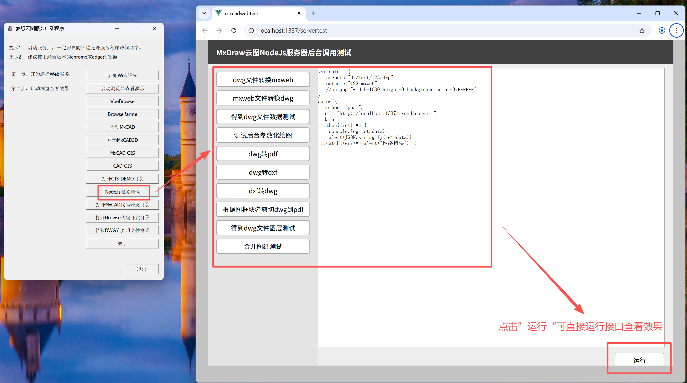

- **打开MxCAD代码开发目录**

  跳转至 `SRC/sample/app/MxCADApp` 目录，供开发者参考完整的 Vue + TypeScript 集成项目源码。

  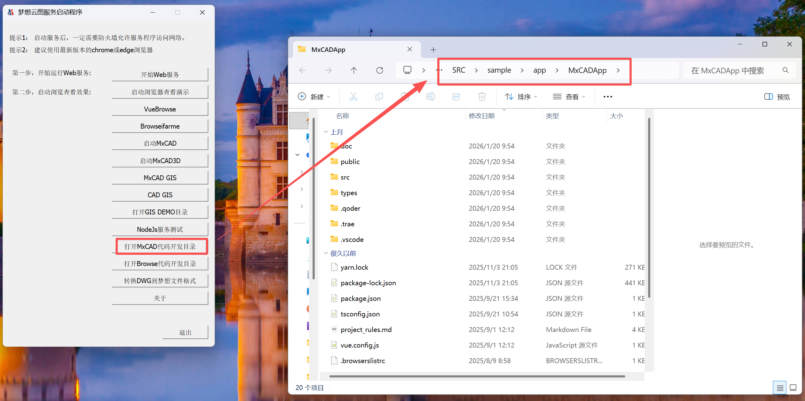

- **打开Browse代码开发目录**

  跳转至 `SRC/sample/Browse` 目录，查看图纸浏览类项目的前端实现逻辑。

  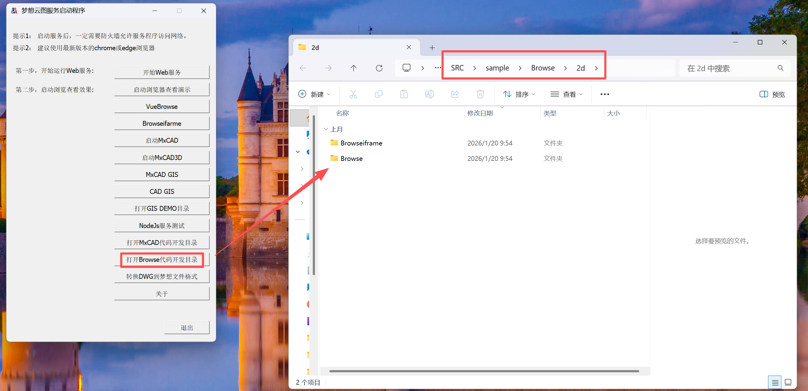

- **转换DWG到梦想文件格式**

  启动 DWG 格式转换工具，将标准 AutoCAD DWG 文件批量转换为 MxDraw 专用的 `.mxweb` 格式，提升加载速度与兼容性。

  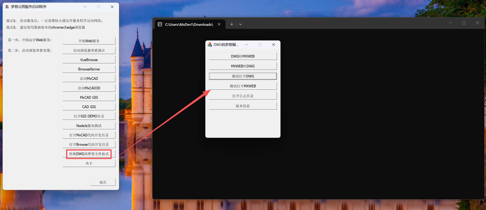

- **关于**

  显示软件版本号、版权信息。

  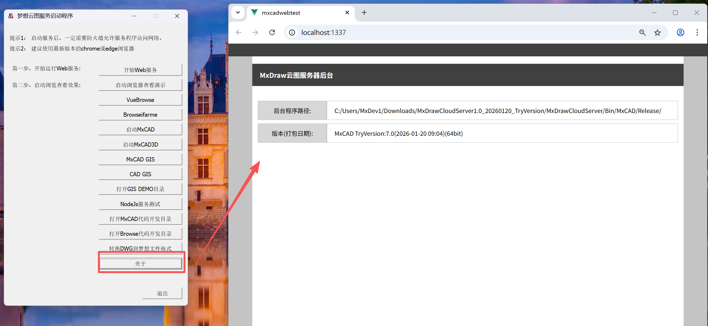

- **退出**

  关闭启动程序窗口。

> 提示：首次运行时，请在 Windows 防火墙中允许 `Mx3dServer.exe` 的网络访问权限，以确保服务可被正常连接。建议使用最新版 Chrome 或 Edge 浏览器获得最佳体验。

#### 2. start_demo.sh：**Linux平台云图服务启动脚本**

`start_demo.sh` 是 MxDraw 云图开发包在 **Linux 系统下的标准启动脚本**，用于一键初始化完整的 Web CAD 演示环境。其功能与 Windows 平台的 `Mx3dServer.exe` 完全对等，确保跨平台体验一致。

#### **核心作用**

- 同时启动两个关键服务：
  - **CAD 核心服务**（Node.js）：运行于 `1337` 端口，提供 DWG 解析、绘图命令执行、格式转换等底层能力；
  - **Web 前端服务**（Express）：运行于 `3000` 端口，托管所有演示页面（如 2D 编辑器、3D 查看器、文件浏览器等）。
- 自动配置服务路径与依赖，无需手动执行多条命令。

#### **使用步骤**

1. **提前查看LinuxDemo启动说明**
   参照《LinuxDemo启动说明.txt》执行权限设置运行。

   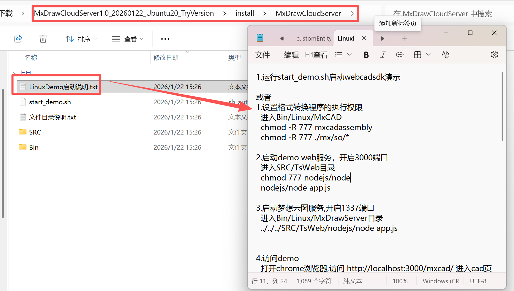

2. **执行启动脚本**

   ```
   ./start_demo.sh
   ```

3. **访问演示页面**
   服务启动成功后，在浏览器中打开：

   - 首页：`http://localhost:3000`
   - 2D 编辑：`http://localhost:3000/mxcad`
   - 3D 查看：`http://localhost:3000/mxcad3d`
   - 文件浏览：`http://localhost:3000/browse`

#### **注意事项**

- 脚本默认以后台方式启动服务，若需调试可修改脚本移除 `&` 符号以查看实时日志；
- 若端口被占用，可编辑脚本中的 `PORT` 变量进行调整；

>  **提示**：尽管无图形界面，`start_demo.sh` 提供了与 Windows `.exe` 相同的功能完整性，是 Linux 开发者快速验证和集成 MxDraw 云图能力的标准入口。