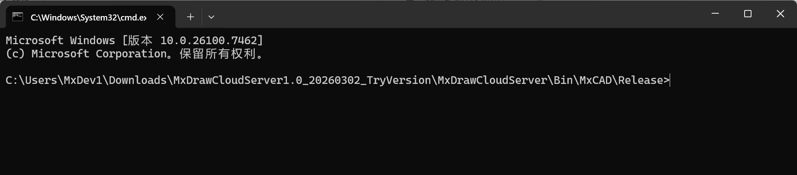
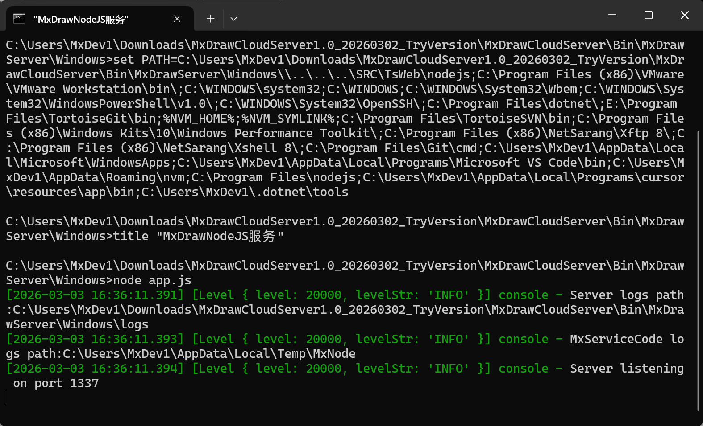

# MxDraw云图开发包图纸转换功能使用指南

## 一、转换前准备：下载最新的云图开发包

图纸格式转换依赖 MxDraw 云图开发包，需根据操作系统下载对应版本：

- Windows版：

  https://demo.mxdraw3d.com/download/MxDrawCloudServer1.0_TryVersion.7z

  https://demo2.mxdraw3d.com:3562/MxDrawCloudServer1.0TryVersion.7z

- Linux X86_64版：

  https://demo.mxdraw3d.com/download/MxDrawCloudServer1.0_Ubuntu20_TryVersion.tar.gz

  https://demo2.mxdraw3d.com:3562/MxDrawCloudServer1.0(Linux)TryVersion.tar.gz

- Linux ARM版(飞腾和鲲鹏)：

  https://demo.mxdraw3d.com:3562/MxDrawCloudServer1.0(arm64)TryVersion.tar.gz

  https://demo2.mxdraw3d.com:3562/MxDrawCloudServer1.0(arm64)TryVersion.tar.gz

如果你对云图开发包的结构还不够了解，可查看 [云图开发包使用说明](./2.Cloud%20Map%20Development%20Kit%20Instructions.md) ， 该文档内详细据介绍的了开发包的结构与功能，有助于你更快上手使用图纸转换功能。

## 二、图纸转换核心原理

MxDraw云图开发包的图纸转换能力，核心依托于开发包内`Bin`目录下的`MxCAD`图纸转换程序（Windows系统直接位于`Bin/MxCAD`，Linux系统位于`Bin/Linux/MxCAD`）。所有图纸转换操作，无论采用哪种调用方式，本质都是触发该转换程序执行格式处理逻辑。


开发包针对不同操作系统（Windows/Linux）对转换程序的部署路径做了适配（如Linux下新增`Linux`子目录），且Linux系统需额外完成转换程序的权限配置，但核心调用逻辑跨平台保持一致。


## 三、图纸转换支持范围

MxDraw云图开发包的转换程序支持多格式互转，且所有格式转换均可自定义指定图纸转换范围，支持的转换格式包含：

- 源/目标格式：DWG、DXF、MXWEB（MxCAD专用格式，提升在线加载速度）、PDF、JPG。

## 四、图纸转换两种实现方式

### 方式一：命令行直接调用转换程序

#### 1. 前置准备

- **Windows系统**：直接定位到开发包`MxDrawCloudServer/Bin/MxCAD`目录（转换程序所在路径）。

  

- **Linux系统**：

  1. 定位到`MxDrawCloudServer/Bin/Linux/MxCAD`目录；

  2. 执行权限配置命令，赋予转换程序可执行权限：

     ```bash
     sudo chmod -R 777 mxcadassembly
     sudo chmod -R 777 ./mx/so/*
     sudo  cp -r -f ./mx/locale /usr/local/share/locale
     ```

     （注：可直接参考开发包内`LinuxDemo启动说明.txt`）

  


#### 2. 调用方式

在命令行终端（Windows：CMD/PowerShell；Linux：Shell）进入转换程序所在目录后，执行对应转换命令，具体转换命令请查看下文 [五、文件格式转换命令详细说明](#五、文件格式转换命令详细说明)

- Winodws:

  

- Linux:

  

### 方式二：调用1337端口转换接口

#### 1. 前置准备

启动云图开发包的CAD核心引擎服务，确保1337端口服务正常运行：

- **Windows系统**：双击`MxDrawCloudServer/Mx3dServer.exe`，点击“开始Web服务”，自动启动1337端口（`Bin/MxDrawServer/Windows/app.js`驱动）的CAD核心引擎服务。

  

- **Linux系统**：执行启动脚本启动1337端口服务：

  ```bash
  ./start_demo.sh
  ```

  

  （脚本会自动启动1337端口的CAD核心服务与3000端口的Web服务）


#### 2. 接口调用方式

通过HTTP请求调用1337端口下的图纸转换接口 `http://localhost:1337/mxcad/convert`，接口核心参数包含源文件路径/URL、目标格式、转换范围等，支持POST/GET方式调用（推荐POST）。具体接口参数设置请参考下文 [五、文件格式转换命令详细说明](#五、文件格式转换命令详细说明)

基础调用示例（HTTP POST）

* Windows:

  ```ts
  var data = {
     srcpath:"D:/Test/123.dwg",
     outname:"123.mxweb"
  };
  axios({
    method: "post",
    url: "http://localhost:1337/mxcad/convert",
    data 
  }).then((ret) => {
      console.log(ret.data)
      alert(JSON.stringify(ret.data))
  }).catch((err)=>{alert("网络错误") })
  ```

* Linux:

  ```bash
  curl -X POST http://localhost:1337/mxcad/convert \
    -H "Content-Type: application/json" \
    -d '{"srcpath":"/home/user/test/123.dwg","outname":"123.mxweb","outpath":"/home/user/output"}'
  ```


##### 接口测试便捷方式

可直接通过开发包提供的可视化测试页面调用转换接口：

1. 确保1337端口服务启动；
2. 打开浏览器访问 http://localhost:1337/servertest；
3. 在页面中找到“DWG转换”相关测试模块，选择源文件、目标格式、转换范围，点击“运行”即可触发转换。

无论采用命令行还是接口调用方式，均基于同一套转换程序，保证转换逻辑、格式支持、范围控制的一致性：

- 命令行方式：适合批量离线转换、自动化脚本集成；
- 1337端口接口方式：适合在线业务系统集成，支持前端/第三方服务远程调用，无需直接操作底层程序。

## 五、文件格式转换命令详细说明

根据文档的整体风格（清晰的层级、代码块区分、表格参数说明、简洁的技术语言），对“DWG、DXF转MXWEB”部分的内容进行了格式调整和语言优化，使其更利于阅读且与全文保持一致：

### 1. DWG、DXF 转 MXWEB

支持将 AutoCAD 标准格式（`.dwg`、`.dxf`）转换为 MxCAD 专用的 Web 格式（`.mxweb`），以提升图纸在云端的加载与渲染速度。

#### (1) 命令行直接调用

**① 默认转换（快速模式）**
若未指定具体路径，程序将自动读取**转换程序同级目录**下的同名文件。

- **输出命名**：原始文件名 + `.mxweb`（例如：`1.dwg` → `1.dwg.mxweb`）
- **输出位置**：源文件同级目录

Windows:

```bash
# 转换 DWG 文件
mxcadassembly.exe 1.dwg

# 转换 DXF 文件
mxcadassembly.exe 1.dxf
```

Linux:

```bash
# 转换 DWG 文件
./mxcadassembly 1.dwg

# 转换 DXF 文件
./mxcadassembly.exe 1.dxf
```

**② 自定义转换（高级模式）**
支持指定源文件路径、输出目录及文件名，并可控制压缩策略。

- **输出命名**：若未写后缀，默认添加 `.mxweb`；也可手动指定 `.mxweb` 后缀。

Winodws:

```bash
mxcadassembly.exe {"srcpath":"D:\test2.dwg","outpath":"D:\test","outname":"test", "compression":0}
```

Linux:

```bash
./mxcadassembly '{"srcpath":"/home/user/test2.dwg","outpath":"/home/user/test","outname":"test", "compression":0}'
```

**参数说明：**

| 参数          | 说明                                                   |
| :------------ | :----------------------------------------------------- |
| `srcpath`     | 待转换源文件的完整路径                                 |
| `outpath`     | 输出文件的目标路径（若为空，默认输出至源文件同级目录） |
| `outname`     | 输出文件名（注意：MXWEB 转 CAD 时需显式加上后缀）      |
| `compression` | 压缩控制：`0` 表示不压缩；若不传该属性，默认进行压缩   |

---

#### (2) 接口调用方式

通过 HTTP POST 请求调用本地 `1337` 端口的转换服务。

**请求示例：**

Winodws:

```javascript
var data = {
   srcpath: "C:/test/a.dwg",
   outname: "123.mxweb",
   outpath: "E:/"
};

axios({
  method: "post",
  url: "http://localhost:1337/mxcad/convert",
  data: data 
}).then((ret) => {
    console.log(ret.data);
    alert(JSON.stringify(ret.data));
}).catch((err) => {
    alert("网络错误");
});
```

Linux:

```bash
curl -X POST "http://localhost:1337/mxcad/convert" \
  -H "Content-Type: application/json" \
  -d '{
    "srcpath": "XXX/a.dwg",
    "outname": "123.mxweb",
    "outpath": "XXX"
  }'
```

### 2. MXWEB 转 DWG、DXF

支持将 MxCAD Web 格式（`.mxweb`）逆向转换回 AutoCAD 标准格式（`.dwg` 或 `.dxf`），以便在本地 CAD 软件中进行二次编辑或归档。

#### (1) 命令行直接调用

通过 JSON 参数指定源文件、输出路径及目标文件名。**注意：** 输出文件名必须显式包含 `.dwg` 或 `.dxf` 后缀，以决定转换的目标格式。

Windows:

```bash
# 转换为 DWG 格式
mxcadassembly.exe {"srcpath":"D:\test.mxweb","outpath":"D:\","outname":"test.dwg"}

# 转换为 DXF 格式
mxcadassembly.exe {"srcpath":"D:\test.mxweb","outpath":"D:\","outname":"test.dxf"}
```

Linux:

```bash
# 转换为 DWG
./mxcadassembly '{"srcpath":"/home/user/data/test.mxweb","outpath":"/home/user/data/","outname":"test.dwg"}'

# 转换为 DXF
./mxcadassembly '{"srcpath":"/home/user/data/test.mxweb","outpath":"/home/user/data/","outname":"test.dxf"}'
```

**关键参数说明：**

*   `srcpath`: 待转换的 `.mxweb` 源文件路径。
*   `outpath`: 转换后文件的保存目录。
*   `outname`: **必须**包含后缀（如 `test.dwg`），程序将根据后缀自动识别转换目标格式。

---

#### (2) 接口调用方式

通过 HTTP POST 请求调用本地服务进行格式逆转。

**请求示例：**

Winodws:

```javascript
var data = {
   srcpath: "D:/Test/123.mxweb",
   outname: "123new.dwg",  // 指定输出为 .dwg 格式
   outpath: "D:/"
};

axios({
  method: "post",
  url: "http://localhost:1337/mxcad/convert",
  data: data 
}).then((ret) => {
    console.log(ret.data);
    alert(JSON.stringify(ret.data));
}).catch((err) => {
    alert("网络错误");
});
```

Linux:

```bash
curl -X POST "http://localhost:1337/mxcad/convert" \
  -H "Content-Type: application/json" \
  -d '{
    "srcpath": "XXX/123.mxweb",
    "outname": "123new.dwg",
    "outpath": "XXX"
  }'
```

> **提示**：与“DWG 转 MXWEB”不同，此过程必须在 `outname` 中明确指定 `.dwg` 或 `.dxf` 后缀，否则无法完成格式转换。

### 3. DWG 转 PDF

支持将 AutoCAD 图纸（`.dwg`）直接转换为便携式文档格式（`.pdf`），适用于图纸预览、打印归档及非 CAD 环境下的分享。支持自定义输出分辨率及颜色策略。

#### (1) 命令行直接调用

通过 JSON 参数配置源文件、输出名称、图像尺寸及颜色模式。

Windows:

```bash
mxcadassembly.exe {'srcpath':'C:/test/1.dwg','outname':'1.pdf','width':'5000','height':'5000','colorPolicy':'mono','exportLayout':'false','outpath':'C:/'}
```

Linux:

```bash
./mxcadassembly '{"srcpath":"/absolute/path/to/1.dwg","outname":"1.pdf","width":"5000","height":"5000","colorPolicy":"mono","exportLayout":"false","outpath":"XXX/XXX/"}'
```

**参数说明：**

| 参数           | 说明                                              |
| :------------- | :------------------------------------------------ |
| `srcpath`      | 待转换的 `.dwg` 源文件路径                        |
| `outpath`      | 输出目录（若不填，默认同 srcpath 目录）            |
| `outname`      | 输出文件名（必须包含 `.pdf` 后缀）                |
| `width`        | 输出 PDF 的宽度（像素）                           |
| `height`       | 输出 PDF 的高度（像素）                           |
| `colorPolicy`  | 颜色策略：`mono` 表示黑白，不设置则默认为**彩色** |
| `exportLayout` | 是否导出布局空间，不设置则默认**导出**            |

> **注意**：若不设置 `colorPolicy`，生成的 PDF 将保留原图色彩；设置为 `mono` 可生成黑白灰度图纸，常用于工程打印以节省墨粉。

---

#### (2) 接口调用方式

通过 HTTP POST 请求调用本地服务，支持更灵活的动态参数配置（如布局导出控制等）。

**请求示例：**

Winodws:

```javascript
var data = {
   srcpath: "C:/test/123.dwg",
   outpath: "C:/",          // 输出目录
   outname: "123.pdf",      // 输出文件名
   width: "2000",           // 自定义宽度
   height: "2000",          // 自定义高度
   // colorPolicy: "mono",  // 可选：取消注释以启用黑白模式
   // exportLayout: "false" // 可选：控制是否导出布局空间
};

axios({
  method: "post",
  url: "http://localhost:1337/mxcad/convert",
  data: data 
}).then((ret) => {
    console.log(ret.data);
    alert(JSON.stringify(ret.data));
}).catch((err) => {
    alert("网络错误");
});
```

Linux:

```bash
curl -X POST "http://localhost:1337/mxcad/convert" \
  -H "Content-Type: application/json" \
  -d '{
    "srcpath": "XXX/XXX/123.dwg",
    "outpath": "XX/",
    "outname": "123.pdf",
    "width": "2000",
    "height": "2000"
  }'
```

> **提示**：接口调用时，`colorPolicy` 和 `exportLayout` 等为可选参数。若需生成黑白 PDF，请取消 `colorPolicy: "mono"` 的注释。

### 4. DWG 与 DXF 互转

本功能支持 AutoCAD 两种主流格式之间的双向无损转换：

- **DWG 转 DXF**：将二进制 DWG 文件转换为文本或二进制 DXF 格式，便于跨平台数据交换。
- **DXF 转 DWG**：将 DXF 文件还原为标准的 DWG 格式，以优化存储体积和加载性能。

#### (1) 命令行直接调用

通过 `outname` 参数的后缀名（`.dxf` 或 `.dwg`）自动识别转换方向。

Winodws:

```bash
# DWG 转 DXF
mxcadassembly.exe {"srcpath":"D:\test.dwg","outpath":"D:\","outname":"test.dxf"}

# DXF 转 DWG
mxcadassembly.exe {"srcpath":"D:\test.dxf","outpath":"D:\","outname":"test.dwg"}
```

Linux:

```bash
# DWG 转 DXF
./mxcadassembly '{"srcpath":"/home/user/data/test.dwg","outpath":"/home/user/data/","outname":"test.dxf"}'
# DXF 转 DWG
./mxcadassembly '{"srcpath":"/home/user/data/test.dxf","outpath":"/home/user/data/","outname":"test.dwg"}'
```

**操作逻辑：**

- 程序读取 `srcpath` 指定的源文件。
- 根据 `outname` 中填写的后缀决定目标格式。
- 结果保存至 `outpath` 指定目录（若为空则保存在源文件同级目录）。

---

#### (2) 接口调用方式

支持通过 HTTP POST 请求进行灵活转换，`outpath` 为可选参数。

Winodws:

```javascript
var data = {
   srcpath: "D:/Test/123.dwg",
   outname: "123.dxf",    // 修改后缀即可改变转换方向
   outpath: "D:/"         // 指定输出目录
};

axios({
  method: "post",
  url: "http://localhost:1337/mxcad/convert",
  data: data 
}).then((ret) => {
    console.log(ret.data);
    alert(JSON.stringify(ret.data));
}).catch((err) => {
    alert("网络错误");
});
```

Linux:

```bash
curl -X POST "http://localhost:1337/mxcad/convert" \
  -H "Content-Type: application/json" \
  -d '{
    "srcpath": "XXX/123.dwg",
    "outname": "123.dxf",
    "outpath": "XXX/"
  }'
```

> **提示**：转换方向完全由 `outname` 的后缀决定。若源文件是 `.dwg` 且 `outname` 后缀为 `.dxf`，则执行 DWG 转 DXF；反之亦然。

### 5. 指定范围裁剪 DWG

本功能支持从原始 DWG 图纸中裁剪出指定矩形范围内的图形内容，并生成新的独立 DWG 文件。适用于提取图纸局部细节、制作大样图或分割超大图纸。

#### (1) 命令行直接调用

通过 `cmd` 参数指定为 `cut_dwg` 模式，并定义裁剪区域的两个对角点坐标 `(pt1_x, pt1_y)` 和 `(pt2_x, pt2_y)`。

Windows:

```bash
mxcadassembly.exe {'cmd':'cut_dwg','bd_pt1_x':'1000','bd_pt1_y':'1200','bd_pt2_x':'1400','bd_pt2_y':'1400','srcpath':'1.dwg','outname':'testcut_1.dwg'}
```

Linux:

```bash
./mxcadassembly '{"cmd":"cut_dwg","bd_pt1_x":"1000","bd_pt1_y":"1200","bd_pt2_x":"1400","bd_pt2_y":"1400","srcpath":"/home/user/test/1.dwg","outname":"/home/user/test/testcut_1.dwg"}'
```

**参数说明：**

| 参数       | 说明                                    |
| :--------- | :-------------------------------------- |
| `cmd`      | **固定值**：`cut_dwg`，用于触发裁剪命令 |
| `srcpath`  | 待裁剪的源 DWG 文件路径                 |
| `outname`  | 输出文件名（需包含 `.dwg` 后缀）        |
| `outpath`  | 输出目录（若不填，默认同 srcpath 目录） |
| `bd_pt1_x` | 裁剪区域 **起点** 的 X 坐标             |
| `bd_pt1_y` | 裁剪区域 **起点** 的 Y 坐标             |
| `bd_pt2_x` | 裁剪区域 **终点** 的 X 坐标             |
| `bd_pt2_y` | 裁剪区域 **终点** 的 Y 坐标             |

> **注意**：坐标值基于图纸当前的坐标系单位。请确保 `pt1` 和 `pt2` 能构成一个有效的矩形区域。

---

#### (2) 接口调用方式

通过 HTTP POST 请求，将裁剪参数封装在 JSON 数据体中发送。

**请求示例：**

Windows:

```bash
var data = {
   cmd: "cut_dwg",            // 指令类型
   bd_pt1_x: "1000",          // 起点 X
   bd_pt1_y: "1200",          // 起点 Y
   bd_pt2_x: "1400",          // 终点 X
   bd_pt2_y: "1400",          // 终点 Y
   srcpath: "1.dwg",          // 源文件路径
   outname: "testcut_2.dwg"   // 输出文件名
   // outpath: "D:/output/"   // 可选：指定输出目录
};

axios({
  method: "post",
  url: "http://localhost:1337/mxcad/convert",
  data: data 
}).then((ret) => {
    console.log(ret.data);
    alert(JSON.stringify(ret.data));
}).catch((err) => {
    alert("网络错误");
});
```

Linux:

```javascript
curl -X POST "http://localhost:1337/mxcad/convert" \
  -H "Content-Type: application/json" \
  -d '{
    "cmd": "cut_dwg",
    "bd_pt1_x": "1000",
    "bd_pt1_y": "1200",
    "bd_pt2_x": "1400",
    "bd_pt2_y": "1400",
    "srcpath": "XXX/1.dwg",
    "outname": "testcut_2.dwg",
    "outpath": "XXX/"
  }'
```

> **提示**：此操作仅保留矩形框内的图元，框外内容将被剔除。生成的新文件将继承原文件的图层、块定义等属性。

### 6. 指定范围输出 PDF

本功能支持将 DWG 图纸中**指定矩形区域**的内容直接打印/导出为 PDF 文件。与“全图转 PDF”不同，此功能允许用户通过坐标精确控制输出范围，并自定义输出纸张尺寸和颜色模式，非常适合制作局部大样图或特定区域的汇报图纸。

#### (1) 命令行直接调用

通过 `cmd` 参数指定为 `print_to_pdf`，并结合坐标参数定义裁剪区域，同时设置输出 PDF 的宽高和颜色策略。

Windows:

```bash
mxcadassembly.exe {'cmd':'print_to_pdf','width':'2100','height':'2970','bd_pt1_x':'1000','bd_pt1_y':'1200','bd_pt2_x':'1400','bd_pt2_y':'1400','srcpath':'D:/Test/testprint.dwg','outname':'testprint.pdf','colorPolicy':'mono', 'outpath':'D:/'}
```

Linux:

```bash
./mxcadassembly '{"cmd":"print_to_pdf","width":"2100","height":"2970","bd_pt1_x":"1000","bd_pt1_y":"1200","bd_pt2_x":"1400","bd_pt2_y":"1400","srcpath":"/home/user/Test/testprint.dwg","outname":"testprint.pdf","colorPolicy":"mono","outpath":"/home/user/Test/"}'
```

**参数说明：**

| 参数                    | 说明                                             |
| :---------------------- | :----------------------------------------------- |
| `cmd`                   | **固定值**：`print_to_pdf`，触发指定范围打印命令 |
| `srcpath`               | 源 DWG 文件路径                                  |
| `outname`               | 输出文件名（必须包含 `.pdf` 后缀）               |
| `outpath`               | 输出目录                                         |
| `bd_pt1_x` / `bd_pt1_y` | 裁剪区域 **起点** 坐标                  |
| `bd_pt2_x` / `bd_pt2_y` | 裁剪区域 **终点** 坐标                  |
| `width`                 | 输出 PDF 页面的宽度 (像素或单位，视配置而定)     |
| `height`                | 输出 PDF 页面的高度                              |
| `colorPolicy`           | 颜色策略：`mono` (黑白)，不填默认为彩色          |

> **注意**：
>
> 1. `width` 和 `height` 决定了生成 PDF 页面的物理尺寸比例，请根据实际出图需求设置（如 A4: 2100x2970, A3: 2970x4200 等）。
> 2. 坐标范围 `(pt1, pt2)` 必须在图纸的有效绘图区域内。

---

#### (2) 接口调用方式

通过 HTTP POST 请求发送包含裁剪范围和打印参数的 JSON 数据。

**请求示例：**

Windows:

```bash
var data = {
   cmd: "print_to_pdf",       // 指令类型
   width: "2100",             // 输出页面宽度
   height: "2970",            // 输出页面高度
   bd_pt1_x: "1000",          // 裁剪起点 X
   bd_pt1_y: "1200",          // 裁剪起点 Y
   bd_pt2_x: "1400",          // 裁剪终点 X
   bd_pt2_y: "1400",          // 裁剪终点 Y
   srcpath: "1.dwg",          // 源文件路径
   outname: "testprint.pdf",  // 输出文件名
   colorPolicy: "mono",       // 黑白模式
   // outpath: "D:/"          // 可选：指定输出目录，若不填则默认同源文件目录
};

axios({
  method: "post",
  url: "http://localhost:1337/mxcad/convert",
  data: data 
}).then((ret) => {
    console.log(ret.data);
    alert(JSON.stringify(ret.data));
}).catch((err) => {
    alert("网络错误");
});
```

Linux:

```javascript
curl -X POST "http://localhost:1337/mxcad/convert" \
  -H "Content-Type: application/json" \
  -d '{
    "cmd": "print_to_pdf",
    "width": "2100",
    "height": "2970",
    "bd_pt1_x": "1000",
    "bd_pt1_y": "1200",
    "bd_pt2_x": "1400",
    "bd_pt2_y": "1400",
    "srcpath": "/XXX/1.dwg",
    "outname": "testprint.pdf",
    "colorPolicy": "mono",
    "outpath": "/XXX/"
  }'
```

> **应用场景**：
>
> - **局部出图**：只需打印图纸中的某个详图节点，无需手动在 CAD 中设置视口。
> - **批量切片**：结合脚本循环调用，可将一张超大图纸按坐标网格自动切割成多张标准尺寸的 PDF。
> - **标准化输出**：强制指定 `width` 和 `height`，确保所有输出的 PDF 页面尺寸统一，便于后续装订或归档。

### 7. DWG 转 JPG (仅限 Windows)

本功能用于将 DWG 图纸转换为高分辨率的 JPG 图片。

> **⚠️ 重要提示**：此功能**仅支持 Windows 操作系统**。使用前必须手动下载并部署额外的转换工具包，否则接口调用将失败。

#### (1) 前置准备：工具部署

在调用接口前，请确保已完成以下环境配置：

1. **下载工具包**：
   访问地址下载 `Bin_Release_tool.7z`：
   [http://www.mxdraw3d.com/download/Bin_Release_tool.7z](http://www.mxdraw3d.com/download/Bin_Release_tool.7z)

2. **部署路径**：

   * 解压下载的压缩包，获取其中的 `tool` 文件夹。

   * 将该 `tool` 文件夹放入云图开发包的指定目录下：
     `MxDrawCloudServer\Bin\Release\tool`

   * **最终目录结构示例**：

     ```text
     MxDrawCloudServer/
     └── Bin/
         └── Release/
             └── tool/          <-- 必须存在此文件夹及内部文件
                 ├── MxWebTool.exe
                 └── ...
     ```

   * *注：如果 `MxDrawCloudServer\Bin\Release` 目录不存在，请手动创建。*

---

#### (2) 接口调用方式

部署完成后，通过 HTTP POST 请求调用 `users/tools` 接口。参数需以特定字符串格式拼接在 `param` 字段中。

**请求示例：**

```javascript
var data = {
   cmd: "cadtojpg",
   // 参数说明：
   // file: 源DWG文件路径
   // width: 输出图片宽度 (像素)，设为0则自动根据高度计算
   // height: 输出图片高度 (像素)，设为0则自动根据宽度计算
   // background_color: 背景颜色 (十六进制RGB)，0xFFFFFF为白色
   // out: 输出JPG文件的完整路径
   param: "file=D:/Test/1.dwg width=1000 height=0 background_color=0xFFFFFF out=D:/Test/test.jpg"
};

axios({
   method: "post",
   url: "http://localhost:1337/users/tools", // 注意此处URL与其他转换接口不同
   data: data 
}).then((ret) => {
   console.log(ret.data);
   alert(JSON.stringify(ret.data));
}).catch((err) => {
   alert("网络错误");
});
```

**参数详解 (`param` 字符串内)：**

| 参数键             | 说明                                                         |
| :----------------- | :----------------------------------------------------------- |
| `file`             | 输入的 `.dwg` 文件绝对路径                                   |
| `width`            | 输出图片的宽度（像素）。若设为 `0`，则根据 `height` 自动缩放。 |
| `height`           | 输出图片的高度（像素）。若设为 `0`，则根据 `width` 自动缩放。 |
| `background_color` | 背景填充颜色，使用 6 位十六进制 RGB 值                       |
| `out`              | 输出 `.jpg` 文件的完整保存路径（含文件名）                   |

> **常见问题排查**：
>
> - 如果返回错误提示找不到工具或命令失败，请首先检查 `MxDrawCloudServer\Bin\Release\tool` 目录是否正确放置了解压后的文件。
> - 确保运行环境为 **Windows**，Linux 或 macOS 下此功能不可用。
> - 路径中的斜杠建议使用正斜杠 `/` 或双反斜杠 `\\` 以避免转义问题。

### 补充说明：MXWEB 格式支持

上述所有功能（包括**全图转换**、**格式互转**、**指定范围裁剪/打印**）均完全支持 **MXWEB** 格式。

**操作原理：**
MXWEB 是 MxCAD 的轻量化 Web 格式。在使用命令行或接口调用时，**无需更改任何命令逻辑或参数结构**，仅需将输入文件路径（`srcpath`）指向 `.mxweb` 文件，并将输出文件名（`outname`）的后缀修改为对应的目标格式即可。

#### 1. MXWEB 参与转换的通用规则

| 场景                | 输入文件 (`srcpath`) | 输出文件 (`outname`) | 说明                         |
| :------------------ | :------------------- | :------------------- | :--------------------------- |
| **MXWEB 转 PDF**    | `xxx.mxweb`          | `xxx.pdf`            | 将轻量格式直接转为打印文档   |
| **MXWEB 转 DWG**    | `xxx.mxweb`          | `xxx.dwg`            | 还原为标准 CAD 二进制格式    |
| **MXWEB 转 DXF**    | `xxx.mxweb`          | `xxx.dxf`            | 转换为交换格式               |
| **MXWEB 范围裁剪**  | `xxx.mxweb`          | `cut_xxx.mxweb`      | 对轻量文件进行局部提取       |
| **MXWEB 范围转PDF** | `xxx.mxweb`          | `part_xxx.pdf`       | 截取轻量文件的局部区域转 PDF |

#### 2. 示例演示

**示例 A：MXWEB 转 PDF (全图)**
只需将源文件后缀改为 `.mxweb`，输出后缀改为 `.pdf`。

```bash
# 命令行
mxcadassembly.exe {'srcpath':'C:/test/model.mxweb','outname':'model.pdf','width':'5000','height':'5000'}
```

**示例 B：MXWEB 指定范围转 PDF**
命令 `cmd` 保持为 `print_to_pdf`，坐标逻辑不变，仅文件后缀变化。

```javascript
// 接口调用
var data = {
   cmd: "print_to_pdf",
   srcpath: "D:/Test/web_model.mxweb",  // 输入 MXWEB
   outname: "web_part.pdf",             // 输出 PDF
   bd_pt1_x: "1000", bd_pt1_y: "1200",
   bd_pt2_x: "1400", bd_pt2_y: "1400",
   width: "2100", height: "2970",
   colorPolicy: "mono"
};
// ... axios 请求代码同上 ...
```

**示例 C：DWG 转 MXWEB (作为中间格式)**
同样适用格式互转逻辑。

```bash
# 命令行
mxcadassembly.exe {"srcpath":"D:\draw.dwg","outpath":"D:\","outname":"draw.mxweb"}
```

> **总结**：系统底层对 `.dwg`、`.dxf` 和 `.mxweb` 进行了统一抽象处理。用户在进行任何转换或裁剪操作时，**只需关注文件后缀名的变化**，其余参数（如坐标、尺寸、颜色策略、命令字）均保持一致，无需额外配置。

## 六、跨平台注意事项

1. 转换程序路径：Windows直接使用`Bin/MxCAD`，Linux需定位到`Bin/Linux/MxCAD`；
2. Linux系统必须完成转换程序的可执行权限配置，否则无法调用；
3. 两种调用方式的转换参数格式跨平台通用，仅需按实际需求指定；
4. 1337端口服务启动后，需确保防火墙放行该端口，避免接口调用失败。